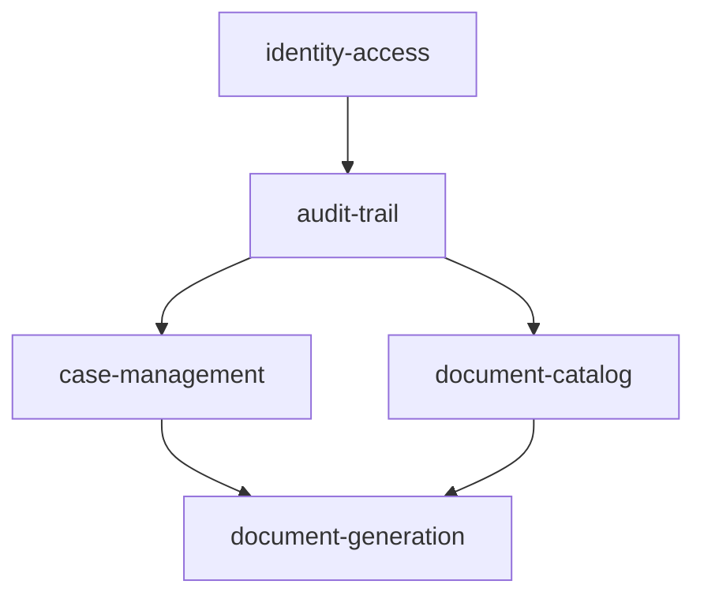

# Implementation Plan: Vietnamese Civil-Matter Document Administration MVP

Status: **Proposed for approval**  
Planning baseline: `docs/specs/LGD_001_SPEC.md` dated 2026-09-02, treated as approved and locked by the planning request  
Task backlog: [`docs/tasks/LGD_001_TASKS.md`](../tasks/LGD_001_TASKS.md)

## 1. Repository assessment

The repository is a **documentation-only, partially prepared foundation**. It is not an empty repository, but it has no application implementation to reuse.

Reusable foundations:

- `docs/specs/LGD_001_SPEC.md`: complete product, architecture, security, data, testing, operational, and acceptance contract for the MVP.
- `DESIGN.md`: framework-neutral administration UI tokens, responsive behavior, states, components, and WCAG 2.2 AA expectations.
- `AGENT.md`, `AGENTS.md`, and `.cursor/rules/*.mdc`: project-wide and path-specific implementation rules.
- `docs/vn/`: Vietnamese reference catalog, normalized field inventory, 33 Markdown form references, and one aggregate `legal-documents.docx` containing the 33 reference forms.
- `docs/en/`: derived English reference catalog and 33 translated Markdown references.
- `.agents/skills/` and `skills-lock.json`: implementation, testing, security, frontend, CI/CD, review, and legal-translation workflow skills.

Missing foundations that implementation must create:

- No Git repository metadata is available from the current workspace.
- No Django project, source modules, templates, static assets, migrations, or tests.
- No Python requirement files, Python lock, `package.json`, or npm lockfile.
- No CI/CD, deployment, environment example, backup, or operational configuration.
- No individual approved render-ready DOCX templates, per-template approval references, placeholder contracts, or recorded Word desktop reviews.

The aggregate DOCX is a readable OPC/ZIP package with 33 reference forms, but it has no separate header/footer parts and is explicitly classified by `docs/specs/LGD_001_SPEC.md` as a reference rather than an approved template. Its SHA-256 at planning time is `dc2749a37e4ac5c68398fdf67f762ffefb3b8c471f318fc9c6dc9d9a71ec43a7`.

No pre-existing `docs/plans/LGD_001_IMPLEMENTATION_PLAN.md`, `docs/tasks/LGD_001_TASKS.md`, `tasks/plan.md`, or `tasks/todo.md` existed, so this plan does not overwrite unfinished work. The requested output names supersede the planning skill's default `tasks/` paths.

## 2. Planning assumptions

- The user instruction makes `docs/specs/LGD_001_SPEC.md` approved and locked despite its stale “Draft for approval” metadata.
- `docs/specs/LGD_001_SPEC.md` controls MVP scope: exactly 12 VDS types. `AGENT.md`'s 33-form mission is the longer-term product direction, not permission to add the deferred 21 forms.
- Vietnamese Markdown and the aggregate DOCX are discovery/reference material only. They do not authorize legal wording, required fields, placeholder syntax, or generated layouts.
- Approved individual DOCX binaries, provenance, legal owner, approval reference, placeholder contract, and representative expected output will arrive per document type. Their absence blocks that type's onboarding completion and ultimately release, not platform implementation.
- Use Django's built-in user model unless implementation discovers a locked requirement that needs a custom user model before the first migration. The approved role model needs groups and permissions, not custom identity fields.
- PostgreSQL is required for integration, concurrency, constraint, and release tests. SQLite may support narrow unit tests only where behavior is demonstrably compatible.
- Synchronous generation remains the MVP design unless measured p95 exceeds 10 seconds or the reverse-proxy timeout. A queue requires a later specification change.
- Private filesystem storage is mounted outside static/public roots and is coordinated with PostgreSQL backups.
- Existing English references are derived material. They are not an English UI or DOCX feature. `AC-28` applies whenever those references or English legal metadata change.
- The Vietnamese-only MVP UI is implemented with English gettext source/fallback entries and matching Vietnamese catalog entries. No Vietnamese UI copy is hardcoded in application code, templates, comments, or developer documentation; approved legal-document wording and user-entered Vietnamese remain protected domain data outside generic UI localization.
- Branding, final Vietnamese product terminology, host sizing, DNS, certificates, monitoring destination, and backup operator/location are implementation or release inputs; none changes the dependency order.

## 3. Architecture and dependency constraints

### 3.1 Capability direction



The Django app graph is acyclic:

| App | Owns | Allowed dependencies | Prohibited responsibility |
| --- | --- | --- | --- |
| `core` | Settings split, common HTTP helpers, storage primitives, base UI, locale/legal formatters, health checks | Django/stdlib and pinned infrastructure packages | Business models or workflows |
| `accounts` | Login/logout, Administrator policy, permissions, server-enforced session lifetime | `core`, Django auth | Case/document decisions |
| `audit` | Generic append-only events, recorder, selectors, browsing | `core`, `accounts` | Imports of business-domain models or payload storage |
| `cases` | Courts, entities, participants, representatives, officials, hearings, case workflows | `core`, `accounts`, `audit` | Imports from `documents` |
| `documents` | Registry, template versions, validation, forms, drafts, mappers, rendering, artifacts, history, downloads | `core`, `accounts`, `audit`, explicit `cases` selectors/transfer values | Arbitrary database-executed forms/template behavior |

Additional boundaries:

- Views coordinate HTTP; Django forms/formsets validate writes; selectors own non-trivial reads; services own state changes and cross-model transactions; models enforce durable invariants.
- `documents` consumes case data through an explicit immutable typed transfer value returned by a `cases` selector. It does not traverse or mutate arbitrary case models inside generation logic.
- Cross-application writes occur only through explicit services. Audit recording accepts generic action/target/metadata contracts. No primary workflow uses Django signals.
- Registry entries are stable code. Template bytes and lifecycle are immutable database-backed `TemplateVersion` records. Arbitrary form definitions, Python expressions, globals, or executable behavior never live in the database.
- `DocumentDraft` is mutable only while validated against its exact schema version. `GeneratedDocument`, its snapshots, artifact metadata, and successful stored binary are immutable.
- A reserved generation transaction is short; rendering/storage happens outside it; finalization/failure persistence uses another short transaction.
- Canonical URLs, server authorization, and server validation remain authoritative. HTMX swaps HTML fragments; Alpine.js owns only ephemeral presentation state.

### 3.2 Document platform separation

The platform is delivered as discrete contracts in this order:

1. Stable code-defined registry and document-type protocol.
2. Immutable `TemplateVersion` metadata plus private uploaded bytes.
3. Bounded OPC/ZIP, relationship, XML, placeholder, run-splitting, and synthetic-render validation.
4. Versioned Django forms/formsets and validated mutable `DocumentDraft`.
5. Explicit case-prefill selector/transfer value and type-specific context mapping.
6. Immutable `GeneratedDocument` reservation with idempotency.
7. Restricted Jinja `StrictUndefined` rendering with allowlisted variables, filters, and globals.
8. Output OPC/ZIP/XML/structure/token validation.
9. Atomic private artifact placement, finalization, durable failure state, and cleanup.
10. History, authorized stored-artifact download, audit recording, and reconciliation.

`python-docx` is permitted only in a named post-processor backed by a documented `docxtpl` limitation, specific tests, and approval under `docs/specs/LGD_001_SPEC.md`'s “Ask first” rule. Inspection through `python-docx` is allowed in tests when it supplements direct OPC/XML assertions.

## 4. Milestone summary

| Milestone | Outcome | Primary task ranges | Exit demonstration |
| --- | --- | --- | --- |
| M1 Repository/tooling foundation | Reproducible Django 5.2/Python 3.13/PostgreSQL/Tailwind 4 project, quality gates, local assets, i18n baseline | `FND-*` | Required command contracts run; CI exercises them |
| M2 Identity, permissions, sessions, shell | Administrator can securely sign in/out and use the responsive Vietnamese shell; non-admin access is denied | `IAM-*` | Login/logout/session/CSRF/HTMX expiry tests and shell browser smoke |
| M3 Append-only audit | Generic immutable audit recording and authorized browsing are available to later apps | `AUD-*` | Login/logout and denied attempts are recorded; update/delete unavailable |
| M4 Case-management vertical slice | Administrator can maintain, search, archive, and restore relational cases with revision conflicts | `CASE-*` | End-to-end case workflow, URL-restorable list, audit, accessibility |
| M5 Document-platform vertical slice | A registered synthetic type can upload/validate/activate a template, save a draft, generate/store/history/download/reconcile a DOCX | `DOC-*` | Synthetic end-to-end generation and hostile-template suite pass |
| M6 Very-high-priority VDS | `01`, `03`, `10`, `05`, `09` onboarded independently | `VDS01-*`, `VDS03-*`, `VDS10-*`, `VDS05-*`, `VDS09-*` | Each type passes `AC-10`–`AC-16` and recorded Word review |
| M7 High-priority VDS | `15`, `21`, `31`, `22` onboarded independently | `VDS15-*`, `VDS21-*`, `VDS31-*`, `VDS22-*` | Same per-type acceptance, including complex repetitions/sections |
| M8 Quite-high-priority VDS | `11`, `04`, `12` onboarded independently | `VDS11-*`, `VDS04-*`, `VDS12-*` | All 12 types selectable with valid active versions |
| M9 Cross-cutting hardening/release | Security, accessibility, performance, observability, deployment, backup/restore, rollback, and release evidence complete | `SEC-*`, `A11Y-*`, `PERF-*`, `OPS-*`, `REL-*` | `AC-01`–`AC-28`, NFR budgets, RPO/RTO, and command gates pass |

Testing, permissions, audit, security, privacy, and accessibility are acceptance conditions inside M2–M8. M9 verifies and hardens the integrated system; it is not the first point at which those qualities are addressed.

## 5. Critical path

The critical path is:

`FND-001` → `FND-002` → `FND-003` → `IAM-001` → `IAM-002` → `IAM-003` → `AUD-001` → `CASE-001` → `CASE-003` → `CASE-006` → `DOC-001` → `DOC-002` → (`DOC-003`, `DOC-004`) → `DOC-005` → `DOC-007` → `DOC-008` → `DOC-010` → `DOC-012` → `DOC-013` → `DOC-014` → `DOC-015` → first type's `*-001` … `*-005` → remaining type acceptance groups → `SEC-002` → `OPS-002` → `REL-001`.

High-risk work is deliberately early:

- PostgreSQL-only constraints and activation concurrency are proven before VDS onboarding.
- Hostile DOCX package and split-run validation are proven on synthetic fixtures before any approved binary is activated.
- Reservation/finalization/failure recovery and reconciliation are proven before form-specific rollout.
- The first approved VDS form is an end-to-end template for all later onboarding groups.

## 6. External inputs and blockers

| Input | Needed by | Blocks planning? | Blocks implementation/release? |
| --- | --- | --- | --- |
| Individual approved DOCX binary for each of 12 types | Each `VDSxx-001` | No | Blocks that type's onboarding and MVP release |
| Legal owner, provenance/source version, approval reference/note | Each `VDSxx-001`, activation | No | Blocks activation and release |
| Approved placeholder inventory and required/optional contract | Each `VDSxx-001` | No | Blocks schema/mapping finalization and activation |
| Approved representative expected output | Each `VDSxx-004/005` | No | Blocks structural assertions and Word review |
| Supported Microsoft Word desktop version and named reviewer | Each `VDSxx-005` | No | Blocks activation/release evidence |
| Vietnamese UI terminology and branding | `IAM-004`, page tasks | No; use neutral spec terminology initially | Blocks final copy/brand approval, not technical implementation |
| Production host topology, DNS, certificate, private volume paths | `OPS-001` | No | Blocks production deployment |
| PostgreSQL/application/backup identities and secrets process | `SEC-002`, `OPS-001/002` | No | Blocks deployment and restore rehearsal |
| Reverse-proxy platform and rate-limit facility | `SEC-002`, `OPS-001` | No | Blocks login-rate-limit and header verification |
| Monitoring/alert destination and owners | `OPS-003` | No | Blocks operational readiness |
| Backup location/operator, encryption-key recovery process | `OPS-002` | No | Blocks `AC-24` |
| Representative target hardware and concurrency data | `PERF-001/002` | No | Blocks `AC-26` |
| Deployment rollback authority and maintenance window | `OPS-004`, `REL-001` | No | Blocks release |

Release blockers are any missing per-type approval/Word review, failed integrity check, failed security or accessibility gate, command-contract failure, inability to meet p95 targets, or restore rehearsal outside RPO/RTO.

## 7. Migration and data-seeding strategy

Migration ordering follows app dependencies and uses small reviewed migrations:

1. `accounts`: built-in auth/session tables plus deterministic Administrator group/custom permission seed. If a custom user becomes necessary, decide before this first migration.
2. `audit`: `AuditEvent` table and indexes. No business-model FKs.
3. `cases` reference entities: `Court`, `Entity`, `EntityAddress`, `Official`.
4. `cases` core: `CaseRecord`, metadata, conditional acceptance constraints, and indexes.
5. `cases` relationships: participants, representations, official assignments, hearings, uniqueness/indexes.
6. `documents` catalog: immutable `TemplateVersion`, lifecycle constraints, and conditional unique active-version constraint.
7. `documents` workflow: `DocumentDraft`, `GeneratedDocument`, protected FKs, revision/idempotency/status/checksum constraints.
8. Optional operational seed migrations: permissions and initial registry-aware metadata only. Template bytes are uploaded through the secured workflow; they are not embedded in migrations.

Rules:

- Every schema task includes migration tests and `makemigrations --check --dry-run`.
- Data migrations are deterministic, reversible where practical, safe for production volume, and never read runtime request state or private files.
- Code-defined registry entries deploy before corresponding template upload. Activation occurs only after database migration, code deployment, validation, and human approval.
- Schema version increments do not rewrite generated snapshots. Draft migration is a separate explicit, tested task and is unnecessary for the initial `v1` schemas.
- Seed data and fixtures use synthetic Vietnamese names/content only. No legal/case personal data enters source control.
- Rollback never reverses a migration that would orphan protected generated history. Application rollback must preserve readers for deployed registry/schema versions.

## 8. Testing strategy

Every behavior task follows the same test-first loop:

1. Add or update a failing test that expresses the locked behavior.
2. Implement the smallest coherent vertical behavior.
3. Refactor without behavior change and retain explicit app boundaries.
4. For every new UI string, add matching English and Vietnamese catalog entries in the same slice; verify source code has no hardcoded Vietnamese UI copy and all code/comments remain English.
5. Run focused unit/model/form/view/service tests.
6. Run the applicable broader quality set: Ruff, format check, mypy, Django checks, migration drift, CSS build, message extraction/compilation, browser smoke, coverage, or deployment check.

Test layers and required evidence:

| Layer | Required coverage |
| --- | --- |
| Models/database | Constraints, indexes, status transitions, conditional acceptance fields, optimistic revisions, immutability, protected history, active-template uniqueness, idempotency under PostgreSQL concurrency |
| Forms/formsets | Valid/invalid/boundary/Unicode input, conditionally required groups, repeated items, authorized related choices, version mismatch, preserved values and linked error summary |
| Auth/security | Anonymous/inactive/non-admin/permission denial, safe local redirects, generic errors, session rotation/invalidation, 30-minute inactivity and 8-hour absolute expiry, CSRF for every unsafe normal/HTMX request |
| Views/HTMX | Full versus `_fragment` responses, canonical query strings, `Vary: HX-Request`, `422`, `409`, `403/404`, no-data session expiry, focus/error/status behavior, progressive enhancement |
| Selectors/performance | Search/filter/sort allowlists, pagination sizes, Vietnamese matching, query-count budgets, no N+1, scale data and p95 measurements |
| Audit | Required success/failure/denied event matrix, bounded safe metadata, correlation IDs, append-only enforcement |
| Template validation | ZIP signature/limits/ratio/count, traversal/duplicates, encryption, macro/ActiveX/OLE/executables, external relationships, bounded safe XML, syntax, required/optional/unknown variables, disallowed filters/globals, split runs and structural tags |
| Generation | Typed prefill/context mapping, strict undefined, escaping, legal formatters, reservation/finalization transactions, idempotency, temporary cleanup, failure recovery, immutable snapshot/artifact, safe filename and authorized stored download |
| DOCX | Direct ZIP/OPC inspection of content types, relationships, document, tables, paragraphs/runs, headers, footers, footnotes/endnotes when supported, styles, sections, page breaks, Unicode, loops, optional blocks, and unresolved `{{`/`{%` tokens; `python-docx` may supplement but never replace XML inspection |
| Browser/accessibility | Login, dashboard, cases, long forms, selector, history, template management, audit and confirmations at compact/tablet/wide; keyboard, focus, error summary, live announcement, contrast, reduced motion, 200% zoom and reflow; JavaScript-disabled core flow; English/Vietnamese catalog parity and Vietnamese UI rendering without hardcoded non-English source strings |
| Operations | Production settings, collectstatic, migrations, coordinated backup/restore, checksums, download authorization, health/readiness, logging redaction, integrity reconciliation, capacity thresholds |

Coverage gates are at least 85% branch overall and 95% branch for registry/context/rendering, permissions, and snapshot-integrity modules. Test assertions may not be removed or weakened to meet a gate.

The required command contract is created in M1 and preserved exactly unless an equivalent is already present when implementation begins:

```bash
python -m pip install -r requirements/development.txt
npm ci
python manage.py runserver
npm run css:watch
npm run css:build
python manage.py makemessages --all --no-obsolete
python manage.py compilemessages
pytest --cov=apps --cov-branch --cov-report=term-missing
ruff check .
ruff format --check .
mypy apps config
python manage.py check
python manage.py check --deploy --settings=config.settings.production
python manage.py makemigrations --check --dry-run
python manage.py collectstatic --noinput
```

## 9. Security strategy

- Deny by default at view and sensitive service boundaries. Scope every object lookup; UUIDs are non-secret identifiers, not authorization.
- Keep Django CSRF middleware enabled and test rejection for all unsafe normal and HTMX paths. No `csrf_exempt`.
- Validate `next` as a local URL, use generic login errors, POST logout, rotate login sessions, invalidate logout/password-change sessions, and enforce server-side inactivity/absolute deadlines.
- Configure reverse-proxy login rate limiting, HTTPS, secure host-scoped cookies, narrow hosts/origins, clickjacking denial, `nosniff`, referrer policy, and a CSP compatible only with locally hosted HTMX/Alpine assets. Roll out HSTS after HTTPS validation.
- Validate uploads by bytes/package structure, not filename/MIME. Enforce 10 MiB compressed limit and bounded entries, expansion, ratio, XML, and relationships. Never execute template-supplied Python or arbitrary Jinja behavior.
- Keep uploaded templates and generated artifacts outside web roots on encrypted storage. Generate opaque server keys; authorize every download; use safe attachment headers.
- Store secrets outside source control, fail production startup for missing values, give PostgreSQL the least privileges needed, and restrict database/filesystem/backup identities.
- Emit structured bounded metadata only: timestamp, severity, correlation ID, route/action, outcome, duration. Never log case/draft/snapshot/document content, passwords, tokens, identifiers, addresses, or bytes.
- Audit authentication, authorization-sensitive attempts, permission changes, case/reference changes, drafts, generation states/downloads, templates, and exceptional maintenance deletion.
- Coordinate encrypted off-host database/filesystem backups, checksum verification, restore rehearsal, capacity alerts, integrity reconciliation, and dependency/security maintenance.

Tasks marked **Security skill** in `docs/tasks/LGD_001_TASKS.md` should be implemented using `security-and-hardening`. Every milestone ends with a `code-review-and-quality` review; sensitive document/storage/auth tasks also receive a fresh adversarial review before merge.

## 10. Deployment and rollback strategy

Baseline deployment is a private Linux host/container behind an HTTPS reverse proxy, WSGI application processes, PostgreSQL 14+ on a private interface, locally built/served static assets, and a private persistent filesystem.

Release sequence:

1. Back up PostgreSQL and private filesystem as a coordinated set; verify recoverability metadata.
2. Build pinned Python/npm dependencies, Tailwind CSS, and compiled message catalogs.
3. Run the complete CI/release gate including production deployment checks and browser smoke.
4. Deploy code that remains able to read all historical registry/schema versions.
5. Apply forward-compatible migrations as a controlled step.
6. Collect static assets and restart/roll application processes.
7. Verify liveness/readiness, login, representative case read, registered-type coverage, generation on synthetic data, authorized download, checksums, logs, and alerts.
8. Activate new template versions separately after automated validation and recorded Word review.

Rollback principles:

- Prefer application rollback without destructive schema reversal. Use expand/contract changes if a future migration cannot be safely read by the prior release.
- Never roll back by deleting template versions, generated records, snapshots, audit events, or artifacts.
- A bad active template is deactivated or superseded atomically; historical files remain untouched.
- Quiesce generation during a storage/database consistency incident. Reconcile before resuming.
- Restore PostgreSQL and private files from the same recovery set. Validate migrations, sample checksums, authorization, and downloads within RTO/RPO.
- Record rollback trigger thresholds, authority, commands, result, and follow-up remediation in the release runbook.

## 11. Milestone exit criteria

| Milestone | Required exit criteria |
| --- | --- |
| M1 | All command entry points exist; clean install/bootstrap is documented; Django checks, lint, format, mypy, unit smoke, CSS build, English/Vietnamese catalog parity plus message extraction/compilation, migration drift, collectstatic, and CI execute; no secrets or public private-media route |
| M2 | `AC-01`–`AC-04` pass for normal/HTMX requests; Administrator permissions seeded; shell/login/session-expired states work with and without JS at three viewport classes |
| M3 | Required identity events are recorded through the generic API; normal application users cannot update/delete audit rows; authorized list filters and bounded metadata are verified |
| M4 | `AC-05`–`AC-07` pass; relational cases and related data are usable; list state survives canonical navigation; case permissions/audit/CSRF/accessibility/query budgets pass |
| M5 | Synthetic document type proves `AC-11`–`AC-22` platform behavior; hostile upload matrix, activation race, draft versioning, idempotency, failure recovery, private download, and reconciliation pass |
| M6 | Five very-high-priority types each satisfy `AC-10`–`AC-16` with approved binary/provenance and recorded Word review |
| M7 | Four high-priority types meet the same gate; complex loops, minutes, decisions, sections and pagination structures have focused tests |
| M8 | Three quite-high-priority types meet the same gate; all 12 have one valid active template and selector coverage |
| M9 | `AC-01`–`AC-28` traceability evidence is complete; `AC-23`–`AC-27`, p95 budgets, accessibility matrix, integrity, monitoring, backup restore, RPO/RTO, rollback rehearsal, and full command suite pass |

After each 2–3 tasks, the checkpoint in `docs/tasks/LGD_001_TASKS.md` requires focused tests plus applicable broader checks. A milestone cannot exit on a skipped test, test suppression, unreviewed migration, or undocumented external blocker.

## 12. Release-readiness gate

Release is approved only when all statements below are evidenced:

- Every one of the 40 functional requirements and `AC-01` through `AC-28` maps to completed tasks and passing verification.
- Exactly the 12 MVP registry types are enabled; each has an approved immutable template, contract, schema/formsets, mapper, filename builder, fixtures, package/structure tests, successful automated validation, and recorded Microsoft Word review.
- Production settings, dependency locks, CSS, translations, static collection, migrations, tests, branch coverage, lint, format, typing, Django checks, and browser smoke are green in CI and the release environment.
- Every user-facing application string is translation-wrapped; English fallback and Vietnamese catalogs have exact key parity; application code, comments, developer documentation, and commit messages remain English-only.
- No known authentication, authorization, CSRF, IDOR, unsafe-upload, template-execution, private-storage, immutable-history, or sensitive-logging defect remains.
- Compact, tablet, and wide core flows meet WCAG 2.2 AA verification, keyboard operation, focus/error/status behavior, 200% zoom, reflow, contrast, and reduced motion.
- At the representative scale and 50-user assumption, list p95 is at most 2 seconds and generation p95 at most 10 seconds, with explicit query budgets and no N+1 regression.
- Integrity reconciliation finds no unexplained missing, modified, or orphaned template/artifact. Capacity alerts at 70%/85% are wired.
- A coordinated encrypted restore completed within 8 hours to a point no older than 24 hours, with at least 35-day retention and verified authorized downloads/checksums.
- Deployment, smoke, rollback, incident, secret recovery, session cleanup, backup, restore, and maintenance runbooks have named owners.
- Legal and product owners sign off the approved binaries, provenance, Vietnamese terminology, representative outputs, and Word reviews. No reference Markdown or aggregate DOCX is substituted for approval.
- Deferred features remain absent: DRF/public API, SPA/Vite, Celery/Redis/WebSockets, object storage, MFA/SSO, multi-tenancy, PDF, public downloads, and the other 21 VDS forms.

Approval of this plan authorizes implementation to begin at `FND-001`; it does not itself authorize application code, legal-template invention, or changes to `docs/specs/LGD_001_SPEC.md`.
