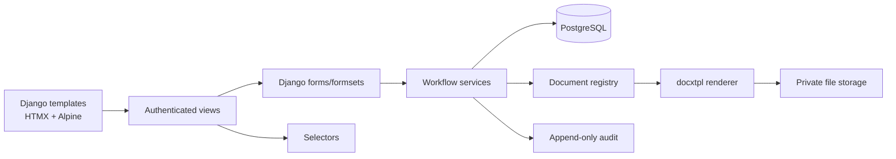
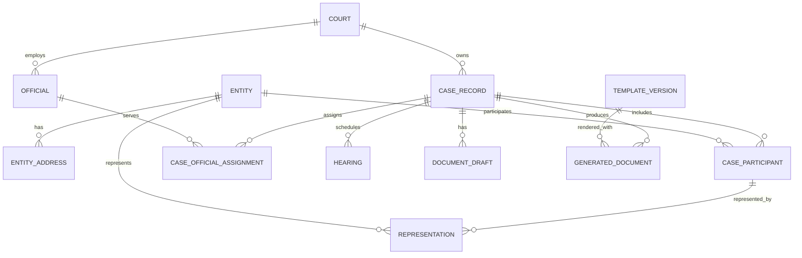

# Specification: Vietnamese Civil-Matter Document Administration Application

Status: **Draft for approval**  
Specification date: 2026-08-31  
Last updated: 2026-09-01  
Default product language: Vietnamese  
Approved scope map: `identity-access` → `audit-trail` → (`case-management`, `document-catalog`) → `document-generation`

This specification is the Phase 1 artifact required by the project's spec-driven workflow. It defines the product and technical contract only. It is not an implementation plan and contains no application implementation.

## 1. Executive summary

Build a private, server-rendered Django application for administrators to maintain Vietnamese civil-matter case data and generate accurate Microsoft Word documents from approved `.docx` templates. The application has its own responsive administration interface; Django Admin remains an internal maintenance tool, not the product UI.

The MVP supports 12 VDS document types in three delivery-priority tiers:

| Priority | Document types |
| --- | --- |
| Very high | `01-VDS`, `03-VDS`, `10-VDS`, `05-VDS`, `09-VDS` |
| High | `15-VDS`, `21-VDS`, `31-VDS`, `22-VDS` |
| Quite high | `11-VDS`, `04-VDS`, `12-VDS` |

Shared and searchable data—courts, cases, entities, participant roles, officials, case identifiers, dates, and hearings—is relational. A versioned, validated JSON payload is permitted only for document-specific draft fields and immutable generation snapshots. Every successful generation stores the exact output DOCX, input snapshot, template version, actor, timestamps, and checksums. Stored output is the canonical record; downloads never silently re-render it.

The architecture uses an allowlisted document registry. A new document type normally adds one approved template, one versioned Django form/schema, explicit context mapping, one registry entry, and tests. A secured application screen permits administrators to upload and activate new template versions for an existing registered type, but introducing a new type requires a reviewed code deployment.

## 2. Goals

1. Give an authenticated administrator a reliable workflow to create, find, inspect, edit, archive, and restore civil-matter records.
2. Reuse normalized case data to prefill document-specific, server-validated forms while permitting a deliberate per-document override.
3. Produce Vietnamese Unicode DOCX files from approved templates while preserving the template's formatting, tables, headers, footers, fonts, spacing, and pagination intent.
4. Make every generation traceable to its administrator, exact validated inputs, schema version, immutable template version, stored output, time, and checksum.
5. Make template-version changes safe, reviewable, reversible for future generations, and backward-compatible with historical artifacts.
6. Make adding document types predictable without duplicating the generation workflow.
7. Provide a responsive, accessible, purpose-built administrative interface based on Django templates, HTMX, Alpine.js, and Tailwind CSS.
8. Protect personal and sensitive legal data through deny-by-default authorization, private storage, secure sessions, auditability, backups, and production hardening.

## 3. Non-goals

- Public registration, public case submission, anonymous access, or a public document-download portal.
- A single-page application, client-side router, SPA framework, Django REST Framework, GraphQL, or a general public API.
- Multi-organization tenancy or per-court/assigned-case access scoping in the MVP.
- Digital signatures, electronic seals, certificate management, or electronic filing with a court.
- OCR, document ingestion, bulk import, case-management integration, email/SMS delivery, or collaborative editing.
- Automated interpretation, correction, or generation of legal wording.
- Runtime machine/agent translation of case data, user-entered legal text, approved templates, or generated documents.
- Celery, Redis, WebSockets, or a worker queue before synchronous-generation measurements show they are necessary.
- Cloud/object storage in the MVP.
- In-application hard deletion of cases, artifacts, snapshots, template versions, or audit events.
- Support for all 33 VDS forms in the MVP. In particular, illustrative forms `02-VDS` and `13-VDS` are deferred because the subsequently confirmed MVP list controls scope.
- A database-driven no-code form/template designer. Document-specific Django forms and mappings remain reviewed code.
- Vite or another general-purpose JavaScript bundler in the MVP. The server-rendered UI has no application JavaScript module graph that justifies a separate development server, manifest integration, or HMR pipeline.

## 4. User roles and permissions

### 4.1 Principals

The MVP has one application role and one operational authority:

| Principal | Authority |
| --- | --- |
| Administrator group | Use every purpose-built application workflow, including case maintenance, generation, history/download access, and template-version management. |
| Django superuser | Emergency/platform maintenance: create or deactivate administrators, assign permissions, reset credentials, access Django Admin, and conduct an exceptionally authorized maintenance deletion. Superuser status is not required for normal application work. |

There are no Authorized Staff or Read-only Auditor accounts in the MVP. Django's built-in groups and model/custom permissions must nevertheless be used so those roles can be added without changing the domain or view architecture.

### 4.2 Permission contract

All application endpoints except login and minimal health checks require an active authenticated user in the Administrator group or an active superuser. Each endpoint and its service boundary must enforce the relevant permission; a hidden UI action is never authorization.

Required permission families include:

- Cases: view, add, change, archive, restore.
- Reference entities: view, add, change, deactivate.
- Document drafts: view, add, change.
- Documents: generate, view generation history, download generated artifact.
- Templates: view, upload version, validate, activate, deactivate.
- Audit: view audit events.
- Accounts: user/group administration is superuser-only in the MVP.

Object lookup must always be scoped to objects the principal may access. Although MVP access is organization-wide, object-level policy checks remain explicit to prevent insecure direct-object references and to create a future extension point.

### 4.3 Access restrictions and sensitive operations

- Unauthenticated HTML requests redirect to login with a safe local `next` target; HTMX requests receive an explicit session-expired response that causes a full redirect without embedding case data.
- Authenticated users lacking a permission receive `403`; nonexistent and inaccessible object identifiers must not reveal sensitive existence details.
- Logout is an unsafe, CSRF-protected `POST`, not a state-changing `GET`.
- Case archive/restore, template activation/deactivation, and generation require an explicit confirmation showing the affected case or template version.
- Template upload/activation is Administrator-only. User and permission administration and exceptional deletion are superuser-only.
- Archived cases remain viewable with history and existing downloads but cannot be edited or used for new generation until restored.

### 4.4 Session behavior

- Use Django database-backed sessions and session cookies; never put sensitive case data in cookies.
- Rotate the session identifier at login. Invalidate the current session at logout and invalidate all of that user's sessions after any password reset or change, including a self-service change if such a flow is later enabled.
- Expire after 30 minutes of inactivity and after an absolute maximum of 8 hours. Enforce both limits server-side; client warnings are informational only.
- Do not provide “remember me” in the MVP. Cookies are `Secure`, `HttpOnly`, `SameSite=Lax`, host-scoped, and sent only over HTTPS in production.
- On expiry, discard access to the protected response and return a generic reauthentication page. Do not persist sensitive unsaved values across reauthentication or in browser storage.
- Clear expired database sessions on a scheduled operational cadence.

## 5. User journeys

### 5.1 Sign in and sign out

1. Administrator opens the login page and submits username and password.
2. The server validates credentials, active status, and Administrator membership, rotates the session, records the outcome, and redirects to a validated local destination or dashboard.
3. Failed login gives a generic Vietnamese error and does not reveal whether an account exists.
4. Administrator signs out with a CSRF-protected action; the server clears the session and records logout.

### 5.2 Find and maintain a case

1. Administrator opens the dashboard or case list.
2. Search, filters, sort, page, and page size are encoded in the URL and update the results table through HTMX.
3. Administrator opens a case, reviews related entities and history, then creates or edits shared data through a validated Django form and formsets.
4. A stale edit is rejected as a conflict rather than overwriting a newer revision.
5. Archive/restore requires confirmation and produces an audit event.

### 5.3 Generate a document

1. From a case, Administrator selects an active registered document type.
2. The server loads that type's versioned Django form, prefilling shared case values and any existing compatible draft.
3. Administrator reviews and may override values. Document-only overrides do not silently mutate the shared case record.
4. The server validates the form/formsets and current case/template state. Invalid submissions return an error summary and field errors while preserving entered values.
5. A confirmed submission creates an idempotent generation attempt and immutable input snapshot.
6. The generation service builds an allowlisted context, verifies required variables, renders a unique DOCX, validates the result, stores it privately, computes checksums, and finalizes the record.
7. Administrator downloads the stored artifact. The download itself is authorized and audited.

### 5.4 Review history

1. Administrator opens a case's generation-history panel.
2. History shows type, status, actor, generation time, template/schema versions, filename, and safe failure summary.
3. Successful records link to their original immutable file; failed records can seed a new attempt but are never rewritten into success.

### 5.5 Manage a template version

1. Administrator chooses an already registered document type and uploads a proposed `.docx` plus a unique version and approval note/reference.
2. The server validates size, type, OPC package structure, prohibited content, placeholder syntax/contract, split runs, and a synthetic render.
3. Invalid versions remain inactive with a non-sensitive validation report.
4. Administrator reviews the report and an externally opened representative render, then confirms activation.
5. Activation is atomic: one version becomes active for future generations; earlier versions become inactive but remain immutable and downloadable through their historical generated records.

## 6. Functional requirements

### 6.1 Authentication and dashboard

- `FR-AUTH-01`: Provide purpose-built Vietnamese login and logout views using Django authentication.
- `FR-AUTH-02`: Reject inactive, non-Administrator, and unauthorized accounts from protected application views.
- `FR-DASH-01`: Show counts of active/archived cases, recent case activity, recent generation results, failed generations requiring attention, and active-template coverage for the 12 MVP types.
- `FR-DASH-02`: Dashboard cards link to filtered canonical URLs and degrade to ordinary navigation without HTMX.

### 6.2 Case records and reusable entities

- `FR-CASE-01`: List cases with debounced text search, filters, allowlisted sorting, pagination, and restorable URL state.
- `FR-CASE-02`: Search relational fields including internal reference, acceptance number/year/type, matter type, court name/code, and participant/entity names. Identifier searches are exact or prefix-aware; names and matter text permit case-insensitive containment suitable for Vietnamese Unicode.
- `FR-CASE-03`: Filter at minimum by court, case status, procedural stage, type code, acceptance year/date range, and archive state.
- `FR-CASE-04`: Sort at minimum by last updated, created date, acceptance date/number, court, and matter type. Server-side allowlists prevent arbitrary field injection.
- `FR-CASE-05`: Support page sizes 10, 25, 50, and 100, defaulting to 25.
- `FR-CASE-06`: Create, view, edit, archive, and restore cases with server validation and optimistic revision checks.
- `FR-CASE-07`: Maintain courts, individuals/organizations, case participant roles, representatives, officials/assignments, and hearing information as reusable relational data.
- `FR-CASE-08`: Permit incomplete pre-acceptance records. Acceptance number, year, date, and type code become conditionally required together when the case is marked accepted.
- `FR-CASE-09`: Preserve case change metadata: creator, creation time, last editor, update time, archive actor/time/reason, and monotonically increasing revision.

### 6.3 Document forms and drafts

- `FR-DOC-01`: Offer only registry entries that are enabled and have one valid active template version.
- `FR-DOC-02`: Render a versioned explicit Django `Form` plus formsets for repeated values. Arbitrary database-defined form execution is prohibited.
- `FR-DOC-03`: Prefill from the current case, related entities, participants, officials, and hearings through explicit mappings.
- `FR-DOC-04`: Clearly distinguish shared-prefilled, document-specific, and overridden values in the UI. An override affects only the draft/snapshot unless the administrator separately edits the case.
- `FR-DOC-05`: Store mutable document-specific drafts as a validated payload with stable type key and schema version. Revalidate on every save and generation.
- `FR-DOC-06`: Preserve entered values and return both a top-level error summary and field/formset errors after validation failure.
- `FR-DOC-07`: Reject a draft created under an incompatible schema version until an explicit tested migration is available; historical generated snapshots are never migrated.

### 6.4 MVP form coverage

Each MVP form receives its own field inventory during template onboarding. The minimum mapping areas are:

| Type | Shared relational prefill | Document-specific validated input |
| --- | --- | --- |
| `01-VDS` | Court, requester entities/contacts, matter type | Requested issues, reasons/bases, related people, attachments, other information, issue/signature details |
| `03-VDS` | Court, submitting requester, address, matter type | Petition date, received date, delivery method, recipient wording, document/signature details |
| `10-VDS` | Court, case acceptance data, requester, assigned official | Decision number/date, assigned judge and signer capacity |
| `05-VDS` | Court, requester, petition date | Recipient, enforcement agency/address, fee amount numeric and words, issue/signature details |
| `09-VDS` | Court, acceptance data, requester/related parties | Notification recipient, requested issues, attachment list, response deadline text where template-approved |
| `15-VDS` | Court, acceptance data, case participants, official assignments, hearing | Decision details, panel composition, alternate prosecutor, other participants, session time/location |
| `21-VDS` | Court, acceptance data, participants, officials, hearing | Attendance/absence, statements, questions/answers, procedural events, conclusions, amendments |
| `31-VDS` | Court, acceptance data, marriage parties | Legal bases, findings, marriage/child/property/other agreements, fees, decision/signature details |
| `22-VDS` | Court, acceptance data, participants, officials, hearing | Case summary, numbered findings, legal bases, outcomes, fees, appeal and enforcement rights |
| `11-VDS` | Court, acceptance data, recipient | Required supplemental evidence list and issue/signature details |
| `04-VDS` | Court, requester, petition date, matter type | Delivery method, amendment/supplement list, issue/signature details |
| `12-VDS` | Court, acceptance data | Request basis, evidence provider, requested items, deadline and issue/signature details |

The official wording and template-specific required/optional status are controlled by an approved template contract, not inferred from this summary or automatically changed from the Markdown references.

### 6.5 Generation and downloads

- `FR-GEN-01`: Resolve type, form/schema, context builder, filename builder, and active template only through the allowlisted registry and stored template-version metadata.
- `FR-GEN-02`: Detect missing required variables and unknown template variables before final rendering; use strict undefined behavior during render.
- `FR-GEN-03`: Use `docxtpl` as the renderer. Use `python-docx` only in a named, tested post-processor justified by a documented `docxtpl` limitation.
- `FR-GEN-04`: Preserve Vietnamese Unicode and template layout/parts. Do not rebuild approved templates in Python.
- `FR-GEN-05`: Store every successful rendered DOCX, SHA-256 checksum, byte size, safe filename, template checksum/version, schema version, actor, timestamps, and exact immutable input/context snapshots.
- `FR-GEN-06`: A retry or regeneration creates a new attempt and artifact; it never overwrites a prior result.
- `FR-GEN-07`: Downloads use the stored artifact, correct DOCX media type, `Content-Disposition: attachment` with safe ASCII fallback and RFC-compatible UTF-8 filename, `nosniff`, no public storage URL, and an object permission check.
- `FR-GEN-08`: Show all generation attempts in reverse chronological order, including safe failure category and retry affordance.

### 6.6 Template management

- `FR-TPL-01`: New document types require a `.docx`, versioned Django form/schema, explicit context mapper, registry entry, placeholder contract, and tests in a reviewed deployment.
- `FR-TPL-02`: Administrators may upload new versions only for an existing registry key.
- `FR-TPL-03`: A template version is immutable after upload. Correcting it creates another version.
- `FR-TPL-04`: Activation requires successful automated validation, a required approval note/reference, and explicit confirmation. One active version per document type is enforced transactionally.
- `FR-TPL-05`: Deactivation prevents new selection/generation but never affects historical downloads.

### 6.7 Internationalization and localization

- `FR-I18N-01`: Enable Django internationalization with `USE_I18N=True`, `LANGUAGE_CODE="vi"`, `LANGUAGES` restricted to Vietnamese in the MVP, and `LocaleMiddleware` after `SessionMiddleware` and before `CommonMiddleware`. The application has no URL language prefix or language switcher in the MVP.
- `FR-I18N-02`: Mark all administrator-facing Python and Django-template strings for translation using Django gettext hooks. Use complete translatable sentences and named interpolation; do not build messages by concatenating translated fragments.
- `FR-I18N-03`: Vietnamese is the source/default product language. User-entered names, addresses, legal text, case identifiers, and approved template wording are data and must never be machine-translated.
- `FR-L10N-01`: Use Django's locale-aware formatting for ordinary UI dates, times, numbers, and form input/output, with UTC storage, `USE_TZ=True`, and `Asia/Ho_Chi_Minh` presentation time.
- `FR-L10N-02`: Legal-document values do not use generic UI localization. Versioned domain formatters deterministically produce the exact approved Vietnamese date, time, currency-in-words, name, address, and legal-text forms required by each DOCX contract.
- `FR-I18N-04`: Maintain translation catalogs through Django's `makemessages`/`compilemessages` workflow. An English UI catalog may be added later without changing stored data, URLs, registry keys, or document snapshots.
- `FR-I18N-05`: Keep product UI localization separate from legal-document translation. Optional English document-type names and English reference documentation use the project's approved legal terminology catalog; they do not imply English DOCX generation.

## 7. Non-functional requirements

### 7.1 Correctness and integrity

- Store all datetimes timezone-aware in UTC and display them in `Asia/Ho_Chi_Minh`; store legal calendar dates as dates without timezone conversion.
- Preserve Unicode normalization deliberately. Search may normalize for comparison, but stored legal names and generated values retain the administrator-approved spelling and diacritics.
- Every finalized template and generated artifact has a SHA-256 checksum. A verification command must detect a missing or changed file.
- Historical generation records, snapshots, template references, and stored output are application-immutable.

### 7.2 Performance and scale assumptions

- Design and index for up to 100,000 cases, 1,000,000 participant links, and 1,000,000 generation records without changing pagination architecture.
- At 50 concurrent authenticated users on the target private deployment, ordinary full-page and HTMX list interactions should achieve p95 server response time at or below 2 seconds, excluding network transfer.
- Representative synchronous DOCX generation should achieve p95 at or below 10 seconds and remain under the reverse-proxy request timeout. If measurements violate this, introduce a durable job design before adding a queue.
- Case list/detail views have explicit query-count budgets established in tests after the schema exists; N+1 behavior is unacceptable.

### 7.3 Availability and recoverability

- Target business-hours availability; planned maintenance is permitted with notice.
- Default recovery objectives are RPO ≤ 24 hours and RTO ≤ 8 hours.
- Backups cover PostgreSQL, private templates, generated artifacts, configuration needed to restore, and encryption keys/secrets through an appropriately separate secret-recovery process.
- Retain backups for at least 35 days and perform a documented restore test at least quarterly.

### 7.4 Accessibility and compatibility

- Meet WCAG 2.2 AA for core workflows, including keyboard-only operation, visible focus, semantic landmarks, labels, error summaries, live status, contrast, reduced motion, 200% zoom, and reflow.
- Support current enterprise desktop/tablet browsers compatible with Tailwind CSS 4: current and previous major Chrome, Edge, Firefox, and Safari, plus current iPadOS Safari. Internet Explorer is unsupported.
- Core navigation, reading, form submission, validation recovery, and download remain usable without HTMX/Alpine enhancement.

### 7.5 Language and locale quality

- Vietnamese UI copy must render with correct diacritics, pluralization, interpolation, date/time/number formats, and text expansion at all supported breakpoints.
- User-facing text must not assume English word order. Translation extraction and compilation failures are release-blocking once a non-default catalog exists.
- Locale selection must not alter stored values, legal snapshots, registry identifiers, authorization, sorting keys, or generated-document meaning.
- Tests activate the Vietnamese locale explicitly rather than depending on the operating system locale.

## 8. Proposed system architecture

Use a conventional Django 5.2 LTS monolith on a currently supported Python 3 release (target Python 3.13), PostgreSQL 14+, Django internationalization/localization, server-rendered templates, Django forms/formsets, HTMX 2.x, Alpine.js 3.x, Tailwind CSS 4.x, `docxtpl` 0.20.x, and narrowly scoped `python-docx` 1.x. Exact patch versions must be pinned in the implementation dependency lock and updated through reviewed maintenance.

Production is one private Linux deployment behind an HTTPS reverse proxy, with Django application processes, PostgreSQL, and a private persistent filesystem. Static JS/CSS assets are locally served and pinned; no production CDN is required. Templates and generated media are never served as a public media directory.

### 8.1 Frontend asset toolchain decision

Vite is not part of the MVP technology stack. Tailwind's standalone/npm CLI builds the CSS, while pinned HTMX and Alpine.js distributions plus a small application script are copied or emitted as Django static assets. This provides deterministic local production assets without a second development server, Vite manifest resolution, or frontend-framework conventions.

Reconsider Vite only through an approved specification change if the frontend later develops a material ES-module dependency graph, multiple compiled entry points, asset imports requiring hashing/manifest resolution, or a measured need for HMR that outweighs Django integration complexity. Adding Vite must not introduce an SPA, client-side routing, or client-owned business state.

### 8.2 Legal-translation tooling boundary

The repository's `vietnamese-legal-translator` skill is a development-time authoring and review aid. It is not installed in or invoked by the Django application, is not part of the production dependency graph, and does not receive live or synthetic case payloads through a runtime integration. Its terminology reference governs project-authored English legal catalogs and translations, subject to the source hierarchy and human approval in Section 11.6.

Using the skill does not add an English product language, generate English DOCX files, translate administrator input, or replace review by the responsible Vietnamese legal owner.

Views handle HTTP concerns, forms validate/normalize input, selectors encapsulate non-trivial reads, services coordinate workflows and transactions, models enforce durable invariants, registry definitions describe document types, and storage adapters manage private files. Primary workflows must not be hidden in signals.



No API layer, separate frontend, queue, cache service, or repository abstraction over the Django ORM is justified for the MVP.

## 9. Django application boundaries

The approved capability map is implemented inside one project as follows:

| Capability / Django app | Responsibility | May depend on |
| --- | --- | --- |
| `core` | Settings split, base templates, common validators/formatters, health checks, storage helpers; no business workflow | Django only |
| `accounts` / `identity-access` | Login/logout, Administrator group checks, session timeouts, account-facing views | `core`, Django auth |
| `audit` / `audit-trail` | Append-only audit-event API and audit UI | `core`, `accounts` |
| `cases` / `case-management` | Courts, entities, participants, representatives, officials, hearings, case CRUD/search/archive | `core`, `accounts`, `audit` |
| `documents` / `document-catalog` + `document-generation` | Registry, schemas/forms, template versions/validation, drafts, context mapping, rendering, artifacts, history/download | `core`, `accounts`, `audit`, `cases` |

Dependency direction is acyclic. `cases` must not import `documents`. `documents` may read case contracts through documented selectors/data-transfer values. `audit` accepts stable generic targets and must not import owning business models. Cross-app writes occur in explicit services.

Proposed project structure, to be created only after specification and plan approval:

| Path | Purpose |
| --- | --- |
| `config/` | Settings, root URLs, WSGI/ASGI entry points |
| `apps/core/` | Shared infrastructure and base UI |
| `apps/accounts/` | Authentication/session policies |
| `apps/audit/` | Audit model, recorder, selectors, views |
| `apps/cases/` | Relational civil-matter domain |
| `apps/documents/` | Registry, forms, mappers, templates, rendering, history |
| `templates/` and app `templates/` | Base/layout and feature-owned full/partial templates |
| `static_src/`, `static/` | Tailwind input, small progressive-enhancement source, and compiled/pinned local static assets; no Vite manifest in the MVP |
| `locale/` | Django gettext catalogs; Vietnamese is the MVP source/default language and future English translation is deferred |
| `private/` | Runtime private template/artifact volume; excluded from source control and web serving |
| `tests/` or app `tests/` | Unit/integration tests following one consistent repository convention |
| `tests/browser/` | Small high-value browser suite |
| `docs/` | Official/reference form documentation already present |
| `.agents/skills/vietnamese-legal-translator/` | Development-only legal translation instructions and mandated English terminology; never packaged as application runtime code |

## 10. Data model and relationships

### 10.1 Relational domain data

| Model | Key fields and invariants |
| --- | --- |
| `Court` | UUID, stable code, full/short name, level, address text, optional superior court, active flag; unique stable code. |
| `Entity` | UUID, individual/organization kind, authoritative display/legal name, optional birth date, identity/registration fields, current contact fields; field validity depends on kind. Sensitive identifiers are never used in URLs. |
| `EntityAddress` | Entity, address kind, full legal text, optional structured locality fields and validity dates; multiple historical addresses allowed. |
| `CaseRecord` | UUID, unique internal reference, court, matter type, optional acceptance number/year/date/type code, procedural stage, active/archived status, revision, creator/editor/archive metadata. Acceptance fields obey an all-or-required-together constraint. |
| `CaseParticipant` | Case, entity, role (`requester`, `respondent`, `related_party`, `witness`, `expert`, `interpreter`, `rights_protector`, `other`), case-specific address/workplace/contact text, ordering, active dates. Unique constraints prevent accidental duplicate identical roles while allowing legally necessary multiple roles. |
| `Representation` | Case, representative entity, represented participant, legal/authorized type, authority reference/date, case-specific description. |
| `Official` | Entity/person, home court, title/position, active state. |
| `CaseOfficialAssignment` | Case, official, procedural role (`judge`, `presiding_judge`, `clerk`, `prosecutor`, etc.), ordering and effective dates. |
| `Hearing` | Case, instance level, scheduled datetime, location, status, created/updated metadata. Detailed minutes remain document-specific unless later query needs justify normalization. |

The case-specific participant/address fields preserve the version relevant to that matter even if the reusable Entity's current contact details later change. Generated snapshots provide the stronger document-time immutability boundary.

### 10.2 Document and audit data

| Model | Key fields and invariants |
| --- | --- |
| `TemplateVersion` | UUID, registry type key, unique semantic/controlled version, private storage key, original display filename, SHA-256, size, status, validation report, uploader/time, activation actor/time, approval reference. File and identity fields are immutable; at most one active version per type. |
| `DocumentDraft` | UUID, case, type key, schema version, validated document-specific JSON payload, `draft/ready` state, revision, creator/editor/timestamps. Payload is mutable only while `draft`/`ready` and is never rendered without revalidation. |
| `GeneratedDocument` | UUID, case, type key, protected template version FK, schema version, `generating/generated/failed` status, immutable input snapshot, immutable render-context snapshot, actor/timestamps, safe failure metadata, idempotency key, output storage key/name/size/SHA-256. A retry is a new row. |
| `AuditEvent` | UUID, UTC timestamp, actor or system marker, action, target type/UUID, outcome, request/correlation ID, changed field names and minimal safe metadata. No generated content or complete personal payload appears in this record. Normal users cannot update/delete it. |

JSON is limited to versioned document-specific draft data, immutable snapshots, and bounded validation/audit metadata. Courts, cases, entities, participant roles, searchable identifiers, and timestamps must not be collapsed into JSON.



## 11. Document-template architecture

### 11.1 Registry contract

Each deployed registry entry has:

- Stable key such as `vds-01`; it is never derived from a translated label and is never renamed in place.
- Official code such as `01-VDS`.
- Required Vietnamese name and optional English name.
- Enabled/disabled state for the document type, separate from template-version state.
- Versioned Django form/formset provider and schema version.
- Context-builder contract returning allowlisted render values.
- Safe-filename builder.
- Required and optional placeholder sets, allowed filters, and expected value kinds.
- Optional named post-processor; absent by default.
- Minimal and representative synthetic test contexts.

The template file location, file checksum, template version, validation state, and active/inactive state belong to immutable `TemplateVersion` database records. Registry code never accepts a request-supplied path.

### 11.2 Placeholders, loops, and conditions

- Placeholder names use stable English dotted namespaces such as `court.name`, `case.acceptance_number`, `party.requesters`, `hearing.time`, `decision.reasoning`, and `document.issue_date`.
- Mappers explicitly translate normalized models and cleaned form values to these keys. Vietnamese labels are presentation only.
- Required/optional placeholders are compared against extracted undeclared variables at upload and immediately before generation. Unknown variables, missing required variables, disallowed filters/globals, or any unresolved Jinja token reject activation/generation.
- Use Jinja loops for repeated participants, evidence, questions/answers, legal bases, fees, or recipients, and conditionals for genuinely optional approved sections.
- Structural `docxtpl` tags for paragraphs, rows, cells, and runs must follow its container rules. Complex presentation logic belongs in the context builder, not the Word template.
- Use a restricted Jinja environment with `StrictUndefined`, an allowlist of filters/globals, and XML-safe autoescaping. User-controlled values are data only and can never become template source or be marked safe without a specific trusted formatter.

### 11.3 Microsoft Word run-splitting risk

Word may split visually contiguous placeholder text across multiple XML runs, while `docxtpl` requires ordinary Jinja tags to be contained in a compatible run/container. The template process must therefore:

1. Give authors a template-authoring guide: enter each placeholder in one operation, include spaces inside delimiters, avoid partially styling it, and apply formatting to the entire token.
2. Inspect all relevant WordprocessingML parts—body, headers, footers, footnotes/endnotes if present—and reconstruct paragraph/cell text to detect delimiters split across `w:r`/`w:t` boundaries.
3. Reject activation when a placeholder or control tag spans unsupported runs/containers, is malformed, or shares a structural container in an unsupported way.
4. Render both minimal and representative contexts and verify that no `{{`, `{%`, or equivalent unresolved token remains.
5. Retain the exact validated template binary and checksum; opening/saving an active template in Word always creates a new version requiring revalidation.

### 11.4 Vietnamese formatting

Central tested formatters produce:

- Dates as approved Vietnamese legal text, for example `ngày 08 tháng 12 năm 2026`, while retaining raw dates separately in snapshots.
- Datetimes in `Asia/Ho_Chi_Minh`, with explicit hour/minute wording required by the template.
- Names without destructive title-casing or diacritic removal.
- Addresses with trimmed whitespace and controlled joining; no guessing of missing administrative units.
- Case/document identifiers using type-specific official patterns.
- Currency as validated numeric value plus separately generated/reviewable Vietnamese words; administrator can review an override before generation.
- Multiline legal text through a controlled `Listing`/rich-text adapter that escapes XML and preserves only approved line/paragraph breaks.

### 11.5 Backward compatibility

- Registry keys, schema versions, placeholder contracts, and template versions are durable identifiers.
- Active-version replacement affects only future attempts. Historical records retain protected references and original stored outputs.
- Removing a document type from selection does not remove its registry reader, historical metadata, files, or download authorization.
- Schema evolution requires a new schema version. Draft migration is explicit and tested; finalized snapshots are never rewritten.
- A template version cannot be overwritten, reused with different bytes, or deleted through the application.

### 11.6 Vietnamese-to-English legal reference policy

Vietnamese approved templates remain authoritative for MVP document generation. English material is derived reference content unless a later, separately approved English template contract says otherwise.

Apply this source hierarchy when maintaining legal names, labels, or translations:

1. The legally approved source/template and its recorded provenance control the official text, identifier, structure, and blank/index placement.
2. `docs/vn/civil-forms-list.md` and `docs/vn/field-cateogies.md` control the project's Vietnamese form catalog and normalized field-label inventory.
3. `.agents/skills/vietnamese-legal-translator/reference.md` controls mandated English form titles, recurring legal terminology, institution/party names, field labels, and matter-code expansions.
4. `docs/en/` is derived documentation and cannot override a Vietnamese source or the mandated terminology catalog.

For any Vietnamese-to-English legal reference update:

- Translate clauses without summarizing, correcting, or changing legal intent.
- Preserve layout semantics, capitalization, line breaks, dividers, numbered clauses, dotted blanks, signature blocks, parenthetical indexes, template placeholders, and matter-type codes.
- Preserve a form suffix exactly as printed by the approved source, including variants such as `26-YDS` or `33-YDS`; never normalize it silently. The stable internal registry key (for example `vds-26`) remains distinct from this provenance-preserved official/display code.
- Use the mandated terminology consistently, including `People's Court`, `People's Procuracy`, `Procurator`, `Civil Matter`, `First-Instance`, and `Appellate` where applicable.
- Record the source document/version and require human bilingual/legal review before treating translated metadata or documentation as approved.
- Never send completed forms, case snapshots, personal data, or generated artifacts to an agent or external translation service.

An English DOCX is a separate versioned legal template/document-type capability. It must not be produced by translating a generated Vietnamese document on demand.

## 12. DOCX generation lifecycle

```mermaid
sequenceDiagram
    participant A as Administrator
    participant V as Django view/form
    participant G as Generation service
    participant DB as PostgreSQL
    participant FS as Private storage
    A->>V: Submit reviewed form + revision + idempotency token
    V->>V: Authenticate, authorize, CSRF, validate
    V->>G: Cleaned versioned input
    G->>DB: Reserve generating row + immutable snapshots
    G->>G: Build context; validate placeholders
    G->>FS: Render/validate unique staging DOCX
    G->>FS: Atomically place immutable artifact
    G->>DB: Finalize metadata/checksum as generated
    G-->>V: Existing or new generation result
    V-->>A: History fragment and authorized download
```

Detailed lifecycle:

1. Authorize case access and `documents.generate`; reject archived cases and inactive types/templates.
2. Bind the versioned form/formsets to POST data, revalidate relational references against the case, and check draft/case revisions.
3. Use a client-generated random submission token under a database uniqueness constraint. Repeated submission returns the existing attempt/result rather than generating twice.
4. In a short transaction, lock/select the active template version as needed, create `GeneratedDocument(status=generating)`, and store exact cleaned input, resolved shared values, override provenance, schema/template identifiers, and actor.
5. After the reservation transaction commits, build a typed context and compare it with the placeholder contract using strict undefined behavior.
6. Render into a unique process-private temporary location. Always clean temporary data in `finally` paths.
7. Validate that the result is a readable OPC/ZIP DOCX with required parts, no unresolved placeholders, expected important structures, and intact Unicode.
8. Compute SHA-256 and save under a unique immutable private key. Never use the uploaded name or user values as a path component.
9. In a short final transaction, update the reserved row to `generated` with storage metadata and audit success. A crash-created orphan is found by a reconciliation command and quarantined/removed; a missing referenced artifact triggers an integrity alert.
10. On any error, remove temporary/uncommitted output where possible, set the attempt to `failed` in a separate reliable transaction, store a bounded error category/reference rather than sensitive input or stack trace, audit failure, and show a recoverable Vietnamese message. The original form values/draft remain available.
11. Concurrent case edits do not change an already reserved snapshot. Concurrent template activation does not change the version locked into that attempt.

Synchronous generation is the default. If representative production measurements exceed the 10-second p95 or request-timeout budget, first retain the durable generation record/status UI, then specify a worker queue as a separate approved change.

## 13. HTMX and Alpine.js interaction boundaries

### 13.1 HTMX: server communication

Use HTMX for case search, filters, sorting, pagination, dependent select/options, server validation responses, document-form loading, case/history table refresh, and modal/panel content that requires server data.

- GET filters use canonical query strings and `hx-push-url`/ordinary links so reload, deep links, back, and forward preserve state.
- The same canonical URL returns a full page for a normal/direct request and a documented leading-underscore fragment for an HTMX request where practical.
- Responses varying on `HX-Request` include `Vary: HX-Request`.
- Sensitive pages disable HTMX history snapshot caching so case data is not copied to browser local storage; history restoration reloads from the server.
- Unsafe requests include Django's CSRF token through normal form fields or the standard header mechanism.
- Validation fragments return an intentional non-success status such as `422`; conflicts return `409`; forbidden/not-found/session-expired paths remain distinct and have client recovery behavior. A small global HTMX response handler must explicitly permit the intended `422`/`409` fragments to swap, because non-2xx responses are not swapped by default in HTMX 2.x.
- Every request declares a narrow `hx-target`, swap behavior, indicator, and focus policy. Search is debounced and obsolete requests are synchronized/cancelled.
- Duplicate prevention exists server-side through revisions/idempotency, supplemented by `hx-disabled-elt`/busy presentation.
- HTML fragments, not JSON, are the default. The MVP has no documented JSON exception.

### 13.2 Alpine.js: local ephemeral state

Alpine.js may control navigation drawers, dropdowns, tabs, opening/closing accessible dialogs, local disclosures, loading presentation, focus restoration, and small confirmations that require no server facts. It must not own permissions, validation, case values, filters, selected document type, template state, generation status, or any durable workflow state.

The server and URL remain authoritative. The core workflow remains recoverable with JavaScript disabled.

## 14. Key pages and URL structure

All names are stable, reversed Django URL names. UUIDs are opaque identifiers, not authorization.

| Method and path | Page/action | Response behavior |
| --- | --- | --- |
| `GET/POST /login/` | Sign in | Full page; safe local redirect only |
| `POST /logout/` | Sign out | CSRF-protected redirect |
| `GET /dashboard/` | Dashboard | Full page; selected panels may refresh as fragments |
| `GET /cases/` | Searchable case list | Full page or `_case_table.html`; URL owns query state |
| `GET/POST /cases/new/` | Create case | Full form or validation fragment |
| `GET /cases/<uuid>/` | Case detail | Summary, entities, procedures, history |
| `GET/POST /cases/<uuid>/edit/` | Edit case | Revision-aware full form/fragment |
| `POST /cases/<uuid>/archive/` | Archive | Confirmed action; redirect or row/detail fragment |
| `POST /cases/<uuid>/restore/` | Restore | Confirmed action |
| `GET /cases/<uuid>/documents/` | Document selector | Full page or selector fragment |
| `GET/POST /cases/<uuid>/documents/<type-key>/` | Load/save/validate draft and generate | Full form or form/result fragment |
| `GET /cases/<uuid>/generation-history/` | History panel | Full fallback or `_generation_history.html` |
| `GET /documents/generated/<uuid>/download/` | Download stored artifact | Authorized attachment; never an HTML fragment |
| `GET /templates/` | Registered types and versions | Full page or table fragment |
| `GET/POST /templates/<type-key>/upload/` | Upload version | Administrator-only form/validation fragment |
| `POST /templates/versions/<uuid>/activate/` | Activate version | Confirmed, atomic, audited |
| `POST /templates/versions/<uuid>/deactivate/` | Deactivate version | Confirmed and audited |
| `GET /audit/` | Audit list/detail | Administrator-only, searchable bounded metadata |
| `GET /lookups/.../` | Dependent form options | HTML `<option>`/list fragments only |

### 14.1 Layout and page behavior

- Wide (`≥1024px`): 56–64px top bar, approximately 240px sidebar, fluid content gutters, tables, and optional 2:1 case-detail layouts.
- Tablet (`640–1023px`): collapsible/drawer navigation, condensed toolbars, responsive two-column forms only where labels and validation remain clear.
- Compact (`<640px`): off-canvas navigation, single-column forms, full-width primary actions, document tables rendered as labelled cards or intentional labelled horizontal scroll. Primary identifier, status, and action remain visible.
- Top navigation contains product identity, page context, theme control, and account/logout. Sidebar contains Dashboard, Cases, Templates, and Audit.
- Case detail uses server-addressable sections/tabs for overview, participants, procedure/hearings, documents, and history.
- Long document forms use semantic fieldsets and normal-flow actions; a sticky action bar is allowed only if it does not cover content, errors, focus, or mobile keyboards.

### 14.2 Required states

Every relevant page/component specifies loading/busy, initial empty, filtered empty, success, validation error, permission denied, session expired, server/network error, stale conflict, and unavailable-template states. Errors do not auto-dismiss. Success is announced accessibly and remains visible long enough to read. Sensitive actions name the affected object and consequence in confirmation.

## 15. Validation and error handling

### 15.1 Case and form validation

- All writes use Django `Form`/`ModelForm`/formsets; never copy `request.POST` directly into models or rendering context.
- Normalize whitespace without altering meaningful legal line breaks or Vietnamese diacritics.
- Enforce lengths, date ranges, conditional required fields, valid choices, numeric/currency constraints, participant role rules, and cross-field case identifier rules on the server.
- Relational choices are re-queried and authorized on submit; posted primary keys are never trusted.
- Forms preserve submitted values, associate errors with fields, focus the error summary on full submission, and link summary items to controls.

### 15.2 Template upload validation

The default maximum compressed upload size is 10 MiB, enforced at reverse proxy and application layers. Limits are configurable only through deployment settings. Validation must:

1. Ignore the supplied path; retain only a sanitized display filename and create a server-generated storage key.
2. Require `.docx`; treat client extension and MIME as advisory; verify ZIP signature, `[Content_Types].xml`, required WordprocessingML parts, and safe central-directory paths.
3. Reject encrypted/password-protected packages, path traversal, duplicate dangerous entries, excessive entries/uncompressed size/compression ratio, macros, ActiveX, OLE/embedded packages, executables, and external relationships unless a later reviewed policy explicitly permits them.
4. Parse XML with external entity/network resolution disabled and bounded resources.
5. Extract and validate Jinja syntax and variables from document, tables, headers, footers, and other supported text parts; detect run splitting and unsupported structural-tag placement.
6. Compare variables with the registry contract and reject unknown, missing-required, malformed, or disallowed expression/filter/global usage.
7. Perform minimal and representative synthetic renders with strict undefined and escaping, then reopen and inspect the outputs.
8. Store invalid uploads as inactive only long enough to show the validation result, or delete/quarantine them according to the private-storage policy; they are never rendered for a case.

### 15.3 Error taxonomy

- Validation (`422` fragment or normal form response): actionable field errors; no attempt record unless generation had already been reserved.
- Conflict (`409`): stale case/draft revision or concurrent template transition; show reload/compare guidance.
- Authentication (`302` full redirect or explicit HTMX reauth flow): no sensitive response body.
- Authorization (`403`) and not found (`404`): generic Vietnamese pages with no internal identifiers or stack traces.
- Generation failure: durable failed attempt with safe category (`template_invalid`, `context_missing`, `render_error`, `storage_error`, `integrity_error`) and correlation ID; full exception only in protected server logs without payload data.
- Unexpected errors (`500`): generic user message, preserved draft, request correlation ID, and operational alert.

## 16. Security and privacy requirements

- Deny by default. Apply login, active-user, group/permission, and object checks on every protected full-page, fragment, mutation, generation, history, template, audit, and download endpoint and again at sensitive service boundaries.
- Keep Django CSRF middleware enabled. All unsafe normal and HTMX requests require valid CSRF tokens; no feature may use `csrf_exempt`.
- Safe methods are side-effect-free. Use POST for logout, archive/restore, activation/deactivation, and generation.
- Use Django password hashing and validators. Apply generic authentication errors and reverse-proxy login rate limiting. MFA is deferred, with private-network/VPN deployment and strong administrative credentials as compensating controls.
- Force HTTPS; set HSTS after deployment validation, secure session/CSRF cookies, allowed hosts, trusted origins narrowly, clickjacking denial, referrer policy, `nosniff`, and a restrictive Content Security Policy compatible with locally hosted HTMX/Alpine assets.
- Keep `DEBUG=False`, secrets in environment/secret files outside source control, separate development/production settings, and run Django's deployment checks against production settings.
- PostgreSQL accepts connections only from the application host/network. Use a least-privilege application database account.
- Store templates, drafts, snapshots, and generated files as sensitive legal data. Use encrypted disks/volumes and encrypted backups; restrict filesystem permissions to the application/backup identities.
- Do not expose a public media URL. Authorize every download through Django or a protected internal redirect after permission checks.
- Escape all user-controlled content for Word XML. Use a restricted template environment; template expressions cannot call arbitrary application/Python behavior.
- Never log passwords, session/CSRF tokens, identity-document values, addresses, form payloads, snapshot content, generated text, or file bytes. Operational logs use correlation IDs and bounded metadata.
- Do not include personal/legal data in analytics, test fixtures, screenshots, seed data, exception pages, or browser local/session storage.
- Apply security updates to supported Python/Django/PostgreSQL and pinned dependencies through a reviewed maintenance process.
- Backups and restored environments inherit the same access, encryption, and retention controls. Restore testing uses synthetic or appropriately protected data.

## 17. Audit and template-versioning strategy

### 17.1 Audit events

Record at minimum:

- Successful/failed login, logout, session expiry, account activation/deactivation, password reset/change, and group/permission changes.
- Case creation, update (changed field names, not full values), archive, and restore.
- Reference entity and participant changes.
- Draft create/update/state changes.
- Generation reservation, success, failure, and every generated-file download.
- Template upload, validation result, activation, deactivation, and attempted unauthorized access.
- Exceptional maintenance deletion, including external authorization reference and scope.

Each event records UTC time, actor/system, action, target, outcome, correlation ID, and minimal bounded context. Audit browsing is Administrator-only; modification/deletion is unavailable to normal application users. Application audit records are retained indefinitely under the confirmed default.

### 17.2 Template versions

- Version strings are unique within a type and have an explicit sortable release/sequence policy; display labels are not identity.
- Bytes, checksum, registry key, and version cannot change after creation.
- Validation state transitions are explicit: `uploaded` → `valid` or `invalid`; `valid` → `active`; `active` → `inactive`. Invalid cannot activate.
- Activation locks the document type and uses a database constraint/transaction so exactly zero or one version is active.
- A generation stores the template FK and copies key version/checksum facts into its snapshot for independent audit readability.
- Historical versions are protected from deletion while any generation references them and, under MVP policy, are not application-deletable at all.

## 18. File-storage strategy

### 18.1 Decision

Store generated DOCX files rather than generating them on demand. For legal/administrative records, the exact binary delivered at a point in time is evidence of what the system produced. On-demand regeneration risks changes from template edits, library upgrades, formatting behavior, external fonts, or context-mapping code even when inputs are retained.

Trade-off: stored files consume space and increase breach/backup scope. The application accepts that cost and mitigates it with private storage, authorization, encryption at rest, checksums, retention controls, capacity monitoring, and tested backups. Retaining template plus snapshots supports investigation/reproduction, but a reproduced file is not substituted for the original canonical output.

### 18.2 Layout and access

- Template key pattern: `templates/<type-key>/<version>/<uuid-or-sha>.docx`.
- Generated key pattern: `generated/<case-uuid>/<generation-uuid>/<server-name>.docx`.
- Runtime keys are server-generated and never derived directly from an uploaded filename, case name, or URL parameter.
- Default output display filename: `<official-code>_<safe-case-reference>_<YYYYMMDD>_<generation-short-id>.docx`, normalized, path-separator/control-character-free, safe for Windows/macOS/Linux reserved names, and bounded to 150 characters.
- Files are outside static/public roots. Downloads use a private authorized streaming/internal-redirect response.
- Monitor available disk and alert before 70%/85% capacity thresholds. A reconciliation command verifies database references/checksums and identifies orphan/missing files without exposing content.
- Storage uses Django's storage abstraction so a separately approved future migration to private object storage need not change domain contracts.

## 19. Testing strategy

Use `pytest`, `pytest-django`, Django's test client with CSRF enforcement where relevant, and a small Playwright browser suite. Use synthetic Vietnamese data only. Default quality threshold is at least 85% branch coverage overall and at least 95% branch coverage for document registry/context/rendering, permission, and snapshot-integrity modules; exclusions require documented approval and must not reduce meaningful assertions.

| Level | Required coverage |
| --- | --- |
| Unit | Vietnamese date/name/address/legal-text formatters; UI locale formatting; gettext interpolation/pluralization; filename sanitizer; ZIP/DOCX validators; placeholder/run-split detection; registry lookup; workflow transitions; idempotency helpers. |
| Model | Unique/conditional constraints, protected template history, one active template, archive behavior, revisions, immutable finalized records/snapshots, timezone fields. |
| Forms/formsets | Valid/invalid/boundary inputs, conditional fields, repeated participants/items, empty optionals, Unicode, hostile XML/Jinja-like input, cross-case relational IDs. |
| Permissions/auth | Login/logout, inactive/non-admin denial, every endpoint unauthenticated/unauthorized, direct-object URLs, downloads, HTMX variants, session inactivity/absolute expiry, CSRF rejection. |
| Views/HTMX | Full versus fragment templates, `Vary`, status codes, URL-preserved filters/sorts/pages, validation fragments, conflict fragments, history/table refresh, and consistent active language/locale across full and fragment responses. |
| Services/integration | Atomic case writes, template activation races, generation reservation/finalization/failure, duplicate POST idempotency, concurrent edits, cleanup/reconciliation, audit events. |
| DOCX | Per type: minimal and representative fixture, required-placeholder failure, unknown placeholder, split-run fixture, Unicode and escaping, safe filename, version selection, loops/conditionals, output package and important structure. |
| Legal translation contracts | For changed English legal references: catalog-title and recurring-term consistency, exact form-ID suffix, placeholder/index/blank preservation, structure parity, source provenance, and recorded human review. No real case data. |
| Browser | Login → create/find case → load/prefill/override → generate/download; keyboard/filter/back-navigation case list; upload/validate/activate template; stale edit or failed generation recovery; Vietnamese UI rendering and responsive text expansion. |

DOCX assertions must open the ZIP/OPC package and relevant XML and, where useful, use `python-docx` to inspect paragraphs, tables, headers/footers, styles, section/page-break properties, relationships, and expected Vietnamese text. Tests assert no unresolved Jinja tokens and validate important structures. They do not compare complete binaries byte-for-byte because ZIP ordering and metadata vary.

Every supported type has:

1. One minimal valid context fixture.
2. One representative full context fixture with Vietnamese diacritics and repeated/optional sections.
3. One render smoke/structure test against the approved template version.
4. Focused regressions for its loops, conditions, tables, headers/footers, page breaks, and any post-processing.
5. A placeholder-contract test proving registry, form/schema, mapper, and template agree.

## 20. Deployment and operational considerations

### 20.1 Baseline deployment

- Private Linux host or equivalent private container deployment.
- HTTPS reverse proxy serving static assets and forwarding dynamic/authorized file requests to Django/Gunicorn-compatible WSGI processes.
- PostgreSQL 14+ on a private interface and a private persistent filesystem volume.
- GNU gettext tooling is installed in build/release environments so Django message extraction and compilation commands are reproducible.
- Separate production settings with environment validation that fails startup when required secrets/hosts/storage paths are absent.
- Run database migrations as a controlled release step, compile translation catalogs and Tailwind, collect static files, run `manage.py check --deploy`, then perform smoke checks.
- Health endpoints expose only liveness/readiness, not versions, paths, record counts, or secrets.
- Structured operational logs include timestamp, severity, request/correlation ID, route name, outcome, and duration without personal payloads.
- Monitor HTTP error rate, response latency, generation failures/duration, PostgreSQL availability/capacity, filesystem capacity/integrity, expiring backups, and failed restore checks.

### 20.2 Backup and recovery

- Back up PostgreSQL and the private filesystem as a coordinated recoverable set at least daily; use transaction-log/WAL retention when available to reduce loss within the 24-hour RPO.
- Preserve template/generated-file checksums in the database backup and verify a sample after backup and restore.
- Keep at least 35 days, encrypt in transit/at rest, restrict backup access, and store a copy outside the primary failure domain.
- Quarterly restore drills must demonstrate database migration compatibility, private file restoration, authorization, and successful checksum/download verification. Record result, duration, and remediation.

### 20.3 Required project commands

The implementation plan may choose exact lock tooling, but the resulting repository must expose these executable commands (or documented direct equivalents) without hidden manual steps:

| Purpose | Required command contract |
| --- | --- |
| Install Python development dependencies | `python -m pip install -r requirements/development.txt` |
| Install frontend dependencies | `npm ci` |
| Development server | `python manage.py runserver` |
| Tailwind watch | `npm run css:watch` |
| Production CSS build | `npm run css:build` |
| Extract translation messages | `python manage.py makemessages --all --no-obsolete` |
| Compile translation messages | `python manage.py compilemessages` |
| Tests and coverage | `pytest --cov=apps --cov-branch --cov-report=term-missing` |
| Lint | `ruff check .` |
| Format check | `ruff format --check .` |
| Type check | `mypy apps config` |
| Django checks | `python manage.py check` |
| Production checks | `python manage.py check --deploy --settings=config.settings.production` |
| Migration drift | `python manage.py makemigrations --check --dry-run` |
| Static collection | `python manage.py collectstatic --noinput` |

Dependency files and commands do not exist in the current repository; their creation belongs to a later approved plan/implementation.

### 20.4 Authoritative technical references

- [Django 5.2 LTS release and Python/PostgreSQL compatibility](https://docs.djangoproject.com/en/5.2/releases/5.2/)
- [Django authentication](https://docs.djangoproject.com/en/5.2/topics/auth/default/), [sessions](https://docs.djangoproject.com/en/5.2/topics/http/sessions/), [CSRF](https://docs.djangoproject.com/en/5.2/ref/csrf/), [security](https://docs.djangoproject.com/en/5.2/topics/security/), and [deployment checklist](https://docs.djangoproject.com/en/5.2/howto/deployment/checklist/)
- [`docxtpl` syntax, run restrictions, escaping, and undeclared variables](https://docxtpl.readthedocs.io/en/latest/)
- [HTMX responses/history/security behavior](https://htmx.org/docs/)
- [Tailwind CSS compatibility and installation](https://tailwindcss.com/docs/installation/tailwind-cli)
- [Django internationalization, translation, and format localization](https://docs.djangoproject.com/en/5.2/topics/i18n/)
- [Vite guide](https://vite.dev/guide/) — evaluated but not selected for the MVP asset pipeline

## 21. Acceptance criteria written as verifiable outcomes

### Authentication and authorization

- `AC-01`: An active Administrator can log in, reach the dashboard, POST logout, and cannot reuse the logged-out session.
- `AC-02`: Anonymous, inactive, and authenticated non-Administrator users cannot access any case, fragment, generation, history, template, audit, or download endpoint.
- `AC-03`: Automated tests demonstrate CSRF rejection for every unsafe workflow under normal and HTMX requests.
- `AC-04`: Sessions expire after 30 minutes of inactivity and no later than 8 hours; an HTMX request after expiry displays no case data and causes reauthentication.

### Cases and interface

- `AC-05`: An Administrator can create, view, edit, archive, and restore a valid case and its relational participants; invalid submissions preserve values and show linked field errors.
- `AC-06`: Search/filter/sort/page combinations return correct results, remain in the URL, survive reload/back/forward, and return full or fragment HTML appropriately.
- `AC-07`: A stale case edit returns a conflict and does not overwrite the newer revision.
- `AC-08`: At compact, tablet, and wide viewports, login, dashboard, case list/detail/form, document form, history, and template pages have no unintended page-level horizontal scroll and retain primary actions.
- `AC-09`: Core workflows pass keyboard-only and automated/manual WCAG 2.2 AA checks, including labels, focus, errors, dialog focus, contrast, zoom, and reduced motion.

### Documents and templates

- `AC-10`: Each of the 12 MVP document types has a registered stable key, versioned form/schema, explicit mapper, placeholder contract, active approved template, minimal/full fixtures, and DOCX tests.
- `AC-11`: Selecting a type loads its correct form; shared case values prefill; an override is reflected in the output snapshot/document but does not change shared case data.
- `AC-12`: Missing/unknown/malformed/run-split placeholders prevent template activation or generation with an actionable safe error.
- `AC-13`: Upload validation rejects a renamed non-DOCX, oversized/unsafe ZIP, traversal, macros/embedded executable content, prohibited external relationships, and invalid placeholder syntax.
- `AC-14`: Activating a valid new version affects future generations only; old outputs and their template metadata/downloads remain byte-for-byte unchanged and accessible.
- `AC-15`: Representative output for every MVP type opens programmatically as valid DOCX and contains expected Vietnamese Unicode, tables, header/footer parts, styles/sections, repeated and optional content without unresolved tokens. Before activation/release, the approved representative output also receives a recorded visual review in a supported Microsoft Word desktop version for fonts, spacing, tables, headers/footers, and pagination.
- `AC-16`: Generated filenames are safe on Windows/macOS/Linux, bounded, unique, and delivered with correct DOCX content type and UTF-8-compatible attachment headers.

### Integrity, history, and failures

- `AC-17`: A successful generation records actor, UTC time, type, schema/template versions/checksums, exact input/context snapshots, output key/name/size/checksum, and an audit event.
- `AC-18`: Finalized snapshot and artifact metadata cannot be edited through models/services/views; regeneration creates a new history row and file.
- `AC-19`: Repeating the same submission token produces or returns one generation attempt, not duplicate artifacts.
- `AC-20`: A forced mapper, render, validation, storage, or finalization failure leaves no usable partial download, retains a durable failed history item and draft, records a safe error/audit event, and permits a new retry.
- `AC-21`: A user cannot download a file by guessing or directly changing a generation UUID without passing authentication, permission, and object checks.
- `AC-22`: Integrity verification detects a modified/missing generated artifact or template by checksum and raises an operationally visible result.

### Operations and quality

- `AC-23`: Production settings pass Django deployment checks with HTTPS/cookie/host/CSRF/clickjacking/security-header controls enabled and no secrets committed.
- `AC-24`: A documented backup restore restores PostgreSQL plus private files within the 8-hour RTO and to a point within the 24-hour RPO, then verifies representative checksums/downloads.
- `AC-25`: The configured test, coverage, lint, format, type, Django, migration-drift, CSS-build, and browser smoke commands pass in CI/release validation.
- `AC-26`: At the stated dataset/concurrency assumptions, measured list interactions and representative generation meet the p95 targets with no N+1 regression.
- `AC-27`: With the Vietnamese locale active, full-page and HTMX responses use marked translatable UI strings and correct Vietnamese UI date/time/number formats; message extraction/compilation succeeds; changing UI locale in a test does not alter stored data or deterministic Vietnamese legal-document output.
- `AC-28`: When an English legal form title, label, or reference translation is added or changed, automated contract checks preserve the approved form ID/suffix, placeholders/indexes/blanks, and mapped terminology; the change records source provenance and bilingual/legal approval, and no runtime or external translation receives case data.

## 22. Risks and mitigations

| Risk | Mitigation |
| --- | --- |
| Word splits Jinja tokens across runs | Authoring guide, XML run-boundary validator, strict activation gate, representative renders. |
| Template change alters historical output | Immutable version bytes/checksum, protected FK, stored canonical generated binary, no overwrite. |
| Legal wording is accidentally altered | Treat approved DOCX as contract; no Python reconstruction/correction; require approval reference and human Word review. |
| User text breaks XML or becomes template code | Validated inputs, restricted Jinja environment, strict undefined, autoescape/controlled rich text, hostile-input tests. |
| Uploaded DOCX contains hostile package content | Size/package/XML bounds; reject traversal, macros, ActiveX, OLE/embedded packages, prohibited external relationships; private quarantine. |
| JSON becomes a dumping ground | Relational model rule, documented payload schema/version, query-needs review before adding JSON keys. |
| Duplicate or concurrent generation | Unique idempotency token, explicit state transitions, short transactions, immutable attempts, client busy state. |
| Database and filesystem diverge | Unique staging/final paths, checksums, cleanup, reconciliation command, coordinated backups and alerts. |
| Sensitive data leaks through logs/cache/URLs | No payload logs, opaque UUID URLs, protected downloads, disabled HTMX sensitive history cache, local assets, review tests. |
| Single-host failure | Off-host encrypted backups, documented rebuild/restore, RPO/RTO, storage monitoring; high availability deferred until required. |
| Only one broad role limits segregation of duties | Django permissions remain explicit; superuser separated from application Administrator; add staff/auditor groups later without model redesign. |
| Same administrator can upload and activate a template | Automated validation, explicit confirmation/approval reference, immutable versions, audit trail; two-person approval deferred. |
| Synchronous generation times out | Measure p95, bounded templates, durable attempt state; specify queue only after threshold breach. |
| Reference documents contain inconsistencies/typos | Do not infer or “fix” legal text; verify official source and approved template during onboarding. |
| Generic localization changes legal wording/format | Keep UI l10n separate from versioned legal-document formatters and test document output under Vietnamese plus a controlled test locale override. |
| English legal references drift from Vietnamese structure or terminology | Apply the translation skill's mandated catalog, compare identifiers/placeholders/indexes/structure, record source provenance, and require human bilingual/legal approval. |
| Agent-assisted translation exposes sensitive case data | Restrict translation assistance to blank standard forms and synthetic reference text; prohibit runtime integration and submission of real cases, snapshots, or generated artifacts. |

## 23. Assumptions and unresolved questions

### 23.1 Confirmed decisions

- The capability map and dependency direction at the top of this specification are approved.
- The MVP contains exactly the 12 prioritized types in Section 1.
- Administrator is the only MVP application role.
- Administrators can upload template versions for registered types; a new type requires deployment-reviewed code/tests.
- Cases, templates, artifacts, snapshots, and audit records are retained indefinitely by default; application hard deletion is absent.
- Backup retention is at least 35 days.
- Production is one private Linux deployment with PostgreSQL and private persistent filesystem storage.
- Session limits are 30 minutes inactive and 8 hours absolute, with no “remember me.”

### 23.2 Working assumptions

- Single organization and organization-wide Administrator access; no tenant or court assignment boundary.
- Vietnamese product copy, `LANGUAGE_CODE="vi"`, Django i18n/l10n enabled, and `Asia/Ho_Chi_Minh` display time; English code identifiers/developer documentation.
- The application may hold up to the scale assumptions in Section 7; actual volume is not yet known.
- An Administrator may activate a template they uploaded; no two-person approval in the MVP.
- The source Markdown and `docs/vn/legal-documents.docx` are references, not approved render-ready templates.
- `docs/en/` and the legal-translator terminology catalog are derived English references, not authority to change an approved Vietnamese template or generate an English legal document.
- Approved individual `.docx` templates will be supplied/onboarded for all 12 MVP types before their acceptance tests can pass.
- Indefinite retention is an interim policy until the responsible legal/data owner approves a formal schedule.
- Private network/VPN controls are available as a compensating control while MFA is deferred.

### 23.3 Unresolved but non-blocking for specification approval

- Production host sizing, DNS, certificate authority, backup operator/location, and monitoring integration.
- Final approved DOCX binary, legal owner, approval reference, placeholder inventory, and expected representative output for each MVP type.
- Organization branding and exact Vietnamese UI terminology.
- Ownership and review process for a future English UI translation catalog.
- Actual dataset/concurrency measurements used to confirm or revise performance thresholds.
- Before a deferred form with differing catalog/file suffixes is onboarded, its approved source/provenance must be recorded. The official/display identifier is then retained exactly as printed (including `26-YDS`/`33-YDS` where applicable) while the stable internal key remains suffix-independent; no silent correction is permitted.

## 24. MVP scope

The MVP includes:

- Purpose-built Administrator login/logout and session controls.
- Responsive accessible shell, dashboard, and Vietnamese UI states.
- Django i18n/l10n foundation with Vietnamese as the only enabled MVP language and deterministic legal-document formatters outside generic UI localization.
- Relational court/entity/participant/official/hearing and civil-case CRUD with archive/restore.
- Searchable, filterable, sortable, paginated case list with URL state and HTMX fragments.
- Registry and versioned Django forms/mappers for all 12 confirmed document types.
- Draft/prefill/review/override workflow.
- Secure template-version upload, validation, activation, and deactivation for registered types.
- Synchronous `docxtpl` generation, restricted context, stored canonical DOCX, immutable snapshots/history, authorized download, checksums, failures, and idempotency.
- Append-only audit visibility for the defined events.
- Private filesystem storage, PostgreSQL production configuration, secure settings, monitoring expectations, and coordinated backup/restore.
- Risk-based automated tests and a small high-value browser suite.

MVP document onboarding proceeds by priority tier, but MVP release acceptance requires all 12 types to satisfy `AC-10` through `AC-16`.

## 25. Explicitly deferred features

- The remaining 21 VDS forms, including `02-VDS` withdrawal and `13-VDS` witness summons.
- Authorized Staff and Read-only Auditor groups; per-court, assigned-case, or field-level permissions.
- English UI translations, user-selectable language, URL language prefixes, and per-user time-zone selection.
- English DOCX templates/output and runtime or on-demand Vietnamese-to-English translation of legal documents or case data.
- Multi-tenancy, external identity/SSO, MFA, dual-control template approval, and self-service password reset/email delivery.
- Public/API/mobile-native clients, Django REST Framework, SPA framework, and offline editing.
- Celery/Redis/background generation, notifications, WebSockets, and bulk generation.
- Cloud/object storage, high-availability multi-node topology, and CDN delivery.
- Digital signing/sealing, PDF conversion, printing service, email/SMS dispatch, court filing, OCR, imports, integrations, and full-text search infrastructure.
- In-application retention purge/legal-hold workflow and routine hard deletion.
- Database-defined dynamic form designer, arbitrary template logic/plugins, and administrator-created document types without deployment.

## 26. Suggested implementation phases

These are outcome gates, not an implementation plan or task breakdown. A technical plan must be created only after this specification is approved.

1. **Foundation and identity:** project/tooling baseline, secure settings, purpose-built shell, authentication/session policy, Administrator permissions, and audit foundation.
2. **Case-management vertical slice:** relational models, case CRUD/archive, responsive list/search/filter/sort/pagination, revisions, and audit events.
3. **Document platform vertical slice:** registry, template-version storage/upload/validation/activation, draft/schema contracts, generation state machine, private storage/download/history, and DOCX test harness.
4. **Very-high-priority onboarding:** `01-VDS`, `03-VDS`, `10-VDS`, `05-VDS`, `09-VDS` with approved templates and per-type acceptance tests.
5. **High-priority onboarding:** `15-VDS`, `21-VDS`, `31-VDS`, `22-VDS`, extending normalized concepts only where repeated query/lifecycle evidence justifies it.
6. **Quite-high-priority onboarding and hardening:** `11-VDS`, `04-VDS`, `12-VDS`, complete accessibility/browser/performance/security checks, backup restore rehearsal, and release readiness.

## Specification boundaries and code conventions

### Always

- Follow `AGENT.md`, matching Cursor rules, `DESIGN.md`, this approved specification, and approved template/legal wording.
- Use the `vietnamese-legal-translator` skill and its complete reference when authoring or revising English VDS form documentation; preserve source structure/identifiers and obtain human legal approval.
- Keep identifiers and interfaces explicit and stable; use English `snake_case` Python names, `kebab-case` URL path segments/type keys, named URLs, timezone-aware datetimes, typed service boundaries, and small focused modules.
- Validate, authorize, audit, and test sensitive workflows server-side.
- Run all configured checks and inspect representative DOCX output before merging/releasing.

### Ask first

- Change legal wording, retention/deletion policy, permission boundaries, stable registry/schema/placeholder keys, storage topology, dependency stack, CI/release configuration, or database design after approval.
- Add a queue/cache/API/cloud service, external integration, new user role, or new document type outside the approved MVP.
- Use `python-docx` post-processing or permit previously prohibited DOCX content.
- Add Vite or another frontend bundler, expand enabled UI languages, or change the boundary between generic UI localization and legal-document formatting.
- Change an approved legal translation, mandated terminology mapping, printed form suffix, or source-provenance decision.

### Never

- Commit secrets or real personal/legal data; expose private storage; log payloads; bypass CSRF/authentication/permissions; trust paths, MIME types, posted IDs, JSON, or templates from requests.
- Overwrite finalized artifacts/template versions/snapshots, edit deployed migrations casually, weaken tests/quality thresholds to obtain a pass, or silently change stable keys.
- Put business logic in Django templates, permission/validation truth in Alpine.js, primary workflows in signals, or all domain data in a JSON field.
- Treat the legal-translator skill as production application code, automatically translate legal content at runtime, or provide real personal/case data to an agent or external translation service.

Code-style contract (without implementation code in this specification): forms end in `Form`, selectors are read-only verb phrases, workflow services use explicit action names, registry definitions use stable `vds-NN` keys, partial templates begin with `_`, tests state behavior in their names, and generic `utils.py`/oversized service modules are prohibited.
