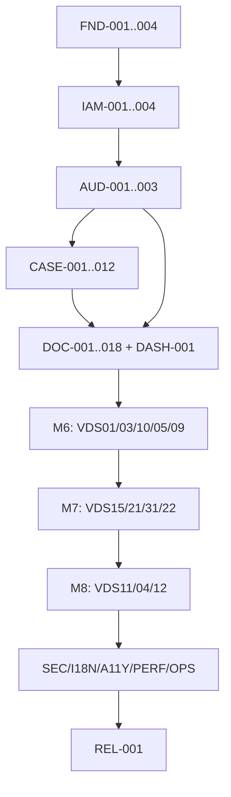

# Implementation Task Backlog: Vietnamese Civil-Matter Document Administration MVP

Status: **Proposed for approval; do not implement until approved**  
Plan: [`docs/plans/LGD_001_IMPLEMENTATION_PLAN.md`](../plans/LGD_001_IMPLEMENTATION_PLAN.md)

## 1. Backlog conventions

Tasks are ordered by importance while remaining dependency-safe. Release blockers, security/privacy controls, data and document integrity, and work that unlocks many later tasks come first; ties are resolved by dependency order, risk reduction, and then delivery priority. `S` is roughly two to four hours, `M` is roughly half to one day, and `L` is roughly one day. No `XL` tasks are permitted. Expected paths are targets, not application code created by this planning change.

For every behavior-bearing task, “Steps” incorporates this mandatory sequence:

1. Add or update a failing test.
2. Implement the smallest coherent behavior.
3. Refactor without changing behavior or app boundaries.
4. Run the task's focused tests.
5. Run the applicable broader checks below.

Command aliases used by tasks are exact command groups, not substitutes for the repository command contract:

- `Q-PY`: `ruff check . && ruff format --check . && mypy apps config`
- `Q-DJ`: `python manage.py check && python manage.py makemigrations --check --dry-run`
- `Q-CSS`: `npm run css:build`
- `Q-I18N`: `python manage.py makemessages --all --no-obsolete && python manage.py compilemessages`
- `Q-TEST`: `pytest --cov=apps --cov-branch --cov-report=term-missing`
- `Q-DEPLOY`: `python manage.py check --deploy --settings=config.settings.production && python manage.py collectstatic --noinput`

All tests use synthetic data. “Audit” always means bounded field names/status/identifiers and correlation metadata—never case payloads, snapshots, generated text, identity values, addresses, credentials, tokens, or file bytes. Every unsafe normal and HTMX request keeps CSRF enforcement enabled.

### Mandatory micro-checkpoints

Implementation pauses after each 2–3 task batch below. At every pause: (1) focused tests for the batch pass, (2) `Q-PY` and applicable `Q-DJ`/`Q-CSS`/`Q-I18N` pass, (3) the app starts and the delivered path works, (4) migrations and dependency direction are reviewed, (5) secrets/personal data/debug output/test suppressions are absent, and (6) the human reviews the demonstrated vertical result before the next batch.

| Checkpoint | Complete after |
| --- | --- |
| CP-FND-A / CP-FND-B | `FND-002` / `FND-004` |
| CP-IAM-A / CP-IAM-B | `IAM-002` / `IAM-004` |
| CP-AUD-A / CP-AUD-B | `AUD-002` / `AUD-003` |
| CP-CASE-A…F | `CASE-002`, `CASE-005`, `CASE-007`, `CASE-009`, `CASE-011`, `CASE-012` |
| CP-DOC-A…J | `DOC-002`, `DOC-004`, `DOC-006`, `DOC-008`, `DOC-010`, `DOC-012`, `DOC-014`, `DOC-016`, `DOC-018`, `DASH-001` |
| CP-VDSxx-A / CP-VDSxx-B | For each of the 12 groups: after `VDSxx-002` and after `VDSxx-005` |
| CP-HARD-A…F | `SEC-002`, `OPS-002`, `I18N-002`, `PERF-001`, `OPS-003`, `REL-001` |

- [x] `CP-FND-B` — Local checkpoint gates passed on 2026-09-01; remote GitHub Actions observation is recorded as pending.

The per-milestone checkpoints below are additional outcome gates, not replacements for these micro-checkpoints.

## 2. Importance-ordered, dependency-safe task backlog

The ranking used below is:

1. Complete the shared foundation, deny-by-default access, audit, case, and document-generation platform because every supported VDS workflow depends on it.
2. Onboard VDS types in the product-approved order: very high (`01`, `03`, `10`, `05`, `09`), high (`15`, `21`, `31`, `22`), then quite high (`11`, `04`, `12`).
3. Execute integrated security, deployment, backup/restore, localization, accessibility, performance, observability, rollback, and release gates as soon as their prerequisites exist.

Completed tasks remain in place as dependency history; when choosing the next task, start with the first unchecked task whose listed dependencies are complete. A later release gate may be more consequential than an earlier implementation task, but it is not actionable before the system it verifies exists.

## Milestone 1 — Repository and tooling foundation

### [x] FND-001 — Scaffold the reproducible Django and dependency baseline

- **Outcome:** A Django 5.2 LTS monolith targeting Python 3.13 and PostgreSQL 14+ installs reproducibly, starts, and exposes every required command without Vite.
- **SPEC:** §§7.2, 8, 8.1, 9, 20.1, 20.3, 25; **FR:** `FR-I18N-01`; **AC:** `AC-23`, `AC-25`.
- **Dependencies:** None.
- **Expected files/modules:** `manage.py`, `config/`, `apps/`, `requirements/{base,development,production}.txt`, Python lock/constraints file, `pyproject.toml`, `package.json`, `package-lock.json`, `.python-version`, `.gitignore`, `.env.example`, `README.md`.
- **Steps:** First add bootstrap/version/command smoke tests; pin supported patch versions for Django, psycopg, docxtpl, python-docx, pytest stack, Ruff, mypy and Tailwind/HTMX/Alpine; create project/app namespace skeletons only; document clean installation and the exact command mapping.
- **Migration:** Initial Django built-in migrations only; do not create business models.
- **Authorization/audit:** None yet; ensure scaffolding does not expose an application page other than a minimal health placeholder.
- **Security/privacy:** Fake example secrets only; private/static paths ignored; local assets pinned; no CDN, public media route, or DEBUG production default.
- **Tests:** Version assertions, settings import, URL/ASGI/WSGI smoke, command availability, PostgreSQL connection profile parsing.
- **Manual/visual:** Fresh-environment install and `runserver` startup page.
- **Commands:** Required install commands, `python manage.py check`, `npm ci`, `npm run css:build`, `Q-PY`.
- **Done:** A clean checkout can install, start, build CSS, and run smoke checks using documented commands; lock artifacts are committed and no redundant toolchain exists.
- **Size:** M. **Blockers/skills:** Python/npm package resolution; use `source-driven-development`, then `code-review-and-quality`.

### [x] FND-002 — Establish settings, locale, storage, and HTTP baselines

- **Outcome:** Development/test/production settings are split, environment validated, Vietnamese i18n/time-zone behavior is correct, and static/private storage boundaries exist.
- **SPEC:** §§4.4, 6.7, 7.1, 8, 9, 18, 20.1; **FR:** `FR-I18N-01`, `FR-I18N-03`, `FR-L10N-01`; **AC:** `AC-23`, `AC-27`.
- **Dependencies:** `FND-001`.
- **Expected files/modules:** `config/settings/{base,development,test,production}.py`, `config/urls.py`, `apps/core/storage.py`, `apps/core/checks.py`, `locale/`, settings tests.
- **Steps:** Write failing setting-order/time-zone/storage checks; configure `SessionMiddleware` → `LocaleMiddleware` → `CommonMiddleware`, Vietnamese-only language, UTC storage and Ho Chi Minh presentation; create private storage alias outside web roots; add liveness/readiness contracts and fail-closed production environment validation.
- **Migration:** None beyond built-in Django state.
- **Authorization/audit:** Health endpoints reveal no versions, paths, counts, or secrets; private storage has no direct route.
- **Security/privacy:** Narrow host/origin placeholders, separate secret inputs, safe file permissions documented; production startup fails if required values are absent.
- **Tests:** Middleware order, locale activation, aware datetimes, private/static separation, missing production settings, non-disclosing health response.
- **Manual/visual:** Vietnamese default locale and correct displayed time in a diagnostic test page only.
- **Commands:** `Q-I18N`, `Q-DJ`, `Q-DEPLOY` with complete fake production environment, `Q-PY`.
- **Done:** Settings checks prove correct locale/time/storage boundaries and production failure behavior without weakening deploy checks.
- **Size:** M. **Blockers/skills:** Final production values are deferred inputs; use `security-and-hardening`.

### [x] FND-003 — Build the test, coverage, and CI quality gate

- **Outcome:** CI provisions PostgreSQL and Node/Python dependencies, then enforces all command contracts, coverage thresholds, migrations, CSS, i18n, and browser-smoke hooks.
- **SPEC:** §§19, 20.1, 20.3; **FR:** all indirectly; **AC:** `AC-25`.
- **Dependencies:** `FND-001`, `FND-002`.
- **Expected files/modules:** CI workflow, `pyproject.toml`, test settings/conftest/factories, browser test config, `README.md` quality section.
- **Steps:** Add a deliberately failing CI smoke expectation; configure pytest-django, CSRF-aware client, branch coverage (85% overall, 95% sensitive modules), PostgreSQL service, Playwright smoke stage and exact command sequence; make artifacts/logs synthetic and non-sensitive.
- **Migration:** CI runs all committed migrations and drift check from an empty PostgreSQL database.
- **Authorization/audit:** Test helpers create users/groups explicitly; no globally privileged default fixture.
- **Security/privacy:** Pin CI actions/dependencies, restrict permissions, never print secrets or retain private DOCX artifacts.
- **Tests:** Self-test coverage configuration, migration-from-zero smoke, browser placeholder, command failure propagation.
- **Manual/visual:** Inspect CI job ordering and retained artifacts.
- **Commands:** `Q-TEST`, `Q-PY`, `Q-DJ`, `Q-CSS`, `Q-I18N`, `Q-DEPLOY`.
- **Done:** CI fails on any required gate and passes locally on the baseline; no check is advisory or silently skipped.
- **Size:** M. **Blockers/skills:** CI provider/repository metadata; use `ci-cd-and-automation`, `code-review-and-quality`.

### [x] FND-004 — Implement local frontend assets and design-system primitives

- **Outcome:** Tailwind 4 CLI, pinned local HTMX 2.x/Alpine 3.x, semantic tokens, accessible base components, themes, and no-JS CSS baseline are available without Vite.
- **SPEC:** §§7.4–7.5, 8.1, 13, 14.1–14.2; `DESIGN.md` §§1–9; **FR:** `FR-I18N-02`; **AC:** `AC-08`, `AC-09`, `AC-25`, `AC-27`.
- **Dependencies:** `FND-001`, `FND-002`.
- **Expected files/modules:** `static_src/css/app.css`, `static_src/js/app.js`, pinned `static/vendor/`, `templates/components/`, frontend tests/docs.
- **Steps:** Add failing build/token/component checks; map design tokens, 4px spacing, Inter/system stack, light/dark/system, focus/reduced-motion/high-contrast primitives; add semantic buttons, fields, alerts, badges, tables, dialogs and status region; copy pinned HTMX/Alpine locally with provenance/checksum.
- **Migration:** None.
- **Authorization/audit:** Components render permitted actions only as presentation; no client-side authority.
- **Security/privacy:** CSP-compatible scripts without CDN/eval; no sensitive browser persistence or HTMX history cache default.
- **Tests:** CSS build, static asset hashes, semantic markup snapshots, contrast/token checks, no-JS rendering.
- **Manual/visual:** Compact/tablet/wide component gallery; keyboard, 200% zoom, dark/system theme, reduced motion.
- **Commands:** `npm ci`, `npm run css:watch`, `Q-CSS`, focused frontend/browser tests.
- **Done:** Locally served primitives meet design contracts and remain usable without JavaScript.
- **Size:** M. **Blockers/skills:** Final branding is non-blocking; use `frontend-ui-engineering`, `browser-testing-with-devtools`, `code-review-and-quality`.

### Checkpoint M1

- [ ] Clean install, Django checks, CSS build, translation commands, migration drift, collectstatic, typing/lint/format, and coverage smoke passed locally; remote GitHub Actions result is pending.
- [x] No application business model/code, legal wording, template, or deferred infrastructure has been introduced.

## Milestone 2 — Identity, permissions, sessions, and application shell

### [x] IAM-001 — Define Administrator permissions and deny-by-default policy

- **Outcome:** A deterministic Administrator group receives only the approved permission families; all protected access uses one explicit policy/object-check interface and accounts administration remains superuser-only.
- **SPEC:** §§4.1–4.3, 9, 16; **FR:** `FR-AUTH-02`; **AC:** `AC-02`.
- **Dependencies:** `FND-003`.
- **Expected files/modules:** `apps/accounts/policies.py`, permission seed migration/command, decorators/mixins, policy tests.
- **Steps:** Write denial/permission matrix tests; define custom permissions and deterministic seed; implement active Administrator/superuser and object-policy checks; prove inactive/non-admin denial and generic inaccessible/not-found handling.
- **Migration:** Add custom permissions/group seed after auth content types; reversible group membership/permission data migration without changing existing users.
- **Authorization/audit:** This is the central deny-by-default contract; denied sensitive attempts expose no object existence.
- **Security/privacy:** Do not rely on hidden buttons or UUIDs; service methods receive actor and recheck sensitive operations.
- **Tests:** Anonymous/inactive/non-admin/admin/superuser matrix, missing individual permission, object policy, inaccessible UUID.
- **Manual/visual:** Generic Vietnamese 403/404 pages contain no identifiers.
- **Commands:** Focused accounts tests, `Q-DJ`, `Q-PY`, `Q-TEST`.
- **Done:** Every later app can require named permissions through one tested policy interface; no normal Administrator can administer users/groups.
- **Size:** M. **Blockers/skills:** **Security skill**; `security-and-hardening`, `test-driven-development`, `code-review-and-quality`.

### [x] IAM-002 — Deliver secure Vietnamese login and POST logout

- **Outcome:** Active Administrators authenticate with generic errors, safe local redirects, rotated sessions, CSRF-protected logout, and clear login/error/loading states.
- **SPEC:** §§4.3, 5.1, 6.1, 14, 16, 17.1; **FR:** `FR-AUTH-01`, `FR-AUTH-02`; **AC:** `AC-01`, `AC-02`, `AC-03`.
- **Dependencies:** `IAM-001`, `FND-004`.
- **Expected files/modules:** accounts forms/views/URLs/templates, auth tests.
- **Steps:** Add failing auth/CSRF/redirect tests; implement purpose-built views/forms; reject inactive/non-group users with the same Vietnamese error; validate local `next`; rotate on login and flush on POST logout; preserve no credentials.
- **Migration:** None.
- **Authorization/audit:** Login is public; logout requires authenticated POST. Audit calls are added in `AUD-002` after the recorder exists.
- **Security/privacy:** Password validators/hashers remain Django-managed; no remember-me; CSRF and safe redirects; rate limiting is deployed in `SEC-002`.
- **Tests:** Success/failure/inactive/non-admin, open-redirect attempts, session-key rotation/reuse, GET logout 405, normal/HTMX CSRF rejection.
- **Manual/visual:** Keyboard-only login, generic error summary/focus, compact/wide layouts, JS disabled.
- **Commands:** Focused accounts tests with CSRF enforcement, `Q-PY`, `Q-CSS`.
- **Done:** `AC-01` auth flow passes except audit evidence deferred to `AUD-002`; no protected content appears on failure.
- **Size:** M. **Blockers/skills:** **Security skill**; final Vietnamese terminology non-blocking.

### [ ] IAM-003 — Enforce inactivity and absolute session expiry

- **Outcome:** Database sessions expire server-side after 30 minutes idle or 8 hours absolute; password changes invalidate all user sessions; normal and HTMX expiry disclose no protected data.
- **SPEC:** §§4.4, 13.1, 15.3, 16, 17.1; **FR:** `FR-AUTH-02`; **AC:** `AC-02`, `AC-04`.
- **Dependencies:** `IAM-001`, `IAM-002`.
- **Expected files/modules:** session middleware/service, HTMX response handler in local JS, expiry templates/tests, session cleanup command/runbook.
- **Steps:** Freeze time in failing boundary tests; store server-side login/last-activity markers; enforce both limits before protected response rendering; emit a data-free HTMX reauth response/full redirect; invalidate sessions on password change/reset through explicit account service/operational integration; document `clearsessions` cadence.
- **Migration:** Database-backed Django sessions only; no sensitive cookie fields.
- **Authorization/audit:** Expiry denies request before view data access. Expiry audit integration follows in `AUD-002`.
- **Security/privacy:** Secure/HttpOnly/SameSite=Lax/host-scoped production cookie; no unsaved payload/browser storage restoration.
- **Tests:** Exact 30-minute and 8-hour boundaries, activity refresh without extending absolute limit, password-change invalidation, HTMX headers/body/no case data, expired-session CSRF behavior.
- **Manual/visual:** Session-expired page and HTMX redirect with keyboard/focus; browser storage remains empty.
- **Commands:** Focused session tests, browser expiry smoke, `Q-PY`, `Q-DJ`.
- **Done:** Server timestamps alone control lifetime and expired requests cannot receive protected fragments.
- **Size:** M. **Blockers/skills:** **Security skill**; password-reset UI is deferred, but admin/reset hooks are covered.

### [ ] IAM-004 — Build the responsive application shell and global error states

- **Outcome:** Authenticated users receive a Vietnamese shell with top bar, responsive sidebar/drawer, theme control, semantic landmarks, skip link, account/logout, and generic 403/404/500/session states.
- **SPEC:** §§6.1, 7.4–7.5, 13, 14.1–14.2; `DESIGN.md` §§2, 3, 5, 7; **FR:** `FR-I18N-02`; **AC:** `AC-08`, `AC-09`, `AC-27`.
- **Dependencies:** `FND-004`, `IAM-002`, `IAM-003`.
- **Expected files/modules:** base/layout/nav/error templates, core context processors, shell browser tests.
- **Steps:** Add failing landmark/navigation/focus/reflow tests; render named-URL navigation with permission-aware visibility; use Alpine only for drawer/theme/focus restoration; provide loading/success/error live regions and no-JS navigation/logout.
- **Migration:** None.
- **Authorization/audit:** Visibility mirrors but never replaces server permission checks; audit nav appears only with audit permission.
- **Security/privacy:** Disable sensitive HTMX history snapshots; no account/case data in local storage; CSP-compatible local behavior.
- **Tests:** Active navigation, permission visibility, full/fragment locale consistency, semantic landmarks, drawer focus/escape/restore, error pages.
- **Manual/visual:** Compact/tablet/wide, keyboard/touch, 200% zoom/reflow, contrast, dark/system, reduced motion, JS disabled.
- **Commands:** Focused template/browser tests, `Q-CSS`, `Q-I18N`, `Q-PY`.
- **Done:** Shell and global states meet WCAG/progressive-enhancement contracts and reveal no sensitive error details.
- **Size:** M. **Blockers/skills:** `frontend-ui-engineering`, `browser-testing-with-devtools`, `code-review-and-quality`.

### Checkpoint M2

- [ ] `AC-01`–`AC-04` behavior passes for normal and HTMX requests, except audit-event assertions completed in M3.
- [ ] Login, expiry, shell and error pages pass compact/tablet/wide keyboard and no-JS smoke.

## Milestone 3 — Append-only audit foundation

### [ ] AUD-001 — Create the append-only audit model and recorder

- **Outcome:** A domain-agnostic service atomically records immutable audit events with safe bounded metadata and correlation IDs; business apps need no audit-model import.
- **SPEC:** §§9, 10.2, 16, 17.1; **FR:** none directly; **AC:** `AC-17`, `AC-18`.
- **Dependencies:** `IAM-001`.
- **Expected files/modules:** audit model/migration, value contract, recorder service, middleware correlation helper, admin protections, tests.
- **Steps:** Add failing immutability/redaction/transaction tests; model UUID/time/actor/system/action/target/outcome/correlation/changed-fields/bounded metadata; expose a generic recorder; prohibit application update/delete and make Django admin read-only.
- **Migration:** Create indexed `AuditEvent` without business FKs; indexes for time, action, target tuple, actor, outcome/correlation.
- **Authorization/audit:** Recorder accepts an actor/system marker and action contract; normal users cannot mutate rows.
- **Security/privacy:** Reject/limit oversized or prohibited metadata keys; never serialize model/request payloads automatically.
- **Tests:** Append, system actor, transaction behavior, immutable save/delete, admin read-only, metadata bounds and prohibited fields.
- **Manual/visual:** Inspect synthetic event row and admin read-only behavior.
- **Commands:** Focused audit model/service tests, `Q-DJ`, `Q-PY`, PostgreSQL tests.
- **Done:** Later services can record required events without domain coupling; update/delete attempts fail through supported paths.
- **Size:** M. **Blockers/skills:** **Security skill**; `api-and-interface-design`, `code-review-and-quality`.

### [ ] AUD-002 — Integrate identity and denied-access audit events

- **Outcome:** Successful/failed login, logout, session expiry, account/password/group/permission changes, and attempted unauthorized sensitive access produce bounded audit events.
- **SPEC:** §§5.1, 16, 17.1; **FR:** `FR-AUTH-01`, `FR-AUTH-02`; **AC:** `AC-01`, `AC-02`, `AC-04`.
- **Dependencies:** `AUD-001`, `IAM-002`, `IAM-003`.
- **Expected files/modules:** accounts audit integration/service hooks, audit action catalog, tests.
- **Steps:** Add failing event-matrix tests; call the recorder explicitly from auth/session/account services and denial handler; capture outcomes/correlation without username enumeration or credentials; avoid signals for primary behavior.
- **Migration:** None.
- **Authorization/audit:** Completes identity event contract, including denied template/download actions when later services call the same helper.
- **Security/privacy:** Failed login metadata cannot reveal account existence; logs/audit omit submitted username where policy treats it as sensitive.
- **Tests:** One event per success/failure/expiry/logout/change; no duplicate signal events; safe failure metadata; transaction rollbacks.
- **Manual/visual:** Compare user-visible generic error with bounded audit record.
- **Commands:** Focused accounts/audit integration tests, `Q-PY`, `Q-TEST`.
- **Done:** Identity acceptance tests assert the exact required audit outcomes without content leakage.
- **Size:** S. **Blockers/skills:** **Security skill**, `code-review-and-quality`.

### [ ] AUD-003 — Deliver authorized audit browsing

- **Outcome:** Administrators can browse paginated, filterable audit metadata through a purpose-built page/full-fragment response; no mutation path exists.
- **SPEC:** §§4.2, 14, 17.1; **FR:** `FR-AUTH-02`; **AC:** `AC-02`, `AC-06`, `AC-08`, `AC-09`.
- **Dependencies:** `AUD-001`, `IAM-004`.
- **Expected files/modules:** audit selectors/views/URLs/templates/tests.
- **Steps:** Add failing permission/filter/full-fragment tests; implement bounded filters by time/action/outcome/actor/target/correlation, allowlisted sorting and pagination; render responsive table/cards, empty/error states and detail metadata; provide no POST/PUT/DELETE route.
- **Migration:** Add missing read indexes only after query-plan evidence.
- **Authorization/audit:** Requires `audit.view_auditevent`; inaccessible requests disclose no events.
- **Security/privacy:** Escape metadata, cap search/ranges/page size, never link guessed business objects without their own permission check.
- **Tests:** Admin/non-admin, pagination/filter/sort allowlist, `Vary: HX-Request`, full/fragment, query counts, no mutation.
- **Manual/visual:** Keyboard filtering and compact/tablet/wide list; JS-disabled navigation.
- **Commands:** Focused audit view tests, `Q-DJ`, `Q-PY`, `Q-CSS`.
- **Done:** Authorized browsing is useful and bounded; mutation and sensitive payload exposure are absent.
- **Size:** M. **Blockers/skills:** `frontend-ui-engineering`, **Security skill**, `code-review-and-quality`.

### Checkpoint M3

- [ ] Identity events are recorded once with correlation IDs and safe metadata.
- [ ] Audit rows are append-only and browseable only with permission; tests and migration drift pass.

## Milestone 4 — Case-management vertical slice

### [ ] CASE-001 — Model courts, entities, addresses, and officials

- **Outcome:** Reusable reference entities have UUID identity, validation, active state, durable uniqueness, history-friendly addresses, and query indexes.
- **SPEC:** §§6.2, 7.1–7.2, 10.1; **FR:** `FR-CASE-07`; **AC:** `AC-05`.
- **Dependencies:** `AUD-001`, `IAM-001`.
- **Expected files/modules:** cases reference models/migration/forms/tests.
- **Steps:** Add failing constraint/form tests; implement Court, Entity, EntityAddress and Official with kind-dependent validation, stable court code, superior court and active fields; add factories and admin operational views.
- **Migration:** Create reference tables, UUID PKs, uniqueness/check constraints, active/name/code indexes and reversible schema.
- **Authorization/audit:** Model writes will be exposed only through `CASE-002` services; admin operations enforce superuser/permissions.
- **Security/privacy:** Identity/registration fields never enter URLs/logs/fixtures; preserve authoritative Unicode spelling.
- **Tests:** Constraints, kind validation, Unicode, boundary lengths, inactive references, index definitions.
- **Manual/visual:** Django admin uses synthetic values and no accidental sensitive list display.
- **Commands:** Focused model/form tests on PostgreSQL, `Q-DJ`, `Q-PY`.
- **Done:** Reference models enforce invariants and contain no document dependency or unvalidated JSON.
- **Size:** M. **Blockers/skills:** `test-driven-development`, `code-review-and-quality`.

### [ ] CASE-002 — Deliver reference-entity maintenance workflows

- **Outcome:** Administrators can create/edit/deactivate courts, entities and officials through validated services/forms and responsive full/HTMX pages.
- **SPEC:** §§4.2, 6.2, 13–16, 17.1; **FR:** `FR-CASE-07`; **AC:** `AC-02`, `AC-03`, `AC-05`, `AC-08`, `AC-09`.
- **Dependencies:** `CASE-001`, `IAM-004`, `AUD-001`.
- **Expected files/modules:** cases reference services/policies/views/templates/tests.
- **Steps:** Add failing CRUD/permission/CSRF tests; implement explicit service writes and object checks; render list/forms, `422` fragments, confirmation for deactivation and states; record changed field names only.
- **Migration:** None unless query-plan evidence adds indexes.
- **Authorization/audit:** Require reference view/add/change/deactivate permissions at view and service; audit success/failure.
- **Security/privacy:** Re-query posted relations, generic inaccessible handling, no identifiers in logs or URLs beyond opaque UUID.
- **Tests:** Normal/HTMX success/invalid/CSRF/denied/not-found; audit; Unicode; full/fragment `Vary`; no-JS.
- **Manual/visual:** Keyboard forms and confirmations at three viewports; field errors link correctly.
- **Commands:** Focused reference tests, `Q-DJ`, `Q-PY`, `Q-CSS`.
- **Done:** Reference maintenance is usable, authorized, audited, progressively enhanced and value-preserving on errors.
- **Size:** M. **Blockers/skills:** **Security skill**, `frontend-ui-engineering`, `code-review-and-quality`.

### [ ] CASE-003 — Model civil cases, acceptance rules, revisions, and archive metadata

- **Outcome:** `CaseRecord` supports incomplete pre-acceptance data, all-or-together accepted identifiers, metadata, monotonic revisions, archive state and scale indexes.
- **SPEC:** §§6.2, 7.1–7.2, 10.1, 15.1; **FR:** `FR-CASE-06`, `FR-CASE-08`, `FR-CASE-09`; **AC:** `AC-05`, `AC-07`.
- **Dependencies:** `CASE-001`.
- **Expected files/modules:** case model/migration/form/domain tests.
- **Steps:** Add failing DB/form constraint tests; implement UUID/internal reference/court/matter/status/stage/acceptance fields, revision and actor/time/archive fields; enforce accepted conditional group in form and database where expressible; define state choices/indexes.
- **Migration:** Create `CaseRecord`, unique internal reference, constraints and composite indexes for archive/status/court/acceptance/sort paths.
- **Authorization/audit:** Actor metadata is set by services, never trusted from form POST.
- **Security/privacy:** Dates remain dates; datetimes aware; names/details excluded from `__str__` where logs might capture them.
- **Tests:** Pre-acceptance valid, partial accepted invalid at form/DB, metadata/revision defaults, timezone, constraints/indexes.
- **Manual/visual:** Migration SQL/index review.
- **Commands:** Focused PostgreSQL model/form tests, `Q-DJ`, `Q-PY`.
- **Done:** Database and form invariants reject inconsistent acceptance/archive/revision state.
- **Size:** M. **Blockers/skills:** `test-driven-development`, `code-review-and-quality`.

### [ ] CASE-004 — Model participants and representation contracts

- **Outcome:** Cases relate reusable entities through ordered role-specific participant records and legally necessary representations without duplicate accidental roles.
- **SPEC:** §§6.2, 10.1, 15.1; **FR:** `FR-CASE-07`; **AC:** `AC-05`, `AC-11`.
- **Dependencies:** `CASE-003`.
- **Expected files/modules:** participant/representation models, migration, forms/formsets, tests.
- **Steps:** Add failing uniqueness/cross-case/formset tests; implement role/effective/address/contact fields and representation type/authority; define authorized formsets and ordering; retain case-specific contact/address snapshots.
- **Migration:** Create participant/representation tables with FKs, check/unique constraints and case/entity/role/order indexes.
- **Authorization/audit:** Only case services write relationships; later events list changed relation categories, not values.
- **Security/privacy:** Reject cross-case represented participant IDs and inactive unauthorized choices; preserve Unicode and meaningful line breaks.
- **Tests:** Multiple legal roles, prohibited duplicate, formset add/update/delete semantics without hard-deleting domain history contrary to policy, cross-case tampering.
- **Manual/visual:** Synthetic relationship formset labels and ordering.
- **Commands:** Focused model/formset tests, `Q-DJ`, `Q-PY`.
- **Done:** Relational participant/representation data is validated, indexed, case-scoped, and ready for prefill transfer values.
- **Size:** M. **Blockers/skills:** Exact template-specific roles wait for contracts; core role list is locked.

### [ ] CASE-005 — Model assignments and hearings

- **Outcome:** Officials can be assigned to cases by procedural role/effective dates and cases can hold validated, timezone-aware hearing records.
- **SPEC:** §§6.2, 10.1, 15.1; **FR:** `FR-CASE-07`; **AC:** `AC-05`, `AC-11`.
- **Dependencies:** `CASE-003`, `CASE-001`.
- **Expected files/modules:** assignment/hearing models, migration, forms/formsets, tests.
- **Steps:** Add failing role/order/time-zone/cross-court tests; implement assignment and hearing state fields; define formsets and reusable selectors; index current roles and upcoming hearings.
- **Migration:** Create assignment/hearing tables with constraints and case/role/effective/scheduled indexes.
- **Authorization/audit:** Writes use case service and case permissions; changed relation names audited.
- **Security/privacy:** Re-query officials; reject tampered case/official IDs; store UTC and display Ho Chi Minh time.
- **Tests:** Valid/invalid roles, ordering, inactive official, aware datetime/DST-independent display, cross-case tampering.
- **Manual/visual:** Vietnamese datetime form and synthetic hearing display.
- **Commands:** Focused model/formset tests, `Q-DJ`, `Q-PY`.
- **Done:** Assignment/hearing contracts are normalized and safe for case detail and document prefill.
- **Size:** M. **Blockers/skills:** None.

### [ ] CASE-006 — Deliver case creation and overview detail

- **Outcome:** Administrators create a validated case and view its overview through full-page or HTMX form responses with correct metadata and audit.
- **SPEC:** §§5.2, 6.2, 13–16, 17.1; **FR:** `FR-CASE-06`, `FR-CASE-08`, `FR-CASE-09`; **AC:** `AC-02`, `AC-03`, `AC-05`, `AC-08`, `AC-09`.
- **Dependencies:** `CASE-003`, `CASE-002`, `IAM-004`.
- **Expected files/modules:** case services/forms/views/URLs/templates/tests.
- **Steps:** Add failing full/fragment/invalid/permission tests; implement atomic create service setting actor/revision; render Vietnamese form/error summary and overview; return intentional `422` for HTMX validation and `Vary: HX-Request`; use canonical URLs/no-JS redirect.
- **Migration:** None.
- **Authorization/audit:** Require case add/view at view and service; record creation outcome without payload.
- **Security/privacy:** Authorized related court queryset, CSRF, generic object failures, no sensitive URL/query data.
- **Tests:** Valid/incomplete/invalid accepted case, preserved values, linked errors, normal/HTMX/CSRF/denied, metadata and audit.
- **Manual/visual:** Form/detail at three viewports, keyboard/error focus, JS-disabled flow.
- **Commands:** Focused case create/view tests, `Q-DJ`, `Q-PY`, `Q-CSS`.
- **Done:** A synthetic case can be created and viewed end to end with correct metadata, authorization, audit, accessibility and errors.
- **Size:** M. **Blockers/skills:** **Security skill**, `frontend-ui-engineering`, `code-review-and-quality`.

### [ ] CASE-007 — Deliver optimistic case editing and conflict recovery

- **Outcome:** Case edits compare submitted revision atomically, increment once on success, and return recoverable `409` conflicts without overwriting newer data.
- **SPEC:** §§5.2, 6.2, 12, 13.1, 15.3; **FR:** `FR-CASE-06`, `FR-CASE-09`; **AC:** `AC-03`, `AC-05`, `AC-07`.
- **Dependencies:** `CASE-006`.
- **Expected files/modules:** case update service/form/view/conflict fragment/tests.
- **Steps:** Add concurrent stale-edit failing tests; lock/conditional-update by revision in explicit service; preserve submitted values and show reload/compare guidance; return full conflict page or swappable `409` fragment; update actor/time and audit changed field names.
- **Migration:** None.
- **Authorization/audit:** Require case change at view/service; audit success/conflict/failure safely.
- **Security/privacy:** Server ignores posted actor/revision manipulation beyond comparison; inaccessible IDs remain generic.
- **Tests:** Two-client concurrency, successful monotonic increments, invalid value preservation, `409` swap handler/focus, normal/HTMX CSRF and permissions.
- **Manual/visual:** Simulate two tabs; keyboard recovery at compact/wide; JS-disabled conflict page.
- **Commands:** Focused PostgreSQL concurrency/view/browser tests, `Q-PY`, `Q-DJ`.
- **Done:** A stale write cannot win and the administrator has a tested recovery path.
- **Size:** M. **Blockers/skills:** **Security skill**, `debugging-and-error-recovery`, `code-review-and-quality`.

### [ ] CASE-008 — Deliver confirmed archive and restore

- **Outcome:** Administrators confirm archive/restore, record actor/time/reason and revision, and archived cases remain readable but immutable/unavailable for new generation.
- **SPEC:** §§4.3, 5.2, 6.2, 14–17; **FR:** `FR-CASE-06`, `FR-CASE-09`; **AC:** `AC-03`, `AC-05`.
- **Dependencies:** `CASE-007`.
- **Expected files/modules:** archive/restore services/forms/views/confirmation templates/tests.
- **Steps:** Add state/permission/CSRF tests; implement POST-only atomic transitions with revision protection; show object/consequence confirmation full-page and enhanced dialog; keep detail/history/download readable; expose policy consumed later by generation.
- **Migration:** None.
- **Authorization/audit:** Separate archive/restore permissions at view/service; audit actor/reason field presence without reason text if sensitive.
- **Security/privacy:** No hard delete; repeated transition is safe/conflict-aware; no client-only confirmation.
- **Tests:** Success/repeat/stale/denied/CSRF normal+HTMX, archived edit denial, existing-view allowance, audit.
- **Manual/visual:** Dialog focus trap/escape/return plus no-JS confirmation at three viewports.
- **Commands:** Focused workflow/browser tests, `Q-PY`, `Q-DJ`, `Q-CSS`.
- **Done:** Archive lifecycle is explicit, reversible, revisioned, audited, and enforced server-side.
- **Size:** M. **Blockers/skills:** **Security skill**, `frontend-ui-engineering`, `code-review-and-quality`.

### [ ] CASE-009 — Build indexed case search, filter, sort, and pagination selectors

- **Outcome:** A read-only selector returns correct URL-driven results for all required fields, filter combinations, allowlisted sorts, and page sizes at target scale.
- **SPEC:** §§6.2, 7.1–7.2, 13.1, 14; **FR:** `FR-CASE-01`–`FR-CASE-05`; **AC:** `AC-06`, `AC-26`.
- **Dependencies:** `CASE-004`, `CASE-005`, `CASE-003`.
- **Expected files/modules:** case selectors/query form/index migration/tests.
- **Steps:** Add failing search/filter/sort/pagination/query-count tests; parse canonical query form; implement exact/prefix identifier and Vietnamese case-insensitive containment search, all filters and sort allowlist; prefetch deliberately; measure `EXPLAIN` on representative synthetic data before index changes.
- **Migration:** Add only evidence-backed composite/functional indexes compatible with PostgreSQL; document SQLite differences.
- **Authorization/audit:** Selector starts from policy-scoped queryset; GET reads are not audit-spammed.
- **Security/privacy:** Bound query length/date ranges/page size; reject arbitrary sort fields; no raw SQL interpolation.
- **Tests:** Every searchable field/filter/sort/page size, malicious sort/query, Unicode, duplicates, stable pagination, query counts, 100k-scale plan fixture.
- **Manual/visual:** Inspect representative SQL plans and result ordering.
- **Commands:** Focused selector tests on PostgreSQL, query-plan script/benchmark, `Q-DJ`, `Q-PY`.
- **Done:** Correct deterministic results and initial query budget are documented with no N+1 or sort injection.
- **Size:** L. **Blockers/skills:** Target hardware deferred; use `performance-optimization`, **Security skill**, `code-review-and-quality`.

### [ ] CASE-010 — Deliver the responsive canonical case list with HTMX

- **Outcome:** Case list controls encode state in the URL, work as ordinary forms/links, and enhance to narrow HTMX table/card updates with accessible states.
- **SPEC:** §§5.2, 6.2, 13–15; `DESIGN.md` §§4–7; **FR:** `FR-CASE-01`–`FR-CASE-05`; **AC:** `AC-02`, `AC-06`, `AC-08`, `AC-09`, `AC-27`.
- **Dependencies:** `CASE-009`, `IAM-004`.
- **Expected files/modules:** list view/query form/templates/fragment/browser tests.
- **Steps:** Add failing full/fragment/URL/back tests; render GET search/filters/sort/page sizes and clear states; use debounce, cancellation, indicator, narrow target and `hx-push-url`; set `Vary`; provide initial/filtered empty, loading, error, forbidden states; disable sensitive history snapshots.
- **Migration:** None.
- **Authorization/audit:** Require case view; links remain scoped.
- **Security/privacy:** Query strings contain filters only, never sensitive payloads; escape all labels/content; GET has no side effects.
- **Tests:** Full vs fragment, `Vary`, URL permutations, reload/back/forward, no-JS submit/links, locale, permission, responsive table/cards.
- **Manual/visual:** Compact/tablet/wide, keyboard sorting/filter chips, 200% zoom/reflow, loading/error/empty.
- **Commands:** Focused view tests, browser list workflow, `Q-CSS`, `Q-I18N`, `Q-PY`.
- **Done:** `AC-06` is demonstrable in JS and no-JS modes without unintended horizontal page scroll.
- **Size:** M. **Blockers/skills:** `frontend-ui-engineering`, `browser-testing-with-devtools`, `code-review-and-quality`.

### [ ] CASE-011 — Deliver case relationships and sectioned detail editing

- **Outcome:** Case detail exposes server-addressable overview, participants/representatives, officials and hearings; authorized formsets update relationships atomically with accessible validation.
- **SPEC:** §§5.2, 6.2, 14–15, 17.1; **FR:** `FR-CASE-06`, `FR-CASE-07`; **AC:** `AC-03`, `AC-05`, `AC-08`, `AC-09`.
- **Dependencies:** `CASE-004`, `CASE-005`, `CASE-006`, `CASE-007`.
- **Expected files/modules:** relationship services/views/section templates/formsets/browser tests.
- **Steps:** Add failing cross-formset atomic/permission tests; implement explicit services and revision checks; build addressable sections/tabs with full fallbacks and HTMX partials; preserve all rows/errors, focus summary and announce success/conflict.
- **Migration:** None.
- **Authorization/audit:** Case change at view/service; audit relation categories and outcome.
- **Security/privacy:** Authorize every posted related UUID, prevent cross-case injection, no Alpine-owned form truth.
- **Tests:** Valid/invalid multi-formset atomicity, stale conflict, Unicode, normal/HTMX/CSRF/permission, `Vary`, query counts.
- **Manual/visual:** Keyboard add/remove rows, detail sections at three viewports and JS disabled.
- **Commands:** Focused relationship/service/view tests, browser detail workflow, `Q-PY`, `Q-DJ`, `Q-CSS`.
- **Done:** Administrator can maintain the relational case graph without partial writes or inaccessible choices.
- **Size:** L. **Blockers/skills:** `incremental-implementation`, **Security skill**, `frontend-ui-engineering`, `code-review-and-quality`.

### [ ] CASE-012 — Add case activity selectors for the dashboard

- **Outcome:** Dashboard shows active/archived counts and recent case activity with canonical links, initially leaving document panels in an explicit unavailable state.
- **SPEC:** §§6.1, 14; **FR:** `FR-DASH-01`, `FR-DASH-02`; **AC:** `AC-06`, `AC-08`, `AC-09`.
- **Dependencies:** `CASE-010`, `CASE-011`.
- **Expected files/modules:** dashboard selectors/view/templates/tests.
- **Steps:** Add failing count/link/query tests; build scoped aggregate/recent selectors; render cards with canonical case filters and ordinary anchors; include loading/empty/error states for enhanced refresh; reserve document card contract for `DASH-001`.
- **Migration:** Add no index without plan evidence.
- **Authorization/audit:** Dashboard requires Administrator access; counts are policy-scoped.
- **Security/privacy:** No sensitive values in card URLs or error messages; bounded recent list.
- **Tests:** Count correctness, canonical filters, full/fragment `Vary`, permission, query budget, no-JS links.
- **Manual/visual:** Dashboard cards at three viewports, keyboard and text expansion.
- **Commands:** Focused dashboard tests, `Q-PY`, `Q-CSS`.
- **Done:** Case dashboard metrics are accurate, accessible and progressively enhanced.
- **Size:** S. **Blockers/skills:** `frontend-ui-engineering`, `code-review-and-quality`.

### Checkpoint M4

- [ ] `AC-05`–`AC-07` pass end to end; permissions, CSRF, audit and accessibility are part of the evidence.
- [ ] Case selectors meet the initial query budget and preserve all canonical URL state with/full without HTMX.

## Milestone 5 — Document-platform vertical slice

### [ ] DOC-001 — Define the stable registry and synthetic test document type

- **Outcome:** Code owns an immutable registry protocol for stable keys, labels, schema/form provider, mapper, filename, placeholder/value-kind contract, allowlists, fixtures and optional named post-processor.
- **SPEC:** §§6.3, 6.5–6.6, 11.1–11.2; **FR:** `FR-DOC-01`, `FR-DOC-02`, `FR-GEN-01`, `FR-TPL-01`; **AC:** `AC-10`, `AC-11`, `AC-12`.
- **Dependencies:** `FND-003`, `CASE-003`.
- **Expected files/modules:** documents registry protocols/types, registry loader, synthetic registry entry/fixtures/tests.
- **Steps:** Add failing duplicate/unknown/incomplete-contract tests; define typed immutable registration API and enabled state; require explicit providers/contracts and stable `vds-NN` convention; add one non-production synthetic entry to drive platform tests.
- **Migration:** None; registry is code-defined.
- **Authorization/audit:** Registry lookup is not authority; selectors later require active valid template and permissions.
- **Security/privacy:** No request path, arbitrary import, database form definition, callable global or executable expression can create a type.
- **Tests:** Duplicate key/code, unknown key, missing contract member, stable serialization, disabled entry, post-processor absent-by-default.
- **Manual/visual:** Registry developer documentation review.
- **Commands:** Focused registry tests, `Q-PY`, `Q-TEST`.
- **Done:** A new type cannot exist without an explicit reviewable code contract; `cases` imports nothing from `documents`.
- **Size:** M. **Blockers/skills:** `api-and-interface-design`, **Security skill**, `code-review-and-quality`.

### [ ] DOC-002 — Model immutable template versions and private storage keys

- **Outcome:** Uploaded template identity/bytes metadata is immutable; lifecycle states and zero-or-one active version per registry key are durably represented on PostgreSQL.
- **SPEC:** §§10.2, 11.1, 11.5, 17.2, 18; **FR:** `FR-TPL-02`–`FR-TPL-05`; **AC:** `AC-13`, `AC-14`, `AC-17`, `AC-18`, `AC-22`.
- **Dependencies:** `DOC-001`, `FND-002`, `AUD-001`.
- **Expected files/modules:** TemplateVersion model/migration, storage-key service, immutability tests.
- **Steps:** Add failing lifecycle/unique/immutable tests; model UUID/type/version/key/display name/SHA/size/status/report/uploader/activation/approval metadata; generate server keys; protect identity/file fields from updates and application deletion.
- **Migration:** Create table, unique `(type_key, version)`, conditional unique active type, lifecycle/checksum/size constraints and read indexes.
- **Authorization/audit:** No direct model writes in views; template services require actor and later record events.
- **Security/privacy:** Private storage only, no request-supplied path, bounded sanitized display name/report, protected history.
- **Tests:** Database uniqueness, zero/one active, invalid transitions, immutable update/delete, storage key pattern, checksum/size validation.
- **Manual/visual:** Inspect PostgreSQL constraint SQL and private permissions.
- **Commands:** Focused PostgreSQL model/storage tests, `Q-DJ`, `Q-PY`.
- **Done:** Template identity and lifecycle invariants survive concurrent/direct model misuse through supported services and DB constraints.
- **Size:** M. **Blockers/skills:** **Security skill**, `code-review-and-quality`.

### [ ] DOC-003 — Validate hostile OPC/ZIP packages and relationships

- **Outcome:** A bounded byte-level validator rejects renamed/non-DOCX, oversized, traversal, duplicate-dangerous, encrypted, macro/ActiveX/OLE/executable, unsafe XML and prohibited external-relationship packages.
- **SPEC:** §§11.3, 15.2, 16; **FR:** `FR-TPL-02`, `FR-TPL-04`; **AC:** `AC-12`, `AC-13`.
- **Dependencies:** `DOC-001`.
- **Expected files/modules:** package validator modules, limits/settings, hostile synthetic fixture builders/tests.
- **Steps:** Add one failing fixture per threat; validate ZIP signature/content types/required parts, normalized central paths, entry count/uncompressed size/ratio/10 MiB compressed limit, encryption and prohibited content types/relationships; parse bounded XML with entity/network resolution disabled; return safe categories.
- **Migration:** None.
- **Authorization/audit:** Pure validator accepts bytes/stream plus registry contract, never actor/request.
- **Security/privacy:** Stream/bound reads, no extraction to user paths, guaranteed temporary cleanup, no exception/package content in user report.
- **Tests:** Every hostile class plus valid minimal package, boundary sizes/ratios/entries, duplicate/traversal encodings, malformed XML and cleanup.
- **Manual/visual:** Review threat-fixture coverage against §15.2.
- **Commands:** Focused package-security tests, `Q-PY`, `Q-TEST`.
- **Done:** All `AC-13` package threats fail safely before Jinja/rendering and valid packages proceed.
- **Size:** L. **Blockers/skills:** **Security skill**, `doubt-driven-development`, `code-review-and-quality`.

### [ ] DOC-004 — Validate Jinja syntax, contracts, related text parts, and split runs

- **Outcome:** Validator discovers placeholders/control tags across body, tables, headers, footers, and supported footnote/endnote parts; rejects malformed/split/unknown/missing/disallowed expressions.
- **SPEC:** §§11.2–11.3, 15.2; **FR:** `FR-GEN-02`, `FR-TPL-04`; **AC:** `AC-12`, `AC-13`, `AC-15`.
- **Dependencies:** `DOC-001`, `DOC-003`.
- **Expected files/modules:** placeholder discovery/run validator/restricted Jinja environment, synthetic DOCX fixtures/tests, authoring guide.
- **Steps:** Add failing part/run/container fixtures; reconstruct paragraph/cell visible tokens while retaining run boundaries; parse with sandboxed/restricted Jinja plus `StrictUndefined`; compare required/optional/unknown variables and allowlisted filters/globals/value kinds; reject unsupported structural placement; document authoring rules.
- **Migration:** None.
- **Authorization/audit:** Pure validation returns bounded findings.
- **Security/privacy:** No arbitrary attribute/call/import access; user values never become template source/safe markup; supported-part allowlist is explicit.
- **Tests:** Body/table/header/footer/footnote/endnote discovery, split delimiters/runs, malformed tags, required/optional/unknown, disallowed filter/global/call, safe escaping.
- **Manual/visual:** Inspect authoring guide and representative finding locations without document content leakage.
- **Commands:** Focused placeholder/Jinja tests, `Q-PY`, coverage for validator modules.
- **Done:** `AC-12` contract/run failures are detected before activation and the same checks are reusable immediately before generation.
- **Size:** L. **Blockers/skills:** **Security skill**, `doubt-driven-development`, `code-review-and-quality`.

### [ ] DOC-005 — Orchestrate upload validation and synthetic renders

- **Outcome:** Proposed bytes are checksummed/stored immutably, validated through package/Jinja gates, minimally and representatively rendered, reopened/inspected, and persisted as valid or inactive-invalid with safe report.
- **SPEC:** §§5.5, 11, 15.2, 17.2; **FR:** `FR-TPL-02`–`FR-TPL-04`; **AC:** `AC-12`, `AC-13`, `AC-15`.
- **Dependencies:** `DOC-002`, `DOC-003`, `DOC-004`.
- **Expected files/modules:** template upload/validation service, render test harness, report types/tests.
- **Steps:** Add failing orchestration/cleanup tests; stream/checksum to quarantine server key; validate registry key/version/approval note; run package/contract plus minimal/full restricted renders and output reopen/token/part inspection; persist explicit uploaded→valid/invalid state and audit outcome; clean temporaries.
- **Migration:** None.
- **Authorization/audit:** Service requires template upload/validate permissions and actor; audit upload and validation once each.
- **Security/privacy:** Registry keys allowlisted; invalid bytes never case-rendered; bounded reports; quarantine retention follows configured private policy.
- **Tests:** Valid/invalid paths, interrupted storage/render, immutable checksum, report redaction, temp cleanup, unauthorized service caller, synthetic structural inspection.
- **Manual/visual:** Review a safe validation report and representative synthetic output; this is not approval of legal content.
- **Commands:** Focused validation integration tests, `Q-PY`, `Q-DJ`, DOCX coverage gate.
- **Done:** Only fully valid immutable versions can become activation candidates; failures are safe, durable and recoverable.
- **Size:** L. **Blockers/skills:** **Security skill**, `incremental-implementation`, `code-review-and-quality`.

### [ ] DOC-006 — Deliver template list, upload, and validation UI

- **Outcome:** Administrators manage versions only for deployed registry keys through accessible full/HTMX pages showing safe status/report/unavailable/error states.
- **SPEC:** §§4.2–4.3, 5.5, 6.6, 13–15; **FR:** `FR-TPL-02`, `FR-TPL-03`; **AC:** `AC-02`, `AC-03`, `AC-08`, `AC-09`, `AC-13`.
- **Dependencies:** `DOC-005`, `IAM-004`.
- **Expected files/modules:** template policies/forms/views/URLs/templates/browser tests.
- **Steps:** Add failing permission/upload/CSRF/full-fragment tests; implement registry-key route lookup, 10 MiB form validation and service call; render version list/upload/status/report with `422`, busy/success/server-error states and no-JS fallback.
- **Migration:** None.
- **Authorization/audit:** View and service require template view/upload/validate; unauthorized attempts audited generically.
- **Security/privacy:** Do not echo paths/unsafe filenames/package content; narrow targets; no direct private URL; preserve only non-sensitive fields after validation.
- **Tests:** Normal/HTMX valid/invalid/oversize/unknown key/permission/CSRF, `Vary`, report safety, no-JS.
- **Manual/visual:** Keyboard upload and state pages at three viewports; error focus/live status.
- **Commands:** Focused template view/browser tests, `Q-PY`, `Q-CSS`.
- **Done:** Upload/validation is usable and secure without JavaScript and exposes no private path/content.
- **Size:** M. **Blockers/skills:** **Security skill**, `frontend-ui-engineering`, `code-review-and-quality`.

### [ ] DOC-007 — Implement atomic activation and confirmed deactivation

- **Outcome:** Valid approved versions activate atomically under concurrency, leaving zero or one active per type; deactivation blocks future selection but preserves history.
- **SPEC:** §§4.3, 5.5, 6.6, 17.2; **FR:** `FR-DOC-01`, `FR-TPL-04`, `FR-TPL-05`; **AC:** `AC-03`, `AC-14`.
- **Dependencies:** `DOC-002`, `DOC-005`, `DOC-006`.
- **Expected files/modules:** activation service/views/confirmation templates/PostgreSQL concurrency tests.
- **Steps:** Add race/invalid/approval tests; lock by type inside short transaction, verify valid state/approval, inactivate prior then activate selected under constraint; implement POST confirmation/deactivation and `409` recovery; audit transitions.
- **Migration:** Use existing conditional unique constraint; add lock/version field only if race test demonstrates need.
- **Authorization/audit:** Separate activate/deactivate permission at view/service; record actor, version, outcome, approval reference identifier.
- **Security/privacy:** No bytes altered; confirmation identifies type/version, not path; historical protected FKs remain.
- **Tests:** Concurrent activations, invalid/missing approval, repeated activation/deactivation, CSRF/permission normal+HTMX, historical version unchanged.
- **Manual/visual:** Accessible confirmation focus and conflict state; verify prior version inactive.
- **Commands:** Focused PostgreSQL transaction/browser tests, `Q-DJ`, `Q-PY`.
- **Done:** Future selection observes a single committed active version and old metadata/bytes are unchanged.
- **Size:** M. **Blockers/skills:** **Security skill**, `doubt-driven-development`, `code-review-and-quality`.

### [ ] DOC-008 — Model versioned mutable drafts and form contracts

- **Outcome:** `DocumentDraft` stores only revalidated document-specific payload under stable type/schema, explicit revision and draft/ready states; incompatible schemas are rejected.
- **SPEC:** §§6.3, 10.2, 11.5, 15.1; **FR:** `FR-DOC-02`, `FR-DOC-05`–`FR-DOC-07`; **AC:** `AC-11`, `AC-18`, `AC-20`.
- **Dependencies:** `DOC-001`, `CASE-003`.
- **Expected files/modules:** draft model/migration, form-provider protocol, draft service/tests.
- **Steps:** Add failing schema/revision/payload tests; model case/type/schema/payload/state/revision/actors/times; validate payload only through registry form/formsets on each save/generation; implement atomic optimistic save; reject incompatible schema without implicit migration.
- **Migration:** Create draft table, type/schema/case indexes, appropriate uniqueness policy and state/revision constraints.
- **Authorization/audit:** Draft view/add/change at service; verify case access; audit create/update/state with changed field names only.
- **Security/privacy:** JSON is bounded document-specific data, never trusted/rendered directly/logged; related IDs revalidated against case.
- **Tests:** Valid/invalid/boundary/Unicode/Jinja-like values, schema mismatch, stale revision `409`, cross-case IDs, atomicity/audit.
- **Manual/visual:** Inspect stored synthetic payload contains no duplicated relational graph beyond resolved override needs.
- **Commands:** Focused draft PostgreSQL/form tests, `Q-DJ`, `Q-PY`.
- **Done:** Drafts are mutable, versioned and validated, while finalized snapshots remain outside this model.
- **Size:** M. **Blockers/skills:** **Security skill**, `api-and-interface-design`, `code-review-and-quality`.

### [ ] DOC-009 — Deliver document selector and draft form framework

- **Outcome:** A case shows only enabled types with valid active templates; selecting one renders its versioned long form/formsets with source/override cues and accessible full/HTMX validation/draft saving.
- **SPEC:** §§5.3, 6.3, 13–15; **FR:** `FR-DOC-01`, `FR-DOC-02`, `FR-DOC-04`–`FR-DOC-07`; **AC:** `AC-03`, `AC-08`, `AC-09`, `AC-11`.
- **Dependencies:** `DOC-007`, `DOC-008`, `IAM-004`, `CASE-008`.
- **Expected files/modules:** document policies/views/URLs/form templates/components/browser tests.
- **Steps:** Add failing availability/full-fragment/error tests; implement selector and draft GET/POST using registry providers; distinguish shared prefill/document-only/override; preserve field/formset errors with `422`, summary focus and `Vary`; provide unavailable-template/session/forbidden/server states and JS-disabled flow.
- **Migration:** None.
- **Authorization/audit:** Draft permissions at view/service; archived case selector/history readable but draft/generation unavailable.
- **Security/privacy:** Type key allowlist; related choices scoped; sensitive HTMX history disabled; Alpine only disclosures/focus.
- **Tests:** Disabled/no-active type exclusion, correct form provider, value preservation, schema mismatch, normal/HTMX/CSRF/permission, no-JS.
- **Manual/visual:** Long form at compact/tablet/wide, keyboard fieldsets/errors, loading/unavailable/conflict states.
- **Commands:** Focused document view/form/browser tests, `Q-PY`, `Q-CSS`, `Q-I18N`.
- **Done:** The form framework can host any explicit VDS schema without database-driven behavior or client-owned truth.
- **Size:** L. **Blockers/skills:** `frontend-ui-engineering`, **Security skill**, `code-review-and-quality`.

### [ ] DOC-010 — Define the case transfer value and explicit prefill boundary

- **Outcome:** `cases` exports one typed immutable document-prefill value; `documents` explicitly maps it to each form without mutating case data.
- **SPEC:** §§6.3–6.4, 9–11, 12; **FR:** `FR-DOC-03`, `FR-DOC-04`; **AC:** `AC-11`, `AC-17`.
- **Dependencies:** `CASE-004`, `CASE-005`, `DOC-008`.
- **Expected files/modules:** cases transfer types/selectors, documents prefill protocol/tests, dependency guard.
- **Steps:** Add failing boundary/query/override tests; define typed Court/Case/party/representation/official/hearing snapshots; build optimized scoped selector; map explicit stable normalized values into form initial data and provenance; test override never calls case write service; add import-cycle guard.
- **Migration:** None; add indexes only from query evidence.
- **Authorization/audit:** Selector requires already authorized case context; no cross-app writes; draft audit records override field names only.
- **Security/privacy:** Transfer value exists in memory and snapshot only, never log/cache/browser storage; preserve Unicode and case-specific contact values.
- **Tests:** Complete/minimal case, deterministic ordering, query count, override isolation, archived behavior, forbidden imports.
- **Manual/visual:** Inspect source/override labels using synthetic case.
- **Commands:** Focused cases/documents contract tests, import-boundary check, `Q-PY`.
- **Done:** `cases` has no `documents` import and prefill is deterministic, typed, explicit and mutation-free.
- **Size:** M. **Blockers/skills:** `api-and-interface-design`, `code-review-and-quality`.

### [ ] DOC-011 — Implement deterministic Vietnamese legal formatters

- **Outcome:** Versioned formatters produce approved-form-ready dates, times, identifiers, names, addresses, currency words and XML-safe multiline legal text independent of UI locale.
- **SPEC:** §§6.7, 7.1, 11.4, 16; **FR:** `FR-I18N-03`, `FR-L10N-01`, `FR-L10N-02`; **AC:** `AC-15`, `AC-27`.
- **Dependencies:** `FND-002`, `DOC-001`.
- **Expected files/modules:** core/document legal formatter modules, value types/tests.
- **Steps:** Add failing Vietnamese/locale/hostile-input tests; implement explicit versioned formatter interfaces retaining raw values in snapshots; avoid destructive title-case/diacritic changes and administrative-unit guessing; create controlled escaped multiline adapter; leave type-specific patterns to onboarding.
- **Migration:** None.
- **Authorization/audit:** Pure functions; no actor or side effects.
- **Security/privacy:** XML escape user data; no `safe` bypass without trusted typed adapter; bounded output.
- **Tests:** Unicode normalization preservation, dates/datetimes Ho Chi Minh, names/addresses, numeric/currency words and reviewed override, line breaks, Jinja/XML hostile text, locale override invariance.
- **Manual/visual:** Review representative Vietnamese strings; legal owner approves formatter conventions used by a template contract.
- **Commands:** Focused formatter tests under Vietnamese/test locale, `Q-PY`, `Q-I18N`.
- **Done:** Legal formatting is deterministic and separate from generic Django UI localization.
- **Size:** M. **Blockers/skills:** Approval of exact template-specific formatting is per VDS contract; **Security skill**, `code-review-and-quality`.

### [ ] DOC-012 — Model generation attempts and reserve idempotently

- **Outcome:** An authorized confirmed submission creates or returns exactly one immutable generation attempt with exact input/resolved/override/template/schema snapshot facts.
- **SPEC:** §§10.2, 12, 17.1–17.2; **FR:** `FR-GEN-05`, `FR-GEN-06`; **AC:** `AC-17`–`AC-20`.
- **Dependencies:** `DOC-007`, `DOC-008`, `DOC-010`.
- **Expected files/modules:** GeneratedDocument model/migration, reservation service/state machine/tests.
- **Steps:** Add failing idempotency/concurrency/snapshot tests; model protected template FK/status/snapshots/actor/times/failure/output/idempotency; in short transaction authorize/revalidate/lock active template and revisions, create generating row or return existing token; freeze exact resolved values and provenance.
- **Migration:** Create generation table with unique idempotency token scope, status/output checks, UUID/date/type/case/history indexes and protected FK.
- **Authorization/audit:** Generate permission at service boundary; reject archived/inaccessible cases and inactive type/template; audit reservation once.
- **Security/privacy:** Token random and bounded; snapshots immutable/not logged; no file work in transaction.
- **Tests:** Duplicate sequential/concurrent POST token, active-template race, stale draft/case, archived/denied, immutable snapshots, transition constraints, audit.
- **Manual/visual:** Inspect synthetic snapshot provenance and absence from logs.
- **Commands:** Focused PostgreSQL concurrency/model tests, `Q-DJ`, `Q-PY`.
- **Done:** One token produces one attempt and a later case/template edit cannot alter its reserved facts.
- **Size:** L. **Blockers/skills:** **Security skill**, `doubt-driven-development`, `code-review-and-quality`.

### [ ] DOC-013 — Render with restricted context and validate DOCX output structure

- **Outcome:** The generation core builds only allowlisted context, rechecks template contract, renders via docxtpl/StrictUndefined, and inspects the full output OPC/XML structure and unresolved tokens.
- **SPEC:** §§6.5, 11–12, 19; **FR:** `FR-GEN-01`–`FR-GEN-04`; **AC:** `AC-12`, `AC-15`, `AC-17`, `AC-20`.
- **Dependencies:** `DOC-004`, `DOC-005`, `DOC-011`, `DOC-012`.
- **Expected files/modules:** context/renderer/output-validator modules, DOCX inspection helpers/tests.
- **Steps:** Add failing mapper/StrictUndefined/structure/token tests; map typed snapshot to declared variables only; use restricted environment/escaping; render unique temp file; validate OPC content types/relationships/document/paragraphs/tables/headers/footers/styles/sections/page breaks/Unicode and no tokens; allow named post-processor only when registry declares an approved tested one.
- **Migration:** None.
- **Authorization/audit:** Pure render stage operates only on reserved attempt data; outcome audit occurs in finalizer.
- **Security/privacy:** No arbitrary globals/calls/paths/network; safe XML values; temp path process-private and cleaned in `finally`.
- **Tests:** Missing/unknown context, hostile user Jinja/XML, loops/conditions, supported parts, malformed output, unresolved tokens, temp cleanup, no post-processing default.
- **Manual/visual:** Open synthetic representative result for developer layout inspection, not legal approval.
- **Commands:** Focused renderer/OPC tests with 95% branch gate, `Q-PY`.
- **Done:** Rendering cannot escape the contract and success requires programmatically verified DOCX structure, not mere file existence.
- **Size:** L. **Blockers/skills:** **Security skill**, `doubt-driven-development`, `code-review-and-quality`.

### [ ] DOC-014 — Finalize immutable artifacts and persist recoverable failures

- **Outcome:** Valid output is atomically stored under a unique private key then finalized with SHA/size/name; every failure cleans partials, preserves draft, persists safe failed state and permits a new retry.
- **SPEC:** §§6.5, 12, 15.3, 18; **FR:** `FR-GEN-05`, `FR-GEN-06`; **AC:** `AC-17`–`AC-20`, `AC-22`.
- **Dependencies:** `DOC-012`, `DOC-013`.
- **Expected files/modules:** artifact storage/finalization/failure services, filename helper, failure-injection tests.
- **Steps:** Add failing mapper/render/validation/storage/finalization crash tests; stage and atomically place unique artifact; compute/verify SHA-256, size and safe cross-platform display filename; finalize in short locked transaction; on error reliably mark failed with bounded category/correlation, audit, and remove temp/uncommitted files.
- **Migration:** Use generation status/output constraints; add failure category choices if not in initial migration.
- **Authorization/audit:** Finalize only reserved attempts; record success/failure once; retry creates a new row/token.
- **Security/privacy:** Server-generated key, 150-char safe filename, Windows reserved names/control/path separators handled; no stack/payload in metadata/logs.
- **Tests:** Each forced failure point, orphan/missing scenarios, temp cleanup, immutable output metadata, retry/new row, checksum/unique filenames.
- **Manual/visual:** Inspect private permissions and safe Vietnamese/ASCII fallback names on three OS conventions.
- **Commands:** Focused generation failure/storage tests, `Q-DJ`, `Q-PY`.
- **Done:** No failed attempt exposes a usable partial and no successful artifact/snapshot can be overwritten.
- **Size:** L. **Blockers/skills:** **Security skill**, `debugging-and-error-recovery`, `code-review-and-quality`.

### [ ] DOC-015 — Deliver confirmed generation through full and HTMX workflows

- **Outcome:** Reviewed valid drafts generate synchronously through POST confirmation/idempotency, display busy/success/failure recovery, and never duplicate on resubmit.
- **SPEC:** §§4.3, 5.3, 12–15; **FR:** `FR-DOC-06`, `FR-GEN-01`–`FR-GEN-06`; **AC:** `AC-03`, `AC-08`, `AC-09`, `AC-11`, `AC-17`–`AC-20`.
- **Dependencies:** `DOC-009`, `DOC-014`.
- **Expected files/modules:** generation view/form/confirmation/result fragments/JS behavior/browser tests.
- **Steps:** Add failing normal/HTMX/duplicate/failure tests; issue random form token, show affected case/type/version confirmation, revalidate form/draft/case/template in service, invoke lifecycle; return accessible result/history or `422/409/failed` recovery; use narrow target/indicator/disabled presentation and no-JS POST flow.
- **Migration:** None.
- **Authorization/audit:** Generate permission and case policy at view/service; audit reservation/result through services.
- **Security/privacy:** CSRF, no snapshot in page/log/history cache, no untrusted type/path, archived case denied.
- **Tests:** Success, invalid preserved values, duplicate token, stale revisions, unavailable template, each forced failure, normal/HTMX/CSRF/permission/session expiry.
- **Manual/visual:** Long-form confirmation/busy/success/failure at three viewports, keyboard/focus/live announcements and JS disabled.
- **Commands:** Focused view/service/browser workflow tests, `Q-PY`, `Q-CSS`.
- **Done:** Synthetic case → review → one immutable generation works and every failure is recoverable without lost draft.
- **Size:** L. **Blockers/skills:** **Security skill**, `frontend-ui-engineering`, `incremental-implementation`, `code-review-and-quality`.

### [ ] DOC-016 — Deliver generation history and retry seeding

- **Outcome:** Case history lists every attempt newest-first with safe status/type/actor/time/template/schema/filename/failure summary and can seed a distinct retry draft/attempt.
- **SPEC:** §§5.4, 6.5, 14, 15.3; **FR:** `FR-GEN-06`, `FR-GEN-08`; **AC:** `AC-14`, `AC-18`, `AC-20`.
- **Dependencies:** `DOC-014`, `DOC-015`.
- **Expected files/modules:** history selector/view/templates/tests.
- **Steps:** Add failing ordering/permission/full-fragment tests; select bounded metadata with related actor/template efficiently; render full fallback and `_generation_history`; link successful download, show safe failed retry action that creates no mutation until POST; provide empty/loading/error states.
- **Migration:** Add history index only if query plan requires.
- **Authorization/audit:** Require generation-history permission and case access; history read is not a download.
- **Security/privacy:** Never expose snapshot/storage key/stack trace; opaque generation UUID only.
- **Tests:** Ordering/all states/old template facts, full/fragment `Vary`, permission/IDOR, query count, retry creates new token/row.
- **Manual/visual:** Responsive history cards/table, keyboard and error status at three viewports.
- **Commands:** Focused history tests, browser smoke, `Q-PY`, `Q-CSS`.
- **Done:** Historical attempts remain immutable/readable and retry never rewrites a failed or successful row.
- **Size:** M. **Blockers/skills:** **Security skill**, `frontend-ui-engineering`, `code-review-and-quality`.

### [ ] DOC-017 — Serve only authorized canonical stored artifacts

- **Outcome:** Download streams/internal-redirects the stored canonical binary with correct DOCX MIME, `nosniff`, safe ASCII and RFC-compatible UTF-8 attachment names after object authorization and integrity checks.
- **SPEC:** §§5.3–5.4, 6.5, 16, 18; **FR:** `FR-GEN-07`; **AC:** `AC-14`, `AC-16`, `AC-21`, `AC-22`.
- **Dependencies:** `DOC-014`, `DOC-016`.
- **Expected files/modules:** download policy/view/header helper/tests.
- **Steps:** Add failing IDOR/header/missing/tampered tests; scope generated UUID to authorized successful records; verify referenced file/checksum per policy; serve stored bytes only, never re-render; create safe `filename` and `filename*`; audit each success/failure/denied attempt.
- **Migration:** None.
- **Authorization/audit:** Authentication, download permission and object policy at view/service; every attempt audited without filename/path content beyond safe identifier.
- **Security/privacy:** No public URL/path traversal/range leak; no cache; `nosniff`; generic 404/403 policy; protected internal redirect if configured.
- **Tests:** Anonymous/non-admin/admin, guessed/cross-object UUID, failed generation, missing/tampered file, exact headers/MIME/bytes, audit, normal request only.
- **Manual/visual:** Download/open synthetic DOCX; inspect headers and browser cache behavior.
- **Commands:** Focused download/integrity tests, `Q-PY`, `Q-DJ`.
- **Done:** The exact stored binary is the only downloadable artifact and cannot be fetched by guessing or direct storage access.
- **Size:** M. **Blockers/skills:** **Security skill**, `doubt-driven-development`, `code-review-and-quality`.

### [ ] DOC-018 — Reconcile database and private template/artifact storage

- **Outcome:** An idempotent management command verifies SHA-256/size/existence, reports modified/missing/orphaned files safely, quarantines/removes only explicitly authorized staging orphans, and emits operational results.
- **SPEC:** §§7.1, 12, 18.2, 20.2; **FR:** `FR-GEN-05`; **AC:** `AC-22`, `AC-24`.
- **Dependencies:** `DOC-002`, `DOC-014`, `DOC-017`.
- **Expected files/modules:** reconciliation selector/service/management command/tests/runbook.
- **Steps:** Add missing/modified/orphan/staging failing tests; stream checksums without loading entire files; classify findings and exit nonzero on integrity breach; default read-only, require explicit narrow option for safe stale staging cleanup; emit metrics/event without content.
- **Migration:** None.
- **Authorization/audit:** Operational identity only; optional system audit event for run result/duration/counts.
- **Security/privacy:** Never print paths containing user values or file contents; prevent broad delete/glob; validate configured private roots.
- **Tests:** Correct/missing/changed/orphan/stale staging, permission errors, interrupted scan, exit codes, read-only default, safe cleanup scope.
- **Manual/visual:** Run against isolated synthetic private directory and inspect bounded report.
- **Commands:** Focused command tests, synthetic `python manage.py reconcile_private_files --check`, `Q-PY`.
- **Done:** Tampering/divergence is detected and operationally visible without destructive default behavior.
- **Size:** M. **Blockers/skills:** **Security skill**, `observability-and-instrumentation`, `code-review-and-quality`.

### [ ] DASH-001 — Complete document-aware dashboard panels

- **Outcome:** Dashboard adds recent generation results, failed attention items, and active-template coverage for all 12 MVP types with canonical links and bounded queries.
- **SPEC:** §§6.1, 14; **FR:** `FR-DASH-01`, `FR-DASH-02`; **AC:** `AC-06`, `AC-08`, `AC-09`.
- **Dependencies:** `CASE-012`, `DOC-007`, `DOC-016`.
- **Expected files/modules:** dashboard document selectors/templates/tests.
- **Steps:** Add failing count/coverage/link tests; aggregate registry against valid active versions, recent and failed attempts; extend cards with canonical template/history filters; retain full-page/no-JS links and HTMX status/error states.
- **Migration:** None; indexes only from query-plan evidence.
- **Authorization/audit:** Dashboard permission and policy-scoped data; no snapshot/failure internals.
- **Security/privacy:** Safe categories only, bounded recents, no private filename/path leakage.
- **Tests:** Counts/status/12-type coverage, canonical links, permission, full/fragment, query count, empty/error.
- **Manual/visual:** Complete dashboard at three viewports, keyboard, zoom and text expansion.
- **Commands:** Focused dashboard tests, browser smoke, `Q-PY`, `Q-CSS`.
- **Done:** All dashboard requirements are accurate and progressively enhanced.
- **Size:** S. **Blockers/skills:** `frontend-ui-engineering`, `performance-optimization`, `code-review-and-quality`.

### Checkpoint M5

- [ ] A synthetic registered type completes upload → hostile validation → activation → prefill/draft → reservation → render/output inspection → private artifact → history/download → reconciliation.
- [ ] Platform evidence covers `422`, `409`, session expiry, CSRF, IDOR, idempotency, activation races, all forced failures and audit events.

## VDS onboarding execution contract

Each type is deliberately five independently verifiable tasks. The `-001` task records an external legal contract; no coding agent may infer required fields or rewrite wording from `docs/specs/LGD_001_SPEC.md`, Markdown, or the aggregate DOCX. `-002` implements the schema/form/formsets; `-003` implements prefill/context/filename; `-004` supplies fixtures and automated DOCX evidence; `-005` validates, activates and records human Word review. Every behavior task uses the test-first sequence in §1.

For every type, the automated suite must inspect the OPC ZIP and XML parts directly: content types, internal/external relationships, document paragraphs/runs/tables, headers, footers, supported footnotes/endnotes, styles, sections and page/page-break properties. It asserts Vietnamese Unicode, required/optional values, repetitions/loops, conditions, pagination-sensitive structures, escaping, and absence of unresolved Jinja tokens according to the approved contract. A structure absent from the approved template is recorded as not applicable; it is never invented merely to make a test exist.

## Milestone 6 — Very-high-priority VDS onboarding

## `01-VDS` onboarding group

### [ ] VDS01-001 — Approve the `01-VDS` binary and placeholder contract

- **Outcome / SPEC trace:** Record immutable binary SHA/size, legal owner, provenance/source, approval reference, Word version target, stable `vds-01`/`01-VDS` identity, schema `v1`, and required/optional/unknown placeholder/value-kind contract for §6.4's requester/court/matter plus requested issues, reasons/bases, related people, attachments, other information and issue/signature areas. **SPEC:** §§6.4, 11.1–11.3, 23.2; **FR:** `FR-TPL-01`; **AC:** `AC-10`, `AC-12`, `AC-13`.
- **Dependencies / files:** `DOC-005`; `docs/onboarding/vds-01/{approval,contract}.md`, controlled upload record. **Migration:** none; create an immutable `TemplateVersion` only through upload later.
- **Steps / auth / security:** Compare the approved binary to source/provenance without altering it; inventory body/table/header/footer/related-part tokens and run boundaries; classify required/optional and allowed loops/conditions/filters/globals; legal owner signs the contract. Upload remains Administrator-only and audited; checksum and private custody prevent substitution.
- **Tests / verification:** Contract-schema completeness and registry-key tests; manual legal/provenance review. Commands: focused `pytest apps/documents/tests/registry/test_vds_01_contract.py`, package inventory command, `Q-PY`.
- **Done / size / blocker:** Approval record, checksum and complete contract are reviewed and contain no invented wording/fields. **S. Release blocker:** approved individual DOCX and legal approval inputs.

### [ ] VDS01-002 — Implement the `01-VDS` schema, form, and formsets

- **Outcome / SPEC trace:** Explicit schema `v1` validates only contract-approved fields and repeated requester/related-person/attachment structures. **SPEC:** §§6.3–6.4, 15.1; **FR:** `FR-DOC-02`, `FR-DOC-05`–`FR-DOC-07`, `FR-TPL-01`; **AC:** `AC-10`, `AC-11`.
- **Dependencies / files:** `VDS01-001`, `DOC-008`, `DOC-009`; `apps/documents/forms/vds_01.py`, registry entry, form tests. **Migration:** none; schema version is code, drafts store the key/version.
- **Steps / auth / security:** Start with required/optional/formset failures from the approved contract, then implement labels/help/fieldsets and authorized relation choices; preserve Unicode/line breaks and errors. Draft view/service permissions, CSRF and audit use platform boundaries; hostile XML/Jinja-looking values remain data.
- **Tests / verification:** Required/optional/boundary/Unicode fields, formset ordering/deletion, cross-case IDs, schema mismatch, full/HTMX `422`; manual long-form keyboard/error review. Commands: focused VDS01 form/view tests, `Q-PY`, `Q-I18N`.
- **Done / size / blocker:** Form/formsets and registry schema agree exactly with the signed contract and preserve invalid input. **M. Blocker:** `VDS01-001`.

### [ ] VDS01-003 — Implement `01-VDS` prefill, context, and filename

- **Outcome / SPEC trace:** Court/requester/contact/matter values prefill explicitly; document-only issues/reasons/related people/attachments/other/issue-signature values map to allowlisted context; safe unique filename is deterministic. **SPEC:** §§6.4, 11.1, 11.4, 12, 18.2; **FR:** `FR-DOC-03`, `FR-DOC-04`, `FR-GEN-01`, `FR-L10N-02`; **AC:** `AC-11`, `AC-16`, `AC-17`.
- **Dependencies / files:** `VDS01-002`, `DOC-010`, `DOC-011`, `DOC-013`; `prefill/vds_01.py`, `contexts/vds_01.py`, `filenames/vds_01.py`, tests. **Migration:** none.
- **Steps / auth / security:** Write failing minimal/full/override/context-key tests; map typed values and provenance explicitly; apply versioned legal formatters and XML-safe multiline adapters; generate bounded ASCII/UTF-8 display name. Authorized selector only; no case mutation/logged values/user path components.
- **Tests / verification:** Minimal/full mapping, deterministic order, override snapshot/output isolation, missing/unknown keys, hostile text, locale invariance, Windows/macOS/Linux filenames. Commands: focused VDS01 mapper/filename tests, `Q-PY`.
- **Done / size / blocker:** Context equals the placeholder contract and override never changes relational case data. **M. Blocker:** approved formatting details in contract.

### [ ] VDS01-004 — Prove `01-VDS` automated rendering and structure

- **Outcome / SPEC trace:** Minimal and representative synthetic Vietnamese fixtures validate and render the approved binary with contract-accurate optional/repeated structures and full OPC/XML assertions. **SPEC:** §§11–12, 19; **FR:** `FR-GEN-02`–`FR-GEN-04`, `FR-TPL-01`; **AC:** `AC-10`, `AC-12`, `AC-13`, `AC-15`, `AC-16`.
- **Dependencies / files:** `VDS01-003`, `DOC-005`, `DOC-013`; `tests/fixtures/documents/vds_01/`, render/contract tests. **Migration:** none.
- **Steps / auth / security:** Add minimal/full fixtures with diacritics, repetitions, optionals and pagination pressure; run upload validation; inspect body/tables/headers/footers/relationships/styles/sections/page breaks and unresolved tokens; add filename/header integration assertion. Synthetic data only; no artifact committed unless policy permits a sanitized test fixture.
- **Tests / verification:** Required/optional, loops/conditions, tables and every contract-declared part, split-run regression, escaping/Unicode, package reopening. Commands: focused VDS01 validation/render/download tests, DOCX 95% coverage gate, `Q-PY`.
- **Done / size / blocker:** Automated validation is green and tests assert meaningful structure, not file existence. **M. Blocker:** representative expected output.

### [ ] VDS01-005 — Activate and visually approve `01-VDS`

- **Outcome / SPEC trace:** The exact validated version is activated and its representative output receives recorded review in the supported Microsoft Word desktop version; evidence confirms `AC-10`–`AC-16`. **SPEC:** §§5.5, 17.2, 21; **FR:** `FR-DOC-01`, `FR-TPL-04`, `FR-TPL-05`; **AC:** `AC-10`–`AC-16`.
- **Dependencies / files:** `VDS01-004`, `DOC-007`, `DOC-017`; `docs/onboarding/vds-01/visual-review.md`, acceptance evidence. **Migration:** no schema migration; create/activate immutable DB row through services.
- **Steps / auth / security:** Reverify checksum/validation/approval reference, activate with confirmation, generate representative artifact, have named reviewer inspect fonts/spacing/tables/headers/footers/sections/pagination and record Word version/result; prove prior outputs unchanged if replacing a version. Activation/download permission and audit required; review uses synthetic data in protected storage.
- **Tests / verification:** Run all VDS01 plus platform activation/history/download tests; manual signed Word checklist. Commands: focused VDS01 suite, reconciliation check, `Q-DJ`, `Q-PY`.
- **Done / size / blocker:** Valid active version is selectable and every `AC-10`–`AC-16` row has evidence. **S. Release blocker:** named legal/Word reviewer approval.

## `03-VDS` onboarding group

### [ ] VDS03-001 — Approve the `03-VDS` binary and placeholder contract

- **Outcome / SPEC trace:** Record approved bytes/provenance/owner/reference, `vds-03`/`03-VDS`, schema `v1`, Word target and contract covering court, submitting requester/address/matter, petition/received dates, delivery method, recipient wording and document/signature details. **SPEC:** §§6.4, 11.1–11.3, 23.2; **FR:** `FR-TPL-01`; **AC:** `AC-10`, `AC-12`, `AC-13`.
- **Dependencies / files:** `DOC-005`; `docs/onboarding/vds-03/{approval,contract}.md`. **Migration:** none; later secured upload only.
- **Steps / auth / security:** Checksum and inventory all supported parts/run boundaries; classify exact required/optional variables, filters/globals, conditions/loops and expected kinds; legal owner approves without correcting reference typos. Administrator upload/audit/private custody apply.
- **Tests / verification:** Contract completeness/registry identity tests and manual provenance/legal review. Commands: focused VDS03 contract test, package inventory, `Q-PY`.
- **Done / size / blocker:** Signed exact contract and immutable binary facts exist. **S. Release blocker:** approved individual DOCX and approvals.

### [ ] VDS03-002 — Implement the `03-VDS` schema, form, and formsets

- **Outcome / SPEC trace:** Explicit schema `v1` validates contract-approved receipt fields and any approved repeated recipients. **SPEC:** §§6.3–6.4, 15.1; **FR:** `FR-DOC-02`, `FR-DOC-05`–`FR-DOC-07`, `FR-TPL-01`; **AC:** `AC-10`, `AC-11`.
- **Dependencies / files:** `VDS03-001`, `DOC-008`, `DOC-009`; `forms/vds_03.py`, registry entry/tests. **Migration:** none.
- **Steps / auth / security:** Test required/optional/date/method/recipient behavior first; implement semantic form/formsets and version contract; retain invalid values/errors. Platform permission/CSRF/audit apply; posted relations scoped and template-like text remains escaped data.
- **Tests / verification:** Boundaries, date relationships only if contract states them, choices, Unicode, repetitions, schema mismatch, normal/HTMX `422`; manual keyboard review. Commands: focused VDS03 tests, `Q-PY`, `Q-I18N`.
- **Done / size / blocker:** Schema/form is contract-exact, not inferred from Markdown. **M. Blocker:** `VDS03-001`.

### [ ] VDS03-003 — Implement `03-VDS` prefill, context, and filename

- **Outcome / SPEC trace:** Explicitly prefill submitting requester/address/court/matter and map petition/receipt/delivery/recipient/document facts to allowlisted context and safe filename. **SPEC:** §§6.4, 11.1, 11.4, 12, 18.2; **FR:** `FR-DOC-03`, `FR-DOC-04`, `FR-GEN-01`, `FR-L10N-02`; **AC:** `AC-11`, `AC-16`, `AC-17`.
- **Dependencies / files:** `VDS03-002`, `DOC-010`, `DOC-011`, `DOC-013`; prefill/context/filename modules/tests. **Migration:** none.
- **Steps / auth / security:** Test minimal/full/override mappings; use raw date plus legal formatter, deterministic recipient ordering and provenance; sanitize bounded unique name. Authorized case transfer only; no shared case writes or sensitive logs/paths.
- **Tests / verification:** Missing/unknown keys, override isolation, Unicode/escaping, locale invariance and cross-platform name/header. Commands: focused VDS03 mapper tests, `Q-PY`.
- **Done / size / blocker:** Mapper and contract match exactly; override remains draft/snapshot-only. **M. Blocker:** approved contract formatting.

### [ ] VDS03-004 — Prove `03-VDS` automated rendering and structure

- **Outcome / SPEC trace:** Minimal/full Vietnamese fixtures and structural render tests cover receipt-specific optionals/repetitions and all contract-declared DOCX parts. **SPEC:** §§11–12, 19; **FR:** `FR-GEN-02`–`FR-GEN-04`, `FR-TPL-01`; **AC:** `AC-10`, `AC-12`, `AC-13`, `AC-15`, `AC-16`.
- **Dependencies / files:** `VDS03-003`, `DOC-005`, `DOC-013`; VDS03 fixtures/render tests. **Migration:** none.
- **Steps / auth / security:** Create synthetic minimal/full/date/method/recipient cases; validate approved upload and inspect package/XML, paragraphs/tables/all related parts/styles/sections/page breaks/tokens and pagination pressure; never use real petition data.
- **Tests / verification:** Contract variables, loops/conditions, split runs, Unicode/escaping, header/footer presence or recorded absence, filename/download headers. Commands: focused VDS03 DOCX suite, `Q-PY`.
- **Done / size / blocker:** Meaningful OPC/XML assertions pass. **M. Blocker:** representative expected output.

### [ ] VDS03-005 — Activate and visually approve `03-VDS`

- **Outcome / SPEC trace:** Exact version is active after automated gate and recorded Word review; `AC-10`–`AC-16` are signed off. **SPEC:** §§5.5, 17.2, 21; **FR:** `FR-DOC-01`, `FR-TPL-04`, `FR-TPL-05`; **AC:** `AC-10`–`AC-16`.
- **Dependencies / files:** `VDS03-004`, `DOC-007`, `DOC-017`; visual-review/evidence docs. **Migration:** none; service-created row/state.
- **Steps / auth / security:** Recheck SHA/report/reference; confirmed activation; representative generation; named Word review of fonts, spacing, tables, all related parts, sections and pagination; record evidence and historical-version preservation. Permission/audit/private synthetic review apply.
- **Tests / verification:** Full VDS03/platform activation/history/download/reconciliation plus Word checklist. Commands: focused suite, reconciliation, `Q-DJ`, `Q-PY`.
- **Done / size / blocker:** Selectable active type and complete acceptance evidence. **S. Release blocker:** Word/legal approval.

## `10-VDS` onboarding group

### [ ] VDS10-001 — Approve the `10-VDS` binary and placeholder contract

- **Outcome / SPEC trace:** Record binary/owner/provenance/reference, `vds-10`/`10-VDS`, schema `v1`, Word target and exact contract for court, acceptance data, requester, assigned official, decision number/date, assigned judge and signer capacity. **SPEC:** §§6.4, 11.1–11.3, 23.2; **FR:** `FR-TPL-01`; **AC:** `AC-10`, `AC-12`, `AC-13`.
- **Dependencies / files:** `DOC-005`; VDS10 approval/contract docs. **Migration:** none.
- **Steps / auth / security:** Checksum/inventory supported parts/run boundaries; classify variables/value kinds/required/optional/logic; legal approval without inventing decision language. Secured upload/audit/private custody.
- **Tests / verification:** Contract/registry completeness and provenance review. Commands: focused VDS10 contract test, inventory, `Q-PY`.
- **Done / size / blocker:** Approved exact template contract exists. **S. Release blocker:** individual approved binary/approval.

### [ ] VDS10-002 — Implement the `10-VDS` schema, form, and formsets

- **Outcome / SPEC trace:** Schema `v1` validates only decision assignment/signature inputs and contract-approved repeats. **SPEC:** §§6.3–6.4, 15.1; **FR:** `FR-DOC-02`, `FR-DOC-05`–`FR-DOC-07`, `FR-TPL-01`; **AC:** `AC-10`, `AC-11`.
- **Dependencies / files:** `VDS10-001`, `DOC-008`, `DOC-009`; form/registry/tests. **Migration:** none.
- **Steps / auth / security:** Start with decision/date/official/capacity required/optional failures; implement authorized official choices, semantic formsets and error preservation. Permission/CSRF/audit are server-side; reject cross-case/unauthorized officials.
- **Tests / verification:** Contract boundaries, inactive/wrong official, Unicode, schema mismatch, normal/HTMX validation. Commands: focused VDS10 tests, `Q-PY`, `Q-I18N`.
- **Done / size / blocker:** Form and contract are version-aligned and safe. **M. Blocker:** `VDS10-001`.

### [ ] VDS10-003 — Implement `10-VDS` prefill, context, and filename

- **Outcome / SPEC trace:** Court/acceptance/requester/assignment prefill maps with decision/signature values to allowlisted context and safe identifier-based filename. **SPEC:** §§6.4, 11.1, 11.4, 12, 18.2; **FR:** `FR-DOC-03`, `FR-DOC-04`, `FR-GEN-01`, `FR-L10N-02`; **AC:** `AC-11`, `AC-16`, `AC-17`.
- **Dependencies / files:** `VDS10-002`, `DOC-010`, `DOC-011`, `DOC-013`; mapping/filename modules/tests. **Migration:** none.
- **Steps / auth / security:** Test exact assignment ordering and overrides; map typed acceptance/official/decision values, legal formats and provenance; sanitize name. Case selector authorization only; override cannot edit assignments.
- **Tests / verification:** Minimal/full/multiple officials, missing expected role, override isolation, Unicode/locale/name safety. Commands: focused VDS10 mapper tests, `Q-PY`.
- **Done / size / blocker:** Context has only contract keys and reproducible official selection. **M. Blocker:** owner-approved role mapping.

### [ ] VDS10-004 — Prove `10-VDS` automated rendering and structure

- **Outcome / SPEC trace:** Minimal/full fixtures render decision assignment content with all approved structures and no unresolved token. **SPEC:** §§11–12, 19; **FR:** `FR-GEN-02`–`FR-GEN-04`, `FR-TPL-01`; **AC:** `AC-10`, `AC-12`, `AC-13`, `AC-15`, `AC-16`.
- **Dependencies / files:** `VDS10-003`, `DOC-005`, `DOC-013`; fixtures/render tests. **Migration:** none.
- **Steps / auth / security:** Build synthetic official/acceptance/decision variations and pagination pressure; validate and inspect OPC/XML document/tables/parts/styles/sections/page breaks/relationships/tokens; verify safe output headers.
- **Tests / verification:** Required/optional, any loops/conditions, split runs, Unicode/escaping and structural preservation. Commands: focused VDS10 DOCX suite, `Q-PY`.
- **Done / size / blocker:** Approved bytes render with contract-significant structure. **M. Blocker:** representative expected output.

### [ ] VDS10-005 — Activate and visually approve `10-VDS`

- **Outcome / SPEC trace:** Exact validated version is active and Word-reviewed with complete `AC-10`–`AC-16` evidence. **SPEC:** §§5.5, 17.2, 21; **FR:** `FR-DOC-01`, `FR-TPL-04`, `FR-TPL-05`; **AC:** `AC-10`–`AC-16`.
- **Dependencies / files:** `VDS10-004`, `DOC-007`, `DOC-017`; visual review/evidence. **Migration:** none.
- **Steps / auth / security:** Verify checksum/reference, activate by confirmation, generate representative decision, record named Word review of typography/layout/tables/parts/sections/pagination and historical stability. Protected synthetic artifact and audit.
- **Tests / verification:** Full VDS10/platform suite, reconciliation and signed Word checklist. Commands: focused suite, `Q-DJ`, `Q-PY`.
- **Done / size / blocker:** Active/selectable with complete evidence. **S. Release blocker:** Word/legal signoff.

## `05-VDS` onboarding group

### [ ] VDS05-001 — Approve the `05-VDS` binary and placeholder contract

- **Outcome / SPEC trace:** Record approved binary SHA/size, legal owner/provenance/reference, `vds-05`/`05-VDS`, schema `v1`, Word target and exact contract for court, requester, petition date, recipient, enforcement agency/address, fee numeric/words, and issue/signature details. **SPEC:** §§6.4, 11.1–11.3, 23.2; **FR:** `FR-TPL-01`; **AC:** `AC-10`, `AC-12`, `AC-13`.
- **Dependencies / files:** `DOC-005`; VDS05 approval/contract documents. **Migration:** none; secured upload later.
- **Steps / auth / security:** Inventory supported parts, variables, Word runs, loops/conditions and value kinds; decide contract-approved numeric/words review behavior; legal owner signs without inventing fee wording. Administrator upload/audit/private custody apply.
- **Tests / verification:** Registry/contract completeness and provenance review. Commands: focused VDS05 contract test, package inventory, `Q-PY`.
- **Done / size / blocker:** Immutable approved bytes and exact contract are recorded. **S. Release blocker:** approved binary/fee wording/approval.

### [ ] VDS05-002 — Implement the `05-VDS` schema, form, and formsets

- **Outcome / SPEC trace:** Schema `v1` validates approved recipient/agency/address/fee/issue/signature fields and repetitions. **SPEC:** §§6.3–6.4, 15.1; **FR:** `FR-DOC-02`, `FR-DOC-05`–`FR-DOC-07`, `FR-TPL-01`; **AC:** `AC-10`, `AC-11`.
- **Dependencies / files:** `VDS05-001`, `DOC-008`, `DOC-009`; VDS05 form/registry/tests. **Migration:** none.
- **Steps / auth / security:** Test required/optional/numeric/range/words-override/formset behavior; implement explicit form and reviewable numeric/words fields exactly as approved; preserve errors/input. Server permission/CSRF/audit; no unvalidated fee or posted relation.
- **Tests / verification:** Decimal boundaries, invalid strings, Unicode, agency choices, repetitions, schema mismatch, full/HTMX `422`. Commands: focused VDS05 tests, `Q-PY`, `Q-I18N`.
- **Done / size / blocker:** Form implements only approved fee/recipient contract. **M. Blocker:** `VDS05-001`.

### [ ] VDS05-003 — Implement `05-VDS` prefill, context, and filename

- **Outcome / SPEC trace:** Court/requester/petition prefill and recipient/agency/fee/signature values map explicitly, including deterministic currency words and reviewed override provenance; filename is safe. **SPEC:** §§6.4, 11.1, 11.4, 12, 18.2; **FR:** `FR-DOC-03`, `FR-DOC-04`, `FR-GEN-01`, `FR-L10N-02`; **AC:** `AC-11`, `AC-16`, `AC-17`.
- **Dependencies / files:** `VDS05-002`, `DOC-010`, `DOC-011`, `DOC-013`; mapping/filename modules/tests. **Migration:** none.
- **Steps / auth / security:** Test numeric/words raw+formatted snapshots, override and mapping; use approved legal formatters, explicit agency address, allowlisted keys and bounded filename. Authorized case selector only; no shared mutation or sensitive logging.
- **Tests / verification:** Minimal/full/override, currency edge cases, Unicode/escaping, locale invariance and filename/header safety. Commands: focused VDS05 mapper tests, `Q-PY`.
- **Done / size / blocker:** Generated context shows reviewable amount facts and matches contract exactly. **M. Blocker:** approved currency wording rules.

### [ ] VDS05-004 — Prove `05-VDS` automated rendering and structure

- **Outcome / SPEC trace:** Minimal/full Vietnamese fee-notice fixtures validate/render with numeric and words values and all contract-declared structures. **SPEC:** §§11–12, 19; **FR:** `FR-GEN-02`–`FR-GEN-04`, `FR-TPL-01`; **AC:** `AC-10`, `AC-12`, `AC-13`, `AC-15`, `AC-16`.
- **Dependencies / files:** `VDS05-003`, `DOC-005`, `DOC-013`; VDS05 fixtures/render tests. **Migration:** none.
- **Steps / auth / security:** Add boundary/full/pagination-pressure fixtures; validate and inspect OPC/XML body/tables/parts/relationships/styles/sections/page breaks/tokens; assert fee numeric/words coherence as contract requires and safe headers. Synthetic values only.
- **Tests / verification:** Required/optional, loops/conditions, split run, agency/address/Unicode/escaping, unresolved token and structure assertions. Commands: focused VDS05 DOCX suite, `Q-PY`.
- **Done / size / blocker:** Automated output demonstrates fee and layout contract, not mere existence. **M. Blocker:** expected representative output.

### [ ] VDS05-005 — Activate and visually approve `05-VDS`

- **Outcome / SPEC trace:** Exact validated version is active and a named Word reviewer confirms layout and fee presentation; `AC-10`–`AC-16` evidence is complete. **SPEC:** §§5.5, 17.2, 21; **FR:** `FR-DOC-01`, `FR-TPL-04`, `FR-TPL-05`; **AC:** `AC-10`–`AC-16`.
- **Dependencies / files:** `VDS05-004`, `DOC-007`, `DOC-017`; review/evidence docs. **Migration:** none.
- **Steps / auth / security:** Recheck checksum/approval, confirmed activation, representative generation, Word inspection of fonts/spacing/fee lines/tables/headers/footers/sections/pagination, historical stability record. Protected synthetic review, authorization and audit.
- **Tests / verification:** Full VDS05/platform suite, reconciliation and signed Word checklist. Commands: focused suite, `Q-DJ`, `Q-PY`.
- **Done / size / blocker:** Active/selectable with complete acceptance evidence. **S. Release blocker:** reviewer/legal signoff.

## `09-VDS` onboarding group

### [ ] VDS09-001 — Approve the `09-VDS` binary and placeholder contract

- **Outcome / SPEC trace:** Record approved bytes/provenance/owner/reference, `vds-09`/`09-VDS`, schema `v1`, Word target and exact contract for court/acceptance/requester/related parties, notification recipient, requested issues, attachments, and template-approved response-deadline text. **SPEC:** §§6.4, 11.1–11.3, 23.2; **FR:** `FR-TPL-01`; **AC:** `AC-10`, `AC-12`, `AC-13`.
- **Dependencies / files:** `DOC-005`; VDS09 approval/contract docs. **Migration:** none.
- **Steps / auth / security:** Checksum and inspect all supported text parts/run boundaries; classify party/attachment repetitions, optional deadline and exact allowed text/format; legal owner approves. Secured upload/audit/private storage.
- **Tests / verification:** Contract completeness/registry identity and provenance review. Commands: focused VDS09 contract test, inventory, `Q-PY`.
- **Done / size / blocker:** Signed exact template/placeholder contract exists. **S. Release blocker:** approved binary/deadline contract/approval.

### [ ] VDS09-002 — Implement the `09-VDS` schema, form, and formsets

- **Outcome / SPEC trace:** Schema `v1` validates notification recipient, issues, attachments, deadline and any approved repeated related parties. **SPEC:** §§6.3–6.4, 15.1; **FR:** `FR-DOC-02`, `FR-DOC-05`–`FR-DOC-07`, `FR-TPL-01`; **AC:** `AC-10`, `AC-11`.
- **Dependencies / files:** `VDS09-001`, `DOC-008`, `DOC-009`; form/registry/tests. **Migration:** none.
- **Steps / auth / security:** Test contract-required/optional/deadline/formset paths; implement semantic long form and authorized case relations; preserve values/errors. Permission/CSRF/audit apply; no inferred response text or untrusted related IDs.
- **Tests / verification:** Unicode, list/formset ordering, optional deadline, schema mismatch, cross-case IDs, normal/HTMX `422`. Commands: focused VDS09 tests, `Q-PY`, `Q-I18N`.
- **Done / size / blocker:** Versioned form is exact and safe. **M. Blocker:** `VDS09-001`.

### [ ] VDS09-003 — Implement `09-VDS` prefill, context, and filename

- **Outcome / SPEC trace:** Acceptance/court/requester/related-party prefill and notification/issues/attachments/deadline map explicitly with safe filename. **SPEC:** §§6.4, 11.1, 11.4, 12, 18.2; **FR:** `FR-DOC-03`, `FR-DOC-04`, `FR-GEN-01`, `FR-L10N-02`; **AC:** `AC-11`, `AC-16`, `AC-17`.
- **Dependencies / files:** `VDS09-002`, `DOC-010`, `DOC-011`, `DOC-013`; mapping/filename modules/tests. **Migration:** none.
- **Steps / auth / security:** Write minimal/full/multi-party/override tests; map deterministic parties/attachments and approved deadline format/provenance; use allowlisted context and filename sanitation. Authorized selector only; override does not edit case/participants.
- **Tests / verification:** Ordering, missing roles, optional deadline, override isolation, hostile text/Unicode, locale/name safety. Commands: focused VDS09 mapper tests, `Q-PY`.
- **Done / size / blocker:** Context matches contract and party overrides remain snapshot-only. **M. Blocker:** approved party/deadline mapping.

### [ ] VDS09-004 — Prove `09-VDS` automated rendering and structure

- **Outcome / SPEC trace:** Minimal/full Vietnamese fixtures validate/render notification, party, attachment and optional-deadline variants with package-level assertions. **SPEC:** §§11–12, 19; **FR:** `FR-GEN-02`–`FR-GEN-04`, `FR-TPL-01`; **AC:** `AC-10`, `AC-12`, `AC-13`, `AC-15`, `AC-16`.
- **Dependencies / files:** `VDS09-003`, `DOC-005`, `DOC-013`; fixtures/render tests. **Migration:** none.
- **Steps / auth / security:** Create minimal/full/optional-empty/multiple/pagination-pressure fixtures; validate and inspect all OPC/XML parts, loops/conditions, styles/sections/page breaks and unresolved tokens; verify safe headers. Synthetic parties only.
- **Tests / verification:** Required/optional/unknown/split run, repeated attachments/parties, deadline condition, Unicode/escaping and declared structures. Commands: focused VDS09 DOCX suite, `Q-PY`.
- **Done / size / blocker:** Structural and content assertions prove the approved contract. **M. Blocker:** expected representative output.

### [ ] VDS09-005 — Activate and visually approve `09-VDS`

- **Outcome / SPEC trace:** Exact validated version is active and Word-reviewed; complete `AC-10`–`AC-16` evidence is recorded. **SPEC:** §§5.5, 17.2, 21; **FR:** `FR-DOC-01`, `FR-TPL-04`, `FR-TPL-05`; **AC:** `AC-10`–`AC-16`.
- **Dependencies / files:** `VDS09-004`, `DOC-007`, `DOC-017`; visual review/evidence. **Migration:** none.
- **Steps / auth / security:** Check checksum/report/reference, confirmed activation, representative generation, named Word review for fonts/spacing/repeated attachments/parts/sections/pagination and historical stability. Protected synthetic review and audit.
- **Tests / verification:** Full VDS09/platform activation/history/download/reconciliation and signed checklist. Commands: focused suite, `Q-DJ`, `Q-PY`.
- **Done / size / blocker:** Active/selectable with every acceptance row evidenced. **S. Release blocker:** reviewer/legal signoff.

### Checkpoint M6

- [ ] `01-VDS`, `03-VDS`, `10-VDS`, `05-VDS`, and `09-VDS` independently satisfy `AC-10`–`AC-16`.
- [ ] Each has immutable approval/provenance, contract, schema/formsets, mapper, fixtures, automated validation, active version and recorded Word review; no reference file was treated as approved.

## Milestone 7 — High-priority VDS onboarding

## `15-VDS` onboarding group

### [ ] VDS15-001 — Approve the `15-VDS` binary and placeholder contract

- **Outcome / SPEC trace:** Record approved bytes/owner/provenance/reference, `vds-15`/`15-VDS`, schema `v1`, Word target and exact contract for court/acceptance/participants/assignments/hearing, decision details, panel composition, alternate prosecutor, other participants and session time/location. **SPEC:** §§6.4, 11.1–11.3, 23.2; **FR:** `FR-TPL-01`; **AC:** `AC-10`, `AC-12`, `AC-13`.
- **Dependencies / files:** `DOC-005`; VDS15 approval/contract docs. **Migration:** none.
- **Steps / auth / security:** Inventory all text parts, tables, role/panel repetitions, conditional alternates and run boundaries; classify exact required/optional/value kinds/filters; legal owner approves official/hearing language. Secured upload/audit/private custody.
- **Tests / verification:** Contract completeness and registry identity; manual legal/provenance review. Commands: focused VDS15 contract test, inventory, `Q-PY`.
- **Done / size / blocker:** Exact signed contract exists without inferred panel rules. **S. Release blocker:** approved DOCX/owner/approval.

### [ ] VDS15-002 — Implement the `15-VDS` schema, form, and formsets

- **Outcome / SPEC trace:** Schema `v1` validates decision, panel, alternate prosecutor, other participant and hearing inputs using approved repeated formsets. **SPEC:** §§6.3–6.4, 15.1; **FR:** `FR-DOC-02`, `FR-DOC-05`–`FR-DOC-07`, `FR-TPL-01`; **AC:** `AC-10`, `AC-11`.
- **Dependencies / files:** `VDS15-001`, `DOC-008`, `DOC-009`; VDS15 form/registry/tests. **Migration:** none unless repeated query/lifecycle evidence justifies a shared relational field, which requires reviewed case migration before proceeding.
- **Steps / auth / security:** Test required/optional panel/role/formset behavior; implement semantic fieldsets and authorized official/participant/hearing choices; preserve errors/input. Server permission/CSRF/audit; reject cross-case roles.
- **Tests / verification:** Multiple panel/participants, optional alternate prosecutor, time/location validation, Unicode, schema mismatch, full/HTMX `422`. Commands: focused VDS15 tests, `Q-PY`, `Q-I18N`.
- **Done / size / blocker:** Form covers only signed contract and reuses normalized concepts where justified. **M. Blocker:** `VDS15-001`.

### [ ] VDS15-003 — Implement `15-VDS` prefill, context, and filename

- **Outcome / SPEC trace:** Acceptance/participants/officials/hearing prefill and decision/panel/alternate/other participant values map deterministically to contract context and safe name. **SPEC:** §§6.4, 11.1, 11.4, 12, 18.2; **FR:** `FR-DOC-03`, `FR-DOC-04`, `FR-GEN-01`, `FR-L10N-02`; **AC:** `AC-11`, `AC-16`, `AC-17`.
- **Dependencies / files:** `VDS15-002`, `DOC-010`, `DOC-011`, `DOC-013`; mapping/filename modules/tests. **Migration:** none.
- **Steps / auth / security:** Test deterministic procedural-role ordering, alternates and overrides; map typed participants/assignments/hearing with legal time/identifier format and provenance; sanitize name. Authorized transfer only; no case assignment edits.
- **Tests / verification:** Minimal/full/multiple panels/missing roles/optional alternate, override isolation, Unicode/locale/name safety. Commands: focused VDS15 mapper tests, `Q-PY`.
- **Done / size / blocker:** Context exactly matches approved role/panel contract. **M. Blocker:** approved role ordering/capacity.

### [ ] VDS15-004 — Prove `15-VDS` automated rendering and structure

- **Outcome / SPEC trace:** Minimal/full Vietnamese fixtures validate/render panels, participants and hearing variants with focused table/section/pagination assertions. **SPEC:** §§11–12, 19; **FR:** `FR-GEN-02`–`FR-GEN-04`, `FR-TPL-01`; **AC:** `AC-10`, `AC-12`, `AC-13`, `AC-15`, `AC-16`.
- **Dependencies / files:** `VDS15-003`, `DOC-005`, `DOC-013`; fixtures/render tests. **Migration:** none.
- **Steps / auth / security:** Add minimal/full/multiple/optional/pagination-pressure fixtures; validate and inspect body/tables/all supported parts/relationships/styles/sections/page breaks/tokens, especially repeated panel rows and optional prosecutor. Synthetic identities only.
- **Tests / verification:** Required/optional, loops/conditions, split runs, Unicode/escaping, hearing formatting, safe filename/download headers. Commands: focused VDS15 DOCX suite, `Q-PY`.
- **Done / size / blocker:** Automated evidence covers complex layout and repetitions. **M. Blocker:** representative expected output.

### [ ] VDS15-005 — Activate and visually approve `15-VDS`

- **Outcome / SPEC trace:** Exact validated version is active and named Word review confirms decision/panel layout and pagination; `AC-10`–`AC-16` evidence is complete. **SPEC:** §§5.5, 17.2, 21; **FR:** `FR-DOC-01`, `FR-TPL-04`, `FR-TPL-05`; **AC:** `AC-10`–`AC-16`.
- **Dependencies / files:** `VDS15-004`, `DOC-007`, `DOC-017`; visual review/evidence. **Migration:** none.
- **Steps / auth / security:** Recheck checksum/approval, confirmed activation, representative generation and Word inspection of fonts/spacing/tables/panel repetitions/headers/footers/sections/page breaks/pagination; record historical stability. Protected synthetic data/audit.
- **Tests / verification:** Full VDS15/platform/reconciliation suite and signed Word checklist. Commands: focused suite, `Q-DJ`, `Q-PY`.
- **Done / size / blocker:** Active/selectable and fully evidenced. **S. Release blocker:** Word/legal signoff.

## `21-VDS` onboarding group

### [ ] VDS21-001 — Approve the `21-VDS` binary and placeholder contract

- **Outcome / SPEC trace:** Record approved bytes/owner/provenance/reference, `vds-21`/`21-VDS`, schema `v1`, Word target and exact contract for court/acceptance/participants/officials/hearing, attendance/absence, statements, questions/answers, procedural events, conclusions and amendments. **SPEC:** §§6.4, 11.1–11.3, 23.2; **FR:** `FR-TPL-01`; **AC:** `AC-10`, `AC-12`, `AC-13`.
- **Dependencies / files:** `DOC-005`; VDS21 approval/contract docs. **Migration:** none.
- **Steps / auth / security:** Inventory long minutes structures, repeated Q&A/events/amendments, conditional attendance and all supported parts/run boundaries; classify exact required/optional logic/value kinds; legal owner signs. Private/audited Administrator upload.
- **Tests / verification:** Contract completeness/registry identity and legal/provenance review. Commands: focused VDS21 contract test, inventory, `Q-PY`.
- **Done / size / blocker:** Signed minutes contract captures structure without summarizing legal content. **S. Release blocker:** approved DOCX/approval.

### [ ] VDS21-002 — Implement the `21-VDS` schema, form, and formsets

- **Outcome / SPEC trace:** Schema `v1` validates long-form attendance, statements, Q&A, events, conclusions and amendment repetitions exactly as approved. **SPEC:** §§6.3–6.4, 15.1; **FR:** `FR-DOC-02`, `FR-DOC-05`–`FR-DOC-07`, `FR-TPL-01`; **AC:** `AC-10`, `AC-11`.
- **Dependencies / files:** `VDS21-001`, `DOC-008`, `DOC-009`; form/registry/tests. **Migration:** none unless repeated shared query/lifecycle evidence triggers a separately reviewed case model task.
- **Steps / auth / security:** Test every approved formset and optional section; implement semantic fieldsets, ordering and authorized party/official/hearing selections; retain long text/line breaks/errors. Permission/CSRF/audit; bound payload/formset counts.
- **Tests / verification:** Minimal/full, empty optionals, attendance choices, repeated Q&A/events/amendments, max counts/lengths, Unicode, cross-case IDs, schema mismatch, `422`. Commands: focused VDS21 tests, `Q-PY`, `Q-I18N`.
- **Done / size / blocker:** Long form is bounded, accessible, versioned and contract-exact. **L. Blocker:** `VDS21-001`.

### [ ] VDS21-003 — Implement `21-VDS` prefill, context, and filename

- **Outcome / SPEC trace:** Court/acceptance/participants/official/hearing prefill and minutes-specific repetitions map deterministically with explicit provenance and safe filename. **SPEC:** §§6.4, 11.1, 11.4, 12, 18.2; **FR:** `FR-DOC-03`, `FR-DOC-04`, `FR-GEN-01`, `FR-L10N-02`; **AC:** `AC-11`, `AC-16`, `AC-17`.
- **Dependencies / files:** `VDS21-002`, `DOC-010`, `DOC-011`, `DOC-013`; mapping/filename modules/tests. **Migration:** none.
- **Steps / auth / security:** Test stable ordering and optional conditions; map typed lists and controlled multiline text to simple template-ready flags/sequences; apply legal time format/provenance and safe name. No complex logic in DOCX, no case mutation/logging.
- **Tests / verification:** Minimal/full/large repeated lists, absence conditions, override isolation, escaping/Unicode/locale and filename safety. Commands: focused VDS21 mapper tests, `Q-PY`.
- **Done / size / blocker:** Context is simple, explicit and bounded despite long minutes data. **L. Blocker:** approved ordering/conditional contract.

### [ ] VDS21-004 — Prove `21-VDS` automated rendering and structure

- **Outcome / SPEC trace:** Minimal/full/pagination-pressure Vietnamese minutes fixtures validate/render all repetitions and page-sensitive structures through OPC/XML inspection. **SPEC:** §§11–12, 19; **FR:** `FR-GEN-02`–`FR-GEN-04`, `FR-TPL-01`; **AC:** `AC-10`, `AC-12`, `AC-13`, `AC-15`, `AC-16`.
- **Dependencies / files:** `VDS21-003`, `DOC-005`, `DOC-013`; fixtures/render tests. **Migration:** none.
- **Steps / auth / security:** Build long synthetic Q&A/events/statements/amendments and optional absences; validate package/run contracts; inspect tables/rows/paragraphs/all related parts/styles/sections/page breaks/relationships/tokens and retained multiline layout. Synthetic content only.
- **Tests / verification:** Every loop/condition, empty/full sections, repeated table integrity, Unicode/escaping, split runs, safe headers. Commands: focused VDS21 DOCX suite, `Q-PY`.
- **Done / size / blocker:** Automated tests cover long-document structure and pagination intent. **L. Blocker:** representative expected output.

### [ ] VDS21-005 — Activate and visually approve `21-VDS`

- **Outcome / SPEC trace:** Exact validated minutes version is active after named Word desktop review; all `AC-10`–`AC-16` evidence is complete. **SPEC:** §§5.5, 17.2, 21; **FR:** `FR-DOC-01`, `FR-TPL-04`, `FR-TPL-05`; **AC:** `AC-10`–`AC-16`.
- **Dependencies / files:** `VDS21-004`, `DOC-007`, `DOC-017`; visual review/evidence. **Migration:** none.
- **Steps / auth / security:** Verify SHA/report/reference; confirm activation; review representative long output in supported Word for fonts/spacing/table splits/headers/footers/sections/page breaks/orphans/pagination; record result and historical stability. Protected synthetic artifact/audit.
- **Tests / verification:** Full VDS21/platform/reconciliation suite and signed long-document Word checklist. Commands: focused suite, `Q-DJ`, `Q-PY`.
- **Done / size / blocker:** Active/selectable with complete long-form acceptance evidence. **M. Release blocker:** Word/legal signoff.

## `31-VDS` onboarding group

### [ ] VDS31-001 — Approve the `31-VDS` binary and placeholder contract

- **Outcome / SPEC trace:** Record approved bytes/owner/provenance/reference, `vds-31`/`31-VDS`, schema `v1`, Word target and exact contract for court/acceptance/marriage parties, legal bases, findings, marriage/child/property/other agreements, fees and decision/signature details. **SPEC:** §§6.4, 11.1–11.3, 23.2; **FR:** `FR-TPL-01`; **AC:** `AC-10`, `AC-12`, `AC-13`.
- **Dependencies / files:** `DOC-005`; VDS31 approval/contract docs. **Migration:** none.
- **Steps / auth / security:** Inventory agreement/findings/fee structures and all parts/run boundaries; classify required/optional/conditions/value kinds and exact party semantics; legal owner approves without inferring family-law language. Private/audited upload.
- **Tests / verification:** Contract/registry completeness and provenance/legal review. Commands: focused VDS31 contract test, inventory, `Q-PY`.
- **Done / size / blocker:** Exact signed marriage-decision contract exists. **S. Release blocker:** approved DOCX/approval.

### [ ] VDS31-002 — Implement the `31-VDS` schema, form, and formsets

- **Outcome / SPEC trace:** Schema `v1` validates approved marriage parties, bases/findings, agreement categories, fees and decision/signature inputs. **SPEC:** §§6.3–6.4, 15.1; **FR:** `FR-DOC-02`, `FR-DOC-05`–`FR-DOC-07`, `FR-TPL-01`; **AC:** `AC-10`, `AC-11`.
- **Dependencies / files:** `VDS31-001`, `DOC-008`, `DOC-009`; form/registry/tests. **Migration:** none unless the contract proves a reusable relational concept requiring a separately approved case migration.
- **Steps / auth / security:** Test exact required/optional agreements/findings/fees and party formsets; implement semantic sensitive long form and authorized party choices; retain input/errors. Permission/CSRF/audit; no inferred legal defaults or real data.
- **Tests / verification:** Minimal/full/optional categories, fee boundaries, multiple bases/findings, Unicode, cross-case parties, schema mismatch, `422`. Commands: focused VDS31 tests, `Q-PY`, `Q-I18N`.
- **Done / size / blocker:** Form matches owner-approved fields and makes no legal conclusion. **L. Blocker:** `VDS31-001`.

### [ ] VDS31-003 — Implement `31-VDS` prefill, context, and filename

- **Outcome / SPEC trace:** Acceptance/marriage-party prefill and approved findings/agreements/fees/decision values map explicitly with safe filename and immutable override provenance. **SPEC:** §§6.4, 11.1, 11.4, 12, 18.2; **FR:** `FR-DOC-03`, `FR-DOC-04`, `FR-GEN-01`, `FR-L10N-02`; **AC:** `AC-11`, `AC-16`, `AC-17`.
- **Dependencies / files:** `VDS31-002`, `DOC-010`, `DOC-011`, `DOC-013`; mapping/filename modules/tests. **Migration:** none.
- **Steps / auth / security:** Test deterministic two-party role selection and agreement conditions; map legal bases/findings/fees through controlled lists/text, raw/formatted facts and provenance; safe filename. Authorized transfer only; no shared case/relationship mutation.
- **Tests / verification:** Minimal/full/role ambiguity/optionals/fee/override, Unicode/escaping/locale/name safety. Commands: focused VDS31 mapper tests, `Q-PY`.
- **Done / size / blocker:** Context is explicit and cannot infer or overwrite marital facts. **L. Blocker:** approved party-role/mapping contract.

### [ ] VDS31-004 — Prove `31-VDS` automated rendering and structure

- **Outcome / SPEC trace:** Minimal/full Vietnamese fixtures validate/render findings, agreements and fee conditions with decision-layout/section/pagination assertions. **SPEC:** §§11–12, 19; **FR:** `FR-GEN-02`–`FR-GEN-04`, `FR-TPL-01`; **AC:** `AC-10`, `AC-12`, `AC-13`, `AC-15`, `AC-16`.
- **Dependencies / files:** `VDS31-003`, `DOC-005`, `DOC-013`; fixtures/render tests. **Migration:** none.
- **Steps / auth / security:** Add optional agreement-category and long findings/pagination fixtures; validate and inspect body/tables/all parts/styles/sections/page breaks/relationships/tokens; assert no blank unresolved optional blocks. Synthetic marriage data only.
- **Tests / verification:** Required/optional/loops/conditions, split runs, fee/Unicode/escaping, signature/table/header/footer preservation and safe download name. Commands: focused VDS31 DOCX suite, `Q-PY`.
- **Done / size / blocker:** Automated evidence covers decision structure without binary comparison. **L. Blocker:** representative expected output.

### [ ] VDS31-005 — Activate and visually approve `31-VDS`

- **Outcome / SPEC trace:** Exact version is active and Word-reviewed for decision/agreement layout; complete `AC-10`–`AC-16` evidence exists. **SPEC:** §§5.5, 17.2, 21; **FR:** `FR-DOC-01`, `FR-TPL-04`, `FR-TPL-05`; **AC:** `AC-10`–`AC-16`.
- **Dependencies / files:** `VDS31-004`, `DOC-007`, `DOC-017`; visual review/evidence. **Migration:** none.
- **Steps / auth / security:** Reverify SHA/reference, activate with confirmation, generate full synthetic decision, named Word review of fonts/spacing/agreement sections/tables/headers/footers/page breaks/pagination/signature and history stability. Protected data/audit.
- **Tests / verification:** Full VDS31/platform/reconciliation suite and signed Word checklist. Commands: focused suite, `Q-DJ`, `Q-PY`.
- **Done / size / blocker:** Active/selectable with complete evidence. **M. Release blocker:** legal/Word signoff.

## `22-VDS` onboarding group

### [ ] VDS22-001 — Approve the `22-VDS` binary and placeholder contract

- **Outcome / SPEC trace:** Record approved bytes/owner/provenance/reference, `vds-22`/`22-VDS`, schema `v1`, Word target and exact contract for court/acceptance/participants/officials/hearing, case summary, numbered findings, legal bases, outcomes, fees, appeal and enforcement rights. **SPEC:** §§6.4, 11.1–11.3, 23.2; **FR:** `FR-TPL-01`; **AC:** `AC-10`, `AC-12`, `AC-13`.
- **Dependencies / files:** `DOC-005`; VDS22 approval/contract docs. **Migration:** none.
- **Steps / auth / security:** Inventory decision sections, numbered/repeated findings/bases/fees/rights and all part/run boundaries; classify required/optional/conditions/value kinds; legal owner signs exact wording contract. Private/audited upload.
- **Tests / verification:** Contract/registry completeness and provenance/legal review. Commands: focused VDS22 contract test, inventory, `Q-PY`.
- **Done / size / blocker:** Exact signed first-instance-decision contract exists. **S. Release blocker:** approved DOCX/approval.

### [ ] VDS22-002 — Implement the `22-VDS` schema, form, and formsets

- **Outcome / SPEC trace:** Schema `v1` validates approved summary, numbered findings, bases, outcomes, fees, rights and repeated participants/official inputs. **SPEC:** §§6.3–6.4, 15.1; **FR:** `FR-DOC-02`, `FR-DOC-05`–`FR-DOC-07`, `FR-TPL-01`; **AC:** `AC-10`, `AC-11`.
- **Dependencies / files:** `VDS22-001`, `DOC-008`, `DOC-009`; form/registry/tests. **Migration:** none unless independently justified shared relational fields receive a reviewed case task first.
- **Steps / auth / security:** Test all contract formsets/conditions/bounds; implement semantic long decision form with authorized relations and preserved errors. Permission/CSRF/audit; bound list/text sizes and never derive legal rights.
- **Tests / verification:** Minimal/full, numbered order, fees, optional rights, Unicode, cross-case IDs, schema mismatch, full/HTMX `422`. Commands: focused VDS22 tests, `Q-PY`, `Q-I18N`.
- **Done / size / blocker:** Form is explicit, bounded, accessible and legally neutral. **L. Blocker:** `VDS22-001`.

### [ ] VDS22-003 — Implement `22-VDS` prefill, context, and filename

- **Outcome / SPEC trace:** Case/participants/official/hearing prefill and summary/findings/bases/outcomes/fees/rights map explicitly with numbering, legal formatting, provenance and safe filename. **SPEC:** §§6.4, 11.1, 11.4, 12, 18.2; **FR:** `FR-DOC-03`, `FR-DOC-04`, `FR-GEN-01`, `FR-L10N-02`; **AC:** `AC-11`, `AC-16`, `AC-17`.
- **Dependencies / files:** `VDS22-002`, `DOC-010`, `DOC-011`, `DOC-013`; mapping/filename modules/tests. **Migration:** none.
- **Steps / auth / security:** Test deterministic numbering/role ordering/optional rights; map lists and controlled multiline text to simple context with raw/formatted fee facts; record overrides; safe name. No template business logic/case mutation/logging.
- **Tests / verification:** Minimal/full/large lists/missing roles, override isolation, Unicode/XML/Jinja hostility, locale/name safety. Commands: focused VDS22 mapper tests, `Q-PY`.
- **Done / size / blocker:** Context contains contract-only render-ready values and deterministic ordering. **L. Blocker:** approved numbering/rights contract.

### [ ] VDS22-004 — Prove `22-VDS` automated rendering and structure

- **Outcome / SPEC trace:** Minimal/full/pagination-pressure Vietnamese decision fixtures render all numbered/repeated/optional content with deep OPC/XML assertions. **SPEC:** §§11–12, 19; **FR:** `FR-GEN-02`–`FR-GEN-04`, `FR-TPL-01`; **AC:** `AC-10`, `AC-12`, `AC-13`, `AC-15`, `AC-16`.
- **Dependencies / files:** `VDS22-003`, `DOC-005`, `DOC-013`; fixtures/render tests. **Migration:** none.
- **Steps / auth / security:** Build long summary/findings/bases/outcomes/fees/rights fixtures; validate and inspect paragraphs/tables/numbering/all parts/styles/sections/page breaks/relationships/tokens and table/page splitting; synthetic data only.
- **Tests / verification:** Required/optional/loops/conditions, numbered findings, split runs, Unicode/escaping, headers/footers/signature/pagination and safe headers. Commands: focused VDS22 DOCX suite, `Q-PY`.
- **Done / size / blocker:** Automated evidence covers the most complex decision layout. **L. Blocker:** representative expected output.

### [ ] VDS22-005 — Activate and visually approve `22-VDS`

- **Outcome / SPEC trace:** Exact validated first-instance decision is active after named Word review; `AC-10`–`AC-16` evidence is complete. **SPEC:** §§5.5, 17.2, 21; **FR:** `FR-DOC-01`, `FR-TPL-04`, `FR-TPL-05`; **AC:** `AC-10`–`AC-16`.
- **Dependencies / files:** `VDS22-004`, `DOC-007`, `DOC-017`; visual review/evidence. **Migration:** none.
- **Steps / auth / security:** Verify SHA/report/reference; confirmed activation; Word review long representative output for fonts/spacing/numbering/tables/header/footer/sections/page breaks/widows/pagination/signature; record historical stability. Protected synthetic artifact/audit.
- **Tests / verification:** Full VDS22/platform/reconciliation suite and signed Word checklist. Commands: focused suite, `Q-DJ`, `Q-PY`.
- **Done / size / blocker:** Active/selectable and fully evidenced. **M. Release blocker:** Word/legal signoff.

### Checkpoint M7

- [ ] `15-VDS`, `21-VDS`, `31-VDS`, and `22-VDS` independently satisfy `AC-10`–`AC-16`.
- [ ] Long/repeated/numbered/pagination-sensitive structures have both programmatic OPC/XML evidence and recorded Word desktop review.

## Milestone 8 — Quite-high-priority VDS onboarding

## `11-VDS` onboarding group

### [ ] VDS11-001 — Approve the `11-VDS` binary and placeholder contract

- **Outcome / SPEC trace:** Record approved bytes/owner/provenance/reference, `vds-11`/`11-VDS`, schema `v1`, Word target and exact contract for court/acceptance/recipient, supplemental evidence list and issue/signature details. **SPEC:** §§6.4, 11.1–11.3, 23.2; **FR:** `FR-TPL-01`; **AC:** `AC-10`, `AC-12`, `AC-13`.
- **Dependencies / files:** `DOC-005`; VDS11 approval/contract docs. **Migration:** none.
- **Steps / auth / security:** Inventory list/recipient/signature structures and all supported parts/run boundaries; classify required/optional/value kinds/loops/conditions; owner approves exact evidence wording contract. Private/audited Administrator upload.
- **Tests / verification:** Contract completeness/registry identity and provenance review. Commands: focused VDS11 contract test, inventory, `Q-PY`.
- **Done / size / blocker:** Signed immutable contract exists without inferred evidence requirements. **S. Release blocker:** approved binary/approval.

### [ ] VDS11-002 — Implement the `11-VDS` schema, form, and formsets

- **Outcome / SPEC trace:** Schema `v1` validates recipient, evidence-list and issue/signature fields exactly as approved. **SPEC:** §§6.3–6.4, 15.1; **FR:** `FR-DOC-02`, `FR-DOC-05`–`FR-DOC-07`, `FR-TPL-01`; **AC:** `AC-10`, `AC-11`.
- **Dependencies / files:** `VDS11-001`, `DOC-008`, `DOC-009`; form/registry/tests. **Migration:** none.
- **Steps / auth / security:** Test required/optional/list bounds and authorized recipient choices; implement evidence formset, semantic fieldsets and value/error preservation. Permission/CSRF/audit; posted IDs re-queried and list counts bounded.
- **Tests / verification:** Empty/min/max evidence, Unicode/line breaks, invalid recipient/cross-case, schema mismatch, full/HTMX `422`. Commands: focused VDS11 tests, `Q-PY`, `Q-I18N`.
- **Done / size / blocker:** Versioned form agrees exactly with approved contract. **M. Blocker:** `VDS11-001`.

### [ ] VDS11-003 — Implement `11-VDS` prefill, context, and filename

- **Outcome / SPEC trace:** Court/acceptance/recipient prefill and evidence/signature values map explicitly with stable ordering/provenance and safe filename. **SPEC:** §§6.4, 11.1, 11.4, 12, 18.2; **FR:** `FR-DOC-03`, `FR-DOC-04`, `FR-GEN-01`, `FR-L10N-02`; **AC:** `AC-11`, `AC-16`, `AC-17`.
- **Dependencies / files:** `VDS11-002`, `DOC-010`, `DOC-011`, `DOC-013`; mapping/filename modules/tests. **Migration:** none.
- **Steps / auth / security:** Test minimal/full/evidence ordering/override; apply explicit legal date/identifier/text format, allowlisted list context and safe name. Authorized transfer only; no mutation or sensitive logs.
- **Tests / verification:** Missing recipient, repetitions, override isolation, Unicode/escaping/locale, filename/header. Commands: focused VDS11 mapper tests, `Q-PY`.
- **Done / size / blocker:** Context and contract match, with document-only evidence isolated. **M. Blocker:** approved mapping/format.

### [ ] VDS11-004 — Prove `11-VDS` automated rendering and structure

- **Outcome / SPEC trace:** Minimal/full Vietnamese evidence-list fixtures validate/render all approved repetitions and structures. **SPEC:** §§11–12, 19; **FR:** `FR-GEN-02`–`FR-GEN-04`, `FR-TPL-01`; **AC:** `AC-10`, `AC-12`, `AC-13`, `AC-15`, `AC-16`.
- **Dependencies / files:** `VDS11-003`, `DOC-005`, `DOC-013`; fixtures/render tests. **Migration:** none.
- **Steps / auth / security:** Build minimal/full/long evidence list and pagination fixtures; validate and inspect OPC/XML body/tables/all parts/styles/sections/page breaks/relationships/tokens; verify list row/paragraph behavior and safe headers. Synthetic evidence only.
- **Tests / verification:** Required/optional/loops/conditions, split runs, Unicode/escaping, signature/layout and no unresolved token. Commands: focused VDS11 DOCX suite, `Q-PY`.
- **Done / size / blocker:** Meaningful structural tests are green. **M. Blocker:** representative expected output.

### [ ] VDS11-005 — Activate and visually approve `11-VDS`

- **Outcome / SPEC trace:** Exact validated version is active and Word-reviewed; `AC-10`–`AC-16` evidence is complete. **SPEC:** §§5.5, 17.2, 21; **FR:** `FR-DOC-01`, `FR-TPL-04`, `FR-TPL-05`; **AC:** `AC-10`–`AC-16`.
- **Dependencies / files:** `VDS11-004`, `DOC-007`, `DOC-017`; visual review/evidence. **Migration:** none.
- **Steps / auth / security:** Verify SHA/reference/report; confirm activation; named Word review of list layout/fonts/spacing/tables/parts/sections/page breaks/pagination/signature; record history stability. Protected synthetic artifact/audit.
- **Tests / verification:** Full VDS11/platform/reconciliation suite and signed checklist. Commands: focused suite, `Q-DJ`, `Q-PY`.
- **Done / size / blocker:** Active/selectable and fully evidenced. **S. Release blocker:** Word/legal signoff.

## `04-VDS` onboarding group

### [ ] VDS04-001 — Approve the `04-VDS` binary and placeholder contract

- **Outcome / SPEC trace:** Record approved bytes/owner/provenance/reference, `vds-04`/`04-VDS`, schema `v1`, Word target and exact contract for court/requester/petition date/matter, delivery method, amendment/supplement list and issue/signature details. **SPEC:** §§6.4, 11.1–11.3, 23.2; **FR:** `FR-TPL-01`; **AC:** `AC-10`, `AC-12`, `AC-13`.
- **Dependencies / files:** `DOC-005`; VDS04 approval/contract docs. **Migration:** none.
- **Steps / auth / security:** Checksum/inventory list/method/signature structures and all parts/run boundaries; classify exact required/optional/value kinds/logic; legal owner approves amendment wording contract. Private/audited upload.
- **Tests / verification:** Contract/registry completeness and provenance/legal review. Commands: focused VDS04 contract test, inventory, `Q-PY`.
- **Done / size / blocker:** Exact signed contract exists. **S. Release blocker:** approved binary/approval.

### [ ] VDS04-002 — Implement the `04-VDS` schema, form, and formsets

- **Outcome / SPEC trace:** Schema `v1` validates delivery method and approved amendment/supplement repetitions plus issue/signature fields. **SPEC:** §§6.3–6.4, 15.1; **FR:** `FR-DOC-02`, `FR-DOC-05`–`FR-DOC-07`, `FR-TPL-01`; **AC:** `AC-10`, `AC-11`.
- **Dependencies / files:** `VDS04-001`, `DOC-008`, `DOC-009`; form/registry/tests. **Migration:** none.
- **Steps / auth / security:** Test method choice/list/optional/length behavior; implement semantic form/formset and preserve values/errors. Permission/CSRF/audit; bound list and keep legal text as escaped data.
- **Tests / verification:** Minimal/full, delivery choices, amendment repetitions, Unicode, schema mismatch, full/HTMX `422`. Commands: focused VDS04 tests, `Q-PY`, `Q-I18N`.
- **Done / size / blocker:** Versioned form is exact and bounded. **M. Blocker:** `VDS04-001`.

### [ ] VDS04-003 — Implement `04-VDS` prefill, context, and filename

- **Outcome / SPEC trace:** Court/requester/petition/matter prefill and method/amendment/signature values map explicitly with provenance and safe filename. **SPEC:** §§6.4, 11.1, 11.4, 12, 18.2; **FR:** `FR-DOC-03`, `FR-DOC-04`, `FR-GEN-01`, `FR-L10N-02`; **AC:** `AC-11`, `AC-16`, `AC-17`.
- **Dependencies / files:** `VDS04-002`, `DOC-010`, `DOC-011`, `DOC-013`; mapping/filename modules/tests. **Migration:** none.
- **Steps / auth / security:** Test method/list ordering/override and exact keys; map legal dates/text through controlled adapters and safe filename. Authorized transfer only; no shared petition/case mutation.
- **Tests / verification:** Minimal/full/optional/multiple amendments, override isolation, Unicode/escaping/locale/name. Commands: focused VDS04 mapper tests, `Q-PY`.
- **Done / size / blocker:** Context matches signed amendment contract exactly. **M. Blocker:** approved mapping/format.

### [ ] VDS04-004 — Prove `04-VDS` automated rendering and structure

- **Outcome / SPEC trace:** Minimal/full Vietnamese amendment fixtures validate/render methods/lists and all approved structures with OPC/XML assertions. **SPEC:** §§11–12, 19; **FR:** `FR-GEN-02`–`FR-GEN-04`, `FR-TPL-01`; **AC:** `AC-10`, `AC-12`, `AC-13`, `AC-15`, `AC-16`.
- **Dependencies / files:** `VDS04-003`, `DOC-005`, `DOC-013`; fixtures/render tests. **Migration:** none.
- **Steps / auth / security:** Build minimal/full/long amendment fixtures; validate and inspect body/tables/all supported parts/styles/sections/page breaks/relationships/tokens and conditional delivery presentation; synthetic content only.
- **Tests / verification:** Required/optional/loops/conditions, split runs, Unicode/escaping, pagination and safe headers. Commands: focused VDS04 DOCX suite, `Q-PY`.
- **Done / size / blocker:** Structural/contract tests pass. **M. Blocker:** representative expected output.

### [ ] VDS04-005 — Activate and visually approve `04-VDS`

- **Outcome / SPEC trace:** Exact validated version is active after named Word review; all `AC-10`–`AC-16` evidence is recorded. **SPEC:** §§5.5, 17.2, 21; **FR:** `FR-DOC-01`, `FR-TPL-04`, `FR-TPL-05`; **AC:** `AC-10`–`AC-16`.
- **Dependencies / files:** `VDS04-004`, `DOC-007`, `DOC-017`; visual review/evidence. **Migration:** none.
- **Steps / auth / security:** Recheck SHA/report/reference; confirmed activation; Word review method/list layout, fonts/spacing/tables/parts/sections/page breaks/pagination/signature and historical stability. Protected synthetic artifact/audit.
- **Tests / verification:** Full VDS04/platform/reconciliation and signed checklist. Commands: focused suite, `Q-DJ`, `Q-PY`.
- **Done / size / blocker:** Active/selectable with complete evidence. **S. Release blocker:** Word/legal signoff.

## `12-VDS` onboarding group

### [ ] VDS12-001 — Approve the `12-VDS` binary and placeholder contract

- **Outcome / SPEC trace:** Record approved bytes/owner/provenance/reference, `vds-12`/`12-VDS`, schema `v1`, Word target and exact contract for court/acceptance, request basis, evidence provider, requested items, deadline and issue/signature details. **SPEC:** §§6.4, 11.1–11.3, 23.2; **FR:** `FR-TPL-01`; **AC:** `AC-10`, `AC-12`, `AC-13`.
- **Dependencies / files:** `DOC-005`; VDS12 approval/contract docs. **Migration:** none.
- **Steps / auth / security:** Inventory provider/items/deadline/signature structures and parts/run boundaries; classify exact required/optional/value kinds/list/conditions; owner approves deadline/evidence wording. Private/audited upload.
- **Tests / verification:** Contract completeness/registry identity and legal/provenance review. Commands: focused VDS12 contract test, inventory, `Q-PY`.
- **Done / size / blocker:** Exact signed evidence-order contract exists. **S. Release blocker:** approved binary/approval.

### [ ] VDS12-002 — Implement the `12-VDS` schema, form, and formsets

- **Outcome / SPEC trace:** Schema `v1` validates approved request basis, evidence provider, requested-item repetitions, deadline and issue/signature fields. **SPEC:** §§6.3–6.4, 15.1; **FR:** `FR-DOC-02`, `FR-DOC-05`–`FR-DOC-07`, `FR-TPL-01`; **AC:** `AC-10`, `AC-11`.
- **Dependencies / files:** `VDS12-001`, `DOC-008`, `DOC-009`; form/registry/tests. **Migration:** none.
- **Steps / auth / security:** Test provider authorization/list/deadline/required/optional cases; implement semantic form/formset and preserved errors. Permission/CSRF/audit; scope provider IDs and bound lists/text.
- **Tests / verification:** Minimal/full, deadline formats only per contract, provider kinds, repeated items, Unicode, cross-case IDs, schema mismatch, `422`. Commands: focused VDS12 tests, `Q-PY`, `Q-I18N`.
- **Done / size / blocker:** Versioned form is approved-contract exact. **M. Blocker:** `VDS12-001`.

### [ ] VDS12-003 — Implement `12-VDS` prefill, context, and filename

- **Outcome / SPEC trace:** Court/acceptance prefill and basis/provider/items/deadline/signature values map explicitly, deterministically and safely. **SPEC:** §§6.4, 11.1, 11.4, 12, 18.2; **FR:** `FR-DOC-03`, `FR-DOC-04`, `FR-GEN-01`, `FR-L10N-02`; **AC:** `AC-11`, `AC-16`, `AC-17`.
- **Dependencies / files:** `VDS12-002`, `DOC-010`, `DOC-011`, `DOC-013`; mapping/filename modules/tests. **Migration:** none.
- **Steps / auth / security:** Test minimal/full/provider/item ordering/override; apply approved deadline/date/text formatter and allowlisted keys; safe name. Authorized transfer only; no case/provider mutation or logs.
- **Tests / verification:** Missing provider, item repetitions, override isolation, Unicode/escaping/locale/name safety. Commands: focused VDS12 mapper tests, `Q-PY`.
- **Done / size / blocker:** Context maps only approved evidence request facts. **M. Blocker:** approved provider/deadline mapping.

### [ ] VDS12-004 — Prove `12-VDS` automated rendering and structure

- **Outcome / SPEC trace:** Minimal/full Vietnamese evidence-request fixtures validate/render lists/deadline and all approved package structures. **SPEC:** §§11–12, 19; **FR:** `FR-GEN-02`–`FR-GEN-04`, `FR-TPL-01`; **AC:** `AC-10`, `AC-12`, `AC-13`, `AC-15`, `AC-16`.
- **Dependencies / files:** `VDS12-003`, `DOC-005`, `DOC-013`; fixtures/render tests. **Migration:** none.
- **Steps / auth / security:** Create minimal/full/long-items/pagination fixtures; validate and inspect OPC/XML body/tables/all parts/styles/sections/page breaks/relationships/tokens, provider/deadline presentation and safe headers. Synthetic evidence/provider only.
- **Tests / verification:** Required/optional/loops/conditions, split runs, Unicode/escaping, header/footer/signature/pagination. Commands: focused VDS12 DOCX suite, `Q-PY`.
- **Done / size / blocker:** Structural/contract evidence passes. **M. Blocker:** representative expected output.

### [ ] VDS12-005 — Activate and visually approve `12-VDS`

- **Outcome / SPEC trace:** Exact validated version is active after named Word review and all `AC-10`–`AC-16` evidence is complete. **SPEC:** §§5.5, 17.2, 21; **FR:** `FR-DOC-01`, `FR-TPL-04`, `FR-TPL-05`; **AC:** `AC-10`–`AC-16`.
- **Dependencies / files:** `VDS12-004`, `DOC-007`, `DOC-017`; visual review/evidence. **Migration:** none.
- **Steps / auth / security:** Reverify SHA/report/reference; confirm activation; Word review list/deadline layout, fonts/spacing/tables/parts/sections/page breaks/pagination/signature and historical stability. Protected synthetic artifact/audit.
- **Tests / verification:** Full VDS12/platform/reconciliation suite and signed checklist. Commands: focused suite, `Q-DJ`, `Q-PY`.
- **Done / size / blocker:** Active/selectable with complete acceptance evidence. **S. Release blocker:** Word/legal signoff.

### Checkpoint M8

- [ ] `11-VDS`, `04-VDS`, and `12-VDS` independently satisfy `AC-10`–`AC-16`.
- [ ] All 12 MVP registry entries have a valid active approved version; selector coverage reports 12/12 and no deferred type is enabled.

## Milestone 9 — Security, accessibility, performance, operations, and release hardening

### [ ] SEC-001 — Verify the deny-by-default endpoint, service, CSRF, and IDOR matrix

- **Outcome:** One executable matrix proves every full page, fragment, mutation, generation, history, template, audit and download path denies anonymous/inactive/non-admin/missing-permission/object-inaccessible principals; every unsafe normal/HTMX path rejects CSRF.
- **SPEC:** §§4, 13–17, 19; **FR:** `FR-AUTH-02`, `FR-CASE-06`, `FR-DOC-05`, `FR-GEN-07`, `FR-TPL-02`–`FR-TPL-05`; **AC:** `AC-02`, `AC-03`, `AC-04`, `AC-21`, `AC-23`.
- **Dependencies:** `AUD-003`, `CASE-011`, `DOC-017`, `VDS12-005`.
- **Expected files/modules:** security endpoint inventory, parameterized authorization/CSRF tests, service-boundary tests, threat review record.
- **Steps:** Add matrix cases that currently reveal gaps; enumerate named URLs/methods and sensitive services; assert denial/no body data/safe `403/404` policy/audit; assert CSRF on logout, CRUD, archive/restore, drafts, generation, upload, activation/deactivation and retry under normal/HTMX; fix only identified gaps and refactor shared policy use.
- **Migration:** None unless a missing custom permission requires a reviewed data migration.
- **Authorization/audit:** This is the final cross-app policy and required-event verification; hidden UI never counts.
- **Security/privacy:** Explicit IDOR attempts, guessed UUIDs, safe redirects, no verbose errors or protected HTMX fragments.
- **Tests:** Complete principal×endpoint×method matrix, service direct calls, CSRF, expiry, denied-audit categories.
- **Manual/visual:** Inspect generic 403/404/session-expired pages and network bodies for data leakage.
- **Commands:** Focused security matrix with CSRF client, `Q-TEST`, `Q-PY`, `Q-DJ`.
- **Done:** Inventory has no unclassified endpoint/service and all denial/CSRF/IDOR assertions pass.
- **Size:** L. **Blockers/skills:** **Use `security-and-hardening` and `code-review-and-quality`;** fresh adversarial review required.

### [ ] SEC-002 — Harden production settings, reverse proxy, cookies, and CSP

- **Outcome:** Production fails closed and runs only behind validated HTTPS with narrow hosts/origins, secure cookies, clickjacking/referrer/nosniff controls, staged HSTS, local-asset CSP and reverse-proxy login rate limiting.
- **SPEC:** §§4.4, 16, 20.1; **FR:** `FR-AUTH-01`, `FR-AUTH-02`; **AC:** `AC-01`, `AC-04`, `AC-23`, `AC-25`.
- **Dependencies:** `FND-002`, `IAM-003`, `FND-004`, `SEC-001`.
- **Expected files/modules:** production settings/checks, reverse-proxy config/template, security-header tests, deployment docs.
- **Steps:** Write failing missing-env/header/cookie/CSP/rate tests; enforce proxy SSL contract, allowed hosts/trusted origins, Secure/HttpOnly/SameSite cookies, frame denial, referrer and nosniff; build CSP without CDN/eval; document HSTS dry run then controlled max-age; configure generic per-IP/account-safe login rate response.
- **Migration:** None.
- **Authorization/audit:** Rate-limited attempts produce bounded operational/audit outcome without account enumeration.
- **Security/privacy:** Secrets from environment/secret files, never sample values; rate logs redact credentials; HTTPS validation precedes HSTS preload consideration (not required).
- **Tests:** Deployment checks, all response headers, secure cookie attributes, CSP browser smoke for HTMX/Alpine, proxy spoofing, allowed origin/host, generic rate response.
- **Manual/visual:** Browser network/console under production-like proxy; HSTS rollout checklist.
- **Commands:** `Q-DEPLOY`, production-like browser smoke, proxy config validation, `Q-PY`.
- **Done:** `AC-23` evidence is green and local HTMX/Alpine work under enforced CSP/HTTPS.
- **Size:** L. **Blockers/skills:** Reverse-proxy choice/certificates; **use `security-and-hardening`, `ci-cd-and-automation`, `code-review-and-quality`.**

### [ ] SEC-003 — Complete template, private-storage, logging, and secret threat review

- **Outcome:** Threat review and regression suite cover upload bombs/traversal/active content/external relationships/Jinja execution, private-file escape, unsafe filenames, sensitive logs, backup/restored access and dependency maintenance.
- **SPEC:** §§15.2, 16, 18, 22; **FR:** `FR-GEN-02`, `FR-GEN-07`, `FR-TPL-02`–`FR-TPL-04`; **AC:** `AC-12`, `AC-13`, `AC-16`, `AC-21`–`AC-23`.
- **Dependencies:** `DOC-018`, `SEC-001`, `SEC-002`.
- **Expected files/modules:** threat model, hostile regression suite, log-capture/redaction tests, dependency maintenance runbook.
- **Steps:** Add regressions for each threat and past failure; trace bytes/request data through upload/render/storage/download/logging; verify storage roots/permissions/opaque keys and backup access model; scan source/config/test artifacts for secrets/personal data; document update cadence and incident response.
- **Migration:** None.
- **Authorization/audit:** Verify service checks and bounded security event taxonomy.
- **Security/privacy:** This task is explicitly privacy/security focused; do not retain hostile uploaded fixtures outside synthetic test assets.
- **Tests:** Complete `AC-13` matrix, path/header injection, public media probes, log snapshots/redaction, dependency/audit config checks.
- **Manual/visual:** Threat-model walkthrough and private-volume permission inspection.
- **Commands:** Focused hostile/security tests, dependency audit command selected in `FND-001`, secret scanner, `Q-TEST`, `Q-PY`.
- **Done:** Each identified threat has mitigation, owner and automated or documented verification; no high/critical finding remains.
- **Size:** L. **Blockers/skills:** **Use `security-and-hardening`, `doubt-driven-development`, `code-review-and-quality`.**

### [ ] OPS-001 — Create production deployment, health, and database least-privilege configuration

- **Outcome:** Reproducible private Linux deployment config runs reverse proxy, WSGI, PostgreSQL/private volumes, controlled migrations/static/i18n/CSS steps and non-disclosing liveness/readiness with least-privilege identities.
- **SPEC:** §§8, 16, 20.1; **FR:** none directly; **AC:** `AC-23`, `AC-25`.
- **Dependencies:** `SEC-002`, `FND-003`.
- **Expected files/modules:** deployment manifests/service units/container files as selected, reverse proxy, environment schema, deploy/smoke runbook, health tests.
- **Steps:** Add config/startup/health failures; define immutable build and writable private volume separation, WSGI/process/timeouts, PostgreSQL network/role grants, controlled deploy sequence and smoke checks; validate gettext/static requirements; document session cleanup schedule.
- **Migration:** Release command applies migrations once with dedicated authority; app account lacks schema-owner privileges where platform permits.
- **Authorization/audit:** Health is minimal public/private as designed; deploy/maintenance identities separate from Administrator.
- **Security/privacy:** Encrypted disk expectation, narrow permissions/network, secrets recovery outside repo, no public media/static confusion.
- **Tests:** Configuration lint, startup with required/missing values, readiness DB/storage checks without disclosure, least-privilege CRUD/no-DDL test, deploy smoke.
- **Manual/visual:** Production-like deployment and permission/network inspection.
- **Commands:** `Q-DEPLOY`, deployment config validator, migration/collectstatic/CSS/i18n smoke, health probes.
- **Done:** A new host can be deployed from runbook with no hidden manual step and fails safely on missing security inputs.
- **Size:** L. **Blockers/skills:** Host/proxy/process manager/DNS/certs; use `ci-cd-and-automation`, `shipping-and-launch`, **Security skill**, `code-review-and-quality`.

### [ ] OPS-002 — Implement coordinated encrypted backup and restore rehearsal

- **Outcome:** Daily coordinated PostgreSQL/private-files backup with ≥35-day encrypted off-host retention and secret-recovery procedure is rehearsed to RPO ≤24h/RTO ≤8h, verifying migrations, authorization, representative checksums and downloads.
- **SPEC:** §§7.3, 16, 18, 20.2; **FR:** none directly; **AC:** `AC-22`, `AC-24`.
- **Dependencies:** `DOC-018`, `OPS-001`.
- **Expected files/modules:** backup/restore scripts or platform jobs, manifests/checksum procedure, runbooks, rehearsal record/tests.
- **Steps:** Define consistency window/quiesce or coordinated snapshot/WAL approach; back up DB/private files/config recovery metadata and key-recovery separately; restore into isolated environment; run migrations/reconciliation/auth/download checks; record timestamps/data point/duration/remediation and quarterly schedule.
- **Migration:** Restore must handle current migration state and protected history; no destructive reverse migration.
- **Authorization/audit:** Backup/restore identity is separate and least privileged; restored downloads still require application permission.
- **Security/privacy:** Encrypt transit/at rest, restrict access, sanitize rehearsal evidence, destroy isolated protected copy according to policy.
- **Tests:** Scheduled-job failure/expiry alerts, manifest completeness, sample checksum, missing half-set detection, actual restore and authorization test.
- **Manual/visual:** Named operator signs RPO/RTO and secret-recovery rehearsal.
- **Commands:** Platform backup/restore commands documented, `python manage.py reconcile_private_files --check`, `Q-DJ`, representative authorized download smoke.
- **Done:** Recorded rehearsal meets RPO/RTO/retention and restores a consistent, authorized, checksum-valid system.
- **Size:** L. **Blockers/skills:** Backup platform/location/operator/key process; use `shipping-and-launch`, **Security skill**, `code-review-and-quality`.

### [ ] I18N-001 — Complete Vietnamese UI localization and locale invariance

- **Outcome:** All administrator-facing Python/template strings are marked as complete translatable Vietnamese messages; full/HTMX responses use consistent locale formats, catalogs build, and changing test locale never changes stored/legal output.
- **SPEC:** §§6.7, 7.5, 11.4, 19; **FR:** `FR-I18N-01`–`FR-I18N-04`, `FR-L10N-01`, `FR-L10N-02`; **AC:** `AC-27`.
- **Dependencies:** `DASH-001`, `VDS12-005`.
- **Expected files/modules:** app templates/Python messages, `locale/`, locale contract tests, copy inventory.
- **Steps:** Add untranslated/concatenated/full-fragment/date-number tests; inventory UI states and mark complete named-interpolation strings; generate/compile catalogs; explicitly activate Vietnamese in tests; compare stored snapshots and rendered legal outputs under Vietnamese versus controlled test locale.
- **Migration:** None; locale must not alter stored data/keys.
- **Authorization/audit:** Translations do not change permission names/keys or audit action identities.
- **Security/privacy:** No runtime/external translation; user/case/legal text remains data.
- **Tests:** Message extraction/compilation, locale middleware, dates/times/numbers/plurals/interpolation/text expansion, full/fragment parity, legal output invariance.
- **Manual/visual:** Vietnamese copy/diacritics at three viewports and error/state pages.
- **Commands:** `Q-I18N`, focused locale/browser tests, all 12 legal-render locale invariance tests, `Q-PY`.
- **Done:** `AC-27` passes and no untranslated administrator copy or locale-dependent legal artifact remains.
- **Size:** L. **Blockers/skills:** Final Vietnamese terminology/branding owner; `frontend-ui-engineering`, `code-review-and-quality`.

### [ ] I18N-002 — Guard English legal-reference structure and provenance

- **Outcome:** Automated contracts protect form IDs/suffixes, blanks/indexes/placeholders/structure and mandated terminology whenever English legal metadata/docs change; provenance and human bilingual/legal review are required, with no runtime translation path.
- **SPEC:** §§6.7, 8.2, 11.6, 19, 21; **FR:** `FR-I18N-05`; **AC:** `AC-28`.
- **Dependencies:** `FND-003`; independent of application runtime after registry identities are stable in `DOC-001`.
- **Expected files/modules:** documentation contract tests, provenance/review schema/template, contributor guidance.
- **Steps:** Write failing structural/catalog checks using synthetic/blank references; compare VN/EN form identifiers including printed suffix, numbered indexes/blanks/headings and terminology catalog mappings; require source/reference/reviewer metadata on changed English legal content; assert production dependencies/routes contain no translator integration.
- **Migration:** None.
- **Authorization/audit:** Development/review workflow only; no production principal or case data.
- **Security/privacy:** Never send completed forms/cases/snapshots/artifacts to agents/external translation; blank reference text only.
- **Tests:** Existing 33 reference pairs baseline, changed-ID/index/blank/term/provenance failures, no runtime dependency/import/route.
- **Manual/visual:** Human bilingual/legal review is mandatory only when English legal content changes.
- **Commands:** Focused legal-reference contract tests, `Q-PY`.
- **Done:** `AC-28` is enforceable and English references cannot silently alter Vietnamese authority or runtime output.
- **Size:** M. **Blockers/skills:** If English content is changed, explicitly use `vietnamese-legal-translator` and its complete reference, then human approval; otherwise do not invoke it.

### [ ] A11Y-001 — Verify accessible responsive workflows and all UI states

- **Outcome:** Login, expiry, dashboard, case list/detail/forms, selector, long document forms, history, templates, audit and confirmations pass keyboard, focus, semantic, live-status, contrast, reduced-motion, 200% zoom and reflow checks at compact/tablet/wide.
- **SPEC:** §§7.4–7.5, 13–14; `DESIGN.md` §§2–10; **FR:** all page-bearing FRs; **AC:** `AC-08`, `AC-09`, `AC-27`.
- **Dependencies:** `I18N-001`, `SEC-001`.
- **Expected files/modules:** Playwright accessibility workflows, visual/manual checklist, component/page fixes, browser support matrix.
- **Steps:** Add automated axe/keyboard/focus/reflow failures; cover loading, initial/filtered empty, success, validation, `409`, forbidden, session expired, unavailable template, server/network error and confirmations; test JS and core no-JS flows; correct semantic/focus/reflow issues without hiding errors.
- **Migration:** None.
- **Authorization/audit:** Tests verify action visibility and server denial separately; accessibility fixes never weaken policy.
- **Security/privacy:** Screenshots/traces use synthetic data and protected CI retention; no sensitive browser storage.
- **Tests:** Automated accessibility plus browser workflow at `<640`, `640–1023`, `≥1024`, 200% zoom/reflow, reduced motion, dark/system/forced-colors where supported.
- **Manual/visual:** Keyboard/screen-reader smoke, dialog focus, contrast, touch targets and Microsoft-supported browser matrix.
- **Commands:** Browser accessibility suite, `Q-CSS`, `Q-I18N`, focused view tests.
- **Done:** No serious/critical automated issue; manual WCAG checklist and all required states have recorded pass/ownered exception.
- **Size:** L. **Blockers/skills:** Browser matrix access; use `frontend-ui-engineering`, `browser-testing-with-devtools`, `code-review-and-quality`.

### [ ] PERF-001 — Lock query budgets, indexes, and scale-safe pagination

- **Outcome:** Case list/detail, audit, dashboard, template list and generation history have measured query-count budgets, reviewed PostgreSQL plans and scale-safe indexes without N+1.
- **SPEC:** §§7.2, 18.2, 19; **FR:** `FR-CASE-01`–`FR-CASE-05`, `FR-DASH-01`, `FR-GEN-08`; **AC:** `AC-06`, `AC-25`, `AC-26`.
- **Dependencies:** `DASH-001`, `AUD-003`, `CASE-011`, `DOC-016`.
- **Expected files/modules:** query-count tests, synthetic scale-data command/fixture, evidence-backed index migrations, performance baseline doc.
- **Steps:** Add failing budgets; load representative distributions up to architecture assumptions; measure queries and `EXPLAIN (ANALYZE, BUFFERS)` safely; fix selector prefetch/select and add only justified indexes; retest canonical filter/sort/page combinations.
- **Migration:** Small separate concurrent-safe index migrations or documented maintenance-window strategy; never combine competing shared-model migrations in parallel.
- **Authorization/audit:** Performance shortcuts retain scoped querysets and permissions.
- **Security/privacy:** Synthetic scale data; bound expensive queries and page sizes; plans contain no real values.
- **Tests:** Query counts and plan regressions for required pages/filters/sorts, stable pagination at 100k/1m relational distributions.
- **Manual/visual:** Review plans/index sizes/write tradeoffs.
- **Commands:** Focused performance tests and scale loader on PostgreSQL, `Q-DJ`, `Q-PY`.
- **Done:** Budgets are explicit, green and documented; no N+1 or unbounded list remains.
- **Size:** L. **Blockers/skills:** Representative resources; use `performance-optimization`, `code-review-and-quality`.

### [ ] PERF-002 — Measure p95 list and synchronous generation latency

- **Outcome:** On target-like infrastructure at 50 concurrent authenticated users, ordinary/HTMX list p95 is ≤2 seconds and representative generation p95 is ≤10 seconds under proxy timeout, with capacity/headroom evidence.
- **SPEC:** §§7.2, 12, 22; **FR:** `FR-CASE-01`, `FR-GEN-01`–`FR-GEN-05`; **AC:** `AC-26`.
- **Dependencies:** `PERF-001`, all `VDS*-005`, `OPS-001`.
- **Expected files/modules:** load scenarios, synthetic dataset, benchmark report, targeted fixes/tests.
- **Steps:** Define reproducible authenticated list/filter and representative per-tier generation scenarios; warm/cold measure server duration, DB, CPU/memory/disk and proxy timeout; profile bottlenecks; apply scoped optimizations and rerun. If generation misses budget, stop release and write a separate durable-job design request—do not add Celery/queue in MVP.
- **Migration:** Only separately reviewed evidence-backed indexes; no architecture change hidden here.
- **Authorization/audit:** Load users have normal Administrator permissions; audit volume/latency included.
- **Security/privacy:** Synthetic data/artifacts, isolated environment, no production attack load.
- **Tests:** Repeated statistically meaningful runs, error rate, idempotency under load, no duplicate artifacts, resource saturation.
- **Manual/visual:** Review benchmark methodology and target-hardware comparability.
- **Commands:** Repository load-test command established by this task, focused query tests, reconciliation after run.
- **Done:** Signed benchmark proves both p95 targets or release is explicitly blocked for specification change.
- **Size:** L. **Blockers/skills:** Target hardware/concurrency inputs; use `performance-optimization`, `observability-and-instrumentation`, `code-review-and-quality`.

### [ ] OPS-003 — Add privacy-safe observability, integrity scheduling, and capacity alerts

- **Outcome:** Structured logs/metrics/alerts cover errors, latency, generation failures/duration, PostgreSQL, filesystem 70%/85%, integrity findings, backup age and restore status without sensitive payloads.
- **SPEC:** §§16, 18.2, 20.1–20.2; **FR:** none directly; **AC:** `AC-22`, `AC-23`, `AC-24`, `AC-26`.
- **Dependencies:** `DOC-018`, `PERF-002`, `OPS-002`.
- **Expected files/modules:** structured logging/middleware, metrics integration/config, schedules, dashboards/alert/runbook docs, redaction tests.
- **Steps:** Add capture/cardinality/redaction/alert tests; emit timestamp/severity/correlation/route/outcome/duration and bounded generation categories; schedule sessions/reconciliation/backups; wire capacity and stale-backup thresholds; define owners/escalation and synthetic alert drill.
- **Migration:** None unless durable job-run metadata is justified; prefer platform scheduler/logs.
- **Authorization/audit:** Operational visibility is not app audit browsing; restrict dashboards/logs to operators.
- **Security/privacy:** No query/body/payload/snapshot/file/name/address/token; bounded labels prevent cardinality/data leakage.
- **Tests:** Log redaction, correlation propagation full/HTMX/generation, metrics labels, threshold alerts, scheduled command exit handling.
- **Manual/visual:** Trigger synthetic generation/integrity/capacity/backup alerts and confirm routing/runbook.
- **Commands:** Focused observability tests, reconciliation/scheduler dry runs, load smoke, `Q-PY`.
- **Done:** Operators can detect and diagnose required failures without seeing case content; alerts have owners and tested recovery links.
- **Size:** L. **Blockers/skills:** Monitoring integration/owners; use `observability-and-instrumentation`, **Security skill**, `code-review-and-quality`.

### [ ] OPS-004 — Rehearse deployment rollback and template rollback

- **Outcome:** Release procedure defines triggers/authority and proves application rollback, non-destructive migration compatibility, template deactivate/supersede, generation quiescing and coordinated restore paths without changing historical artifacts.
- **SPEC:** §§11.5, 12, 17.2, 20; **FR:** `FR-GEN-06`, `FR-TPL-03`–`FR-TPL-05`; **AC:** `AC-14`, `AC-18`, `AC-20`, `AC-24`.
- **Dependencies:** `OPS-001`, `OPS-002`, `OPS-003`.
- **Expected files/modules:** release/rollback runbook, compatibility checks, rehearsal record.
- **Steps:** Define failure thresholds and decision owner; deploy a synthetic release/template, generate artifact, simulate app/template/storage fault, roll back code or deactivate/supersede, reconcile and verify old bytes/history/download; document irreversible migration prohibition and expand/contract policy.
- **Migration:** Demonstrate prior-code compatibility or block rollback before incompatible migration; never delete protected rows/files.
- **Authorization/audit:** Operator versus Administrator template authority is explicit; activation/deactivation/recovery events recorded.
- **Security/privacy:** Synthetic case only; preserve encrypted/private custody during rehearsal.
- **Tests:** Compatibility smoke, old artifact byte/checksum, new generation version selection, failed-state recovery, no history overwrite.
- **Manual/visual:** Named release owner signs rehearsal and recovery times.
- **Commands:** Deployment/rollback commands from runbook, focused template/history tests, reconciliation, `Q-DEPLOY`.
- **Done:** Rollback is executable, time-bounded and preserves all immutable evidence.
- **Size:** M. **Blockers/skills:** Release environment/authority; use `shipping-and-launch`, `deprecation-and-migration`, `code-review-and-quality`.

### [ ] REL-001 — Execute the final requirements and release-readiness gate

- **Outcome:** Independent review proves all 40 FRs, `AC-01`–`AC-28`, NFR measurements, 12 type approvals and operational gates are complete; deferred features are absent.
- **SPEC:** §§21, 24–26 and all referenced sections; **FR:** all; **AC:** `AC-01`–`AC-28`.
- **Dependencies:** `SEC-003`, `I18N-001`, `I18N-002`, `A11Y-001`, `PERF-002`, `OPS-004`.
- **Expected files/modules:** release evidence index, final review report, known-risk/approval record, release checklist.
- **Steps:** Run every required command from clean state; audit matrices below against completed task/test evidence; inspect migration order/diff/dependency graph/secrets/suppressions; verify 12 active approved types/Word reviews/checksums; review restore/performance/accessibility/security evidence; confirm exclusion list; obtain product/legal/security/operations approvals.
- **Migration:** Apply from empty and supported prior state; drift clean; rollback constraints reviewed.
- **Authorization/audit:** Re-run entire endpoint/event matrix and inspect representative events.
- **Security/privacy:** Fresh `security-and-hardening` threat check and secret/personal-data scan; no unresolved high/critical issue.
- **Tests:** Full automated/browser/load/restore/reconciliation suite and evidence audit; no skipped required check.
- **Manual/visual:** Final three-viewport/keyboard/Word/release/rollback/restore signoffs.
- **Commands:** all 15 required command contracts plus benchmark, reconciliation, security scan, backup/restore and deployment smoke commands.
- **Done:** Every traceability row links to passing evidence and every release blocker is closed; human approves release.
- **Size:** L. **Blockers/skills:** All external inputs; **use `code-review-and-quality`, `security-and-hardening`, `shipping-and-launch`, `doubt-driven-development`.**

### Checkpoint M9 / release

- [ ] `REL-001` evidence satisfies the release gate in `docs/plans/LGD_001_IMPLEMENTATION_PLAN.md` §12.
- [ ] No requirement was moved to future work, no acceptance criterion lacks evidence, and every exclusion remains absent.

## 3. Task dependency graph

Detailed ordering inside the document platform:

`DOC-001` → `DOC-002` → `DOC-003` → `DOC-004` → `DOC-005` → (`DOC-006` → `DOC-007`) → (`DOC-008` → `DOC-009`, `DOC-010`, `DOC-011`) → `DOC-012` → `DOC-013` → `DOC-014` → `DOC-015` → `DOC-016` → `DOC-017` → `DOC-018`.

Within each VDS group: `*-001` → `*-002` → `*-003` → `*-004` → `*-005`.

Migration order is strictly: auth/permission seed → audit → case references → case core → case relations/hearings → template versions → drafts/generated documents → evidence-backed indexes. Migrations within the same Django app are integrated sequentially even when surrounding non-migration work is parallel.

## 4. Parallelization notes

Safe after their stated dependencies and with separate files/contracts:

- `FND-003` and `FND-004` can proceed in parallel after `FND-001/002`, coordinating only `package.json`/CI command names.
- `AUD-003` UI can proceed while `CASE-001` model work begins after `AUD-001`; neither shares business models/migrations.
- Case participant and hearing domain design/tests can be prepared concurrently after `CASE-003`, but `CASE-004` and `CASE-005` migrations must be numbered/merged sequentially in the `cases` app.
- After `DOC-001` freezes the registry protocol and `DOC-005` freezes validation, different VDS type groups can be implemented in parallel because they have separate form/mapper/fixture modules and no migrations. Shared registry aggregation, common base templates, and snapshot changes merge one at a time.
- Per-type `*-001` legal/provenance work can run in parallel for all 12 forms. A type's `*-002` cannot start until its own contract is approved.
- `I18N-002` can run beside most application work because it touches documentation contracts only; it must coordinate if registry official English metadata changes.
- `SEC-002`, `A11Y-001` preparation, `PERF-001` preparation and `OPS-001` deployment design can overlap after their prerequisites, but final measurements wait for the integrated 12-type build.

Not safe to parallelize without explicit ownership/merge sequencing:

- Any tasks editing the same settings files, dependency/lock files, CI workflow, base templates, design tokens, shared registry protocol/aggregate, shared case/document models, or the same app's migration chain.
- Template activation and generation state-machine changes before their contracts/tests are merged.
- Evidence-backed index migrations derived from different performance branches; plans must be reviewed together.
- Release, restore, rollback and integrity operations against the same environment/private volume.

## 5. Suggested pull-request boundaries

Default to one task per PR. The following compact groupings are acceptable where the diff remains reviewable:

| PR boundary | Tasks | Review emphasis |
| --- | --- | --- |
| Foundation scaffold | `FND-001` | Pins, command contracts, no business code |
| Settings/storage | `FND-002` | Production failure, locale, private roots |
| Quality pipeline | `FND-003` | Required gates and PostgreSQL CI |
| UI primitives | `FND-004` | Tokens, local assets, accessibility/CSP |
| Identity policy | `IAM-001` | Permission migration and deny default |
| Auth flow | `IAM-002` | CSRF, safe redirect, session rotation |
| Session policy | `IAM-003` | Two server deadlines, HTMX no-data expiry |
| Shell | `IAM-004` | Responsive/no-JS/focus states |
| Audit core | `AUD-001` | Domain-neutral append-only contract |
| Audit integration/UI | `AUD-002`, then `AUD-003` as separate commits | Event safety, browsing permission |
| Case schema | One PR each for `CASE-001`, `CASE-003`, `CASE-004`, `CASE-005` | Migration order and constraints |
| Case vertical behaviors | One PR per `CASE-002`, `CASE-006`…`CASE-012` | Tests, audit, HTMX/full behavior |
| Registry/catalog model | `DOC-001`, then `DOC-002` | API stability and migrations |
| Template security | One PR per `DOC-003`, `DOC-004`, `DOC-005` | Adversarial fixtures and bounds |
| Template UI/lifecycle | `DOC-006`, then `DOC-007` | Permission, CSRF, race behavior |
| Draft/prefill | One PR per `DOC-008`…`DOC-011` | Schema/version/boundary/formatters |
| Generation core | One PR per `DOC-012`…`DOC-014` | Transactions, idempotency, cleanup |
| Generation UX/history/download | One PR per `DOC-015`…`DOC-018`, `DASH-001` | Recovery, IDOR, integrity |
| Each VDS type | Legal evidence `*-001`; form `*-002`; mapper `*-003`; automated proof `*-004`; activation/review evidence `*-005` | No cross-type mega-PR; exact template contract |
| Hardening | One PR per `SEC-*`, `I18N-*`, `A11Y-001`, `PERF-*`, `OPS-*` | Independent evidence and rollback |
| Release gate | `REL-001` | Evidence only plus necessary reviewed fixes |

No PR may combine migrations from two parallel branches without regenerating the migration graph and running PostgreSQL from-zero plus upgrade tests.

## 6. Recommended implementation-skill handoff

| Milestone | Primary skills | Mandatory review handoff |
| --- | --- | --- |
| M1 | `source-driven-development`, `ci-cd-and-automation`, `frontend-ui-engineering`, `test-driven-development`, `incremental-implementation` | `code-review-and-quality`; `security-and-hardening` for settings/dependencies |
| M2 | `test-driven-development`, `security-and-hardening`, `frontend-ui-engineering`, `browser-testing-with-devtools` | `code-review-and-quality` after auth/session/shell |
| M3 | `api-and-interface-design`, `test-driven-development`, `security-and-hardening` | `code-review-and-quality` for append-only/event privacy |
| M4 | `test-driven-development`, `incremental-implementation`, `frontend-ui-engineering`, `performance-optimization` | `security-and-hardening` for object/service policy; `code-review-and-quality` |
| M5 | `api-and-interface-design`, `test-driven-development`, `incremental-implementation`, `debugging-and-error-recovery`, `security-and-hardening`, `doubt-driven-development` | `code-review-and-quality` after registry, validator, state machine and download |
| M6 | Same as M5 plus `browser-testing-with-devtools` | Per-type legal owner/Word reviewer; `code-review-and-quality` after each type |
| M7 | M6 plus `performance-optimization` for long/repeated documents | Fresh `doubt-driven-development` review for `21/22/31`; legal/Word signoff |
| M8 | M6 | Per-type legal/Word signoff and milestone `code-review-and-quality` |
| M9 | `security-and-hardening`, `browser-testing-with-devtools`, `performance-optimization`, `observability-and-instrumentation`, `ci-cd-and-automation`, `shipping-and-launch`, `deprecation-and-migration`, `doubt-driven-development` | Final independent `code-review-and-quality` and human product/legal/security/operations approval |

Use `vietnamese-legal-translator` only if English legal reference content is authored or changed under `I18N-002`; it is never a production dependency and never receives case data.

## 7. Functional-requirements traceability matrix

| Functional requirement | Implementing tasks | Primary verification |
| --- | --- | --- |
| `FR-AUTH-01` | `IAM-002`, `AUD-002`, `SEC-002` | Login/logout/session rotation/CSRF/audit/rate tests |
| `FR-AUTH-02` | `IAM-001`–`IAM-003`, `SEC-001` | Principal×endpoint/service denial matrix |
| `FR-DASH-01` | `CASE-012`, `DASH-001` | Count/recents/failure/12-template coverage selector tests |
| `FR-DASH-02` | `CASE-012`, `DASH-001` | Canonical link, full/fragment and no-JS tests |
| `FR-CASE-01` | `CASE-009`, `CASE-010`, `PERF-001` | Query form, URL state, HTMX/full, load/query budgets |
| `FR-CASE-02` | `CASE-009` | Every field search, identifier semantics, Vietnamese Unicode tests |
| `FR-CASE-03` | `CASE-009`, `CASE-010` | Filter combination and URL restoration tests |
| `FR-CASE-04` | `CASE-009`, `CASE-010` | Allowlisted sort and injection tests |
| `FR-CASE-05` | `CASE-009`, `CASE-010` | 10/25/50/100/default pagination tests |
| `FR-CASE-06` | `CASE-003`, `CASE-006`–`CASE-008` | CRUD/archive/restore/revision/CSRF/audit/browser tests |
| `FR-CASE-07` | `CASE-001`, `CASE-002`, `CASE-004`, `CASE-005`, `CASE-011` | Relational constraints and maintenance formset workflows |
| `FR-CASE-08` | `CASE-003`, `CASE-006` | Form and PostgreSQL conditional acceptance tests |
| `FR-CASE-09` | `CASE-003`, `CASE-006`–`CASE-008` | Actor/time/archive/revision assertions |
| `FR-DOC-01` | `DOC-001`, `DOC-007`, `DOC-009`, all `VDS*-005` | Enabled+valid-active selector coverage and 12/12 dashboard test |
| `FR-DOC-02` | `DOC-001`, `DOC-008`, `DOC-009`, all `VDS*-002` | Registry provider and per-type form/formset tests |
| `FR-DOC-03` | `DOC-010`, all `VDS*-003` | Typed prefill selector and per-type mapping tests |
| `FR-DOC-04` | `DOC-009`, `DOC-010`, all `VDS*-003` | Source/override UI and no-case-mutation tests |
| `FR-DOC-05` | `DOC-008`, `DOC-009`, all `VDS*-002` | Save/generate revalidation and versioned payload tests |
| `FR-DOC-06` | `DOC-009`, `DOC-015`, all `VDS*-002` | Preserved values, summary, field/formset `422` tests |
| `FR-DOC-07` | `DOC-008`, `DOC-009` | Incompatible-schema rejection/no snapshot migration tests |
| `FR-GEN-01` | `DOC-001`, `DOC-010`, `DOC-013`, all `VDS*-003` | Allowlisted registry/context/template resolution tests |
| `FR-GEN-02` | `DOC-004`, `DOC-013`, all `VDS*-004` | StrictUndefined and missing/unknown/token tests |
| `FR-GEN-03` | `DOC-013`, all `VDS*-004` | docxtpl path and absent-by-default named post-processor tests |
| `FR-GEN-04` | `DOC-013`, all `VDS*-004/005` | OPC/XML Unicode/layout assertions and Word review |
| `FR-GEN-05` | `DOC-012`, `DOC-014`, `DOC-018` | Snapshot/artifact metadata/checksum/reconciliation tests |
| `FR-GEN-06` | `DOC-012`, `DOC-014`, `DOC-016`, `OPS-004` | New-row retry, no overwrite, historical stability tests |
| `FR-GEN-07` | `DOC-017`, all `VDS*-004` | Stored bytes, MIME/attachment/nosniff/IDOR/checksum tests |
| `FR-GEN-08` | `DOC-016`, `DASH-001` | Reverse chronology, failures, retry affordance tests |
| `FR-TPL-01` | `DOC-001`, `DOC-005`, every `VDS*-001..004` | Complete code/template/contract/test gate per type |
| `FR-TPL-02` | `DOC-002`, `DOC-005`, `DOC-006`, `SEC-003` | Existing-key-only secure upload tests |
| `FR-TPL-03` | `DOC-002`, `DOC-006`, `OPS-004` | Immutable bytes/identity and replacement-version tests |
| `FR-TPL-04` | `DOC-005`, `DOC-007`, every `VDS*-005` | Automated validation/approval/concurrency/activation tests |
| `FR-TPL-05` | `DOC-007`, `DOC-016`, `DOC-017`, `OPS-004` | Deactivation selection denial and historical download tests |
| `FR-I18N-01` | `FND-002`, `I18N-001` | Middleware/order/settings/no-switcher tests |
| `FR-I18N-02` | `FND-004`, `IAM-004`, page tasks, `I18N-001` | Marked-message inventory and full/fragment locale tests |
| `FR-I18N-03` | `FND-002`, `DOC-011`, `I18N-001` | Data non-translation and locale-invariant snapshots tests |
| `FR-L10N-01` | `FND-002`, `I18N-001` | UTC/date storage and Vietnamese UI format tests |
| `FR-L10N-02` | `DOC-011`, all `VDS*-003/004`, `I18N-001` | Deterministic legal formatter and locale-invariance tests |
| `FR-I18N-04` | `FND-001`, `FND-003`, `I18N-001` | `makemessages`/`compilemessages` in CI |
| `FR-I18N-05` | `I18N-002` | Bilingual structure/terminology/provenance/no-runtime tests |

## 8. Acceptance-criteria traceability matrix

| Acceptance criterion | Tasks | Verifiable evidence |
| --- | --- | --- |
| `AC-01` | `IAM-002`, `AUD-002`, `SEC-002` | Admin login/dashboard, POST logout, unusable old session, audit |
| `AC-02` | `IAM-001`–`IAM-003`, `SEC-001` | Complete protected endpoint/service principal matrix |
| `AC-03` | Every unsafe behavior task, consolidated by `SEC-001` | CSRF-aware normal+HTMX tests for every unsafe workflow |
| `AC-04` | `IAM-003`, `AUD-002`, `SEC-001` | Frozen-time 30m/8h boundaries and data-free HTMX reauth |
| `AC-05` | `CASE-001`–`CASE-008`, `CASE-011` | Relational CRUD/archive/restore, form errors and browser flow |
| `AC-06` | `CASE-009`, `CASE-010`, `AUD-003`, `DASH-001` | Query permutations, canonical URL, reload/back/full/fragment |
| `AC-07` | `CASE-007` | PostgreSQL two-client conflict and no-overwrite assertion |
| `AC-08` | `IAM-004`, page tasks, `A11Y-001` | Compact/tablet/wide reflow/no-scroll/primary-action matrix |
| `AC-09` | `FND-004`, page tasks, `A11Y-001` | Automated/manual WCAG, keyboard, focus, contrast, zoom, motion |
| `AC-10` | Every `VDS*-001..005`, `DASH-001` | 12 stable entries/contracts/schemas/mappers/approved active templates/fixtures/tests |
| `AC-11` | `DOC-009`, `DOC-010`, every `VDS*-002/003/004` | Correct form/prefill and override snapshot/output/no case mutation |
| `AC-12` | `DOC-004`, `DOC-005`, `DOC-013`, every `VDS*-001/004` | Missing/unknown/malformed/split-run activation/generation rejection |
| `AC-13` | `DOC-003`–`DOC-006`, `SEC-003`, every `VDS*-004` | Complete hostile DOCX upload matrix |
| `AC-14` | `DOC-002`, `DOC-007`, `DOC-016`, `DOC-017`, all `VDS*-005`, `OPS-004` | Future-only activation and byte-identical history/download |
| `AC-15` | `DOC-004`, `DOC-013`, every `VDS*-004/005` | Deep OPC/XML assertions and recorded Word desktop review |
| `AC-16` | `DOC-014`, `DOC-017`, every `VDS*-003/004/005` | Cross-platform bounded unique name and exact headers/MIME |
| `AC-17` | `AUD-001`, `DOC-012`–`DOC-014`, all `VDS*-003` | Actor/time/version/checksum/snapshots/artifact/audit assertions |
| `AC-18` | `AUD-001`, `DOC-002`, `DOC-008`, `DOC-012`, `DOC-014`, `DOC-016` | Immutable finalized records/snapshots/artifacts and new-row regeneration |
| `AC-19` | `DOC-012`, `DOC-015` | Sequential/concurrent duplicate-token tests |
| `AC-20` | `DOC-012`–`DOC-016`, `OPS-004` | Forced mapper/render/validation/storage/finalize failures and retry |
| `AC-21` | `DOC-017`, `SEC-001`, `SEC-003` | Guessed/cross-object UUID denial and no direct storage access |
| `AC-22` | `DOC-017`, `DOC-018`, `OPS-002`, `OPS-003` | Missing/modified template/artifact detection and alert |
| `AC-23` | `FND-002`, `SEC-002`, `SEC-003`, `OPS-001` | Production deploy checks, headers/cookies/CSP/secrets evidence |
| `AC-24` | `OPS-002`–`OPS-004` | Recorded coordinated restore ≤8h and recovery point ≤24h |
| `AC-25` | `FND-001`–`FND-003`, `REL-001` | All required commands green in CI/release |
| `AC-26` | `CASE-009`, `PERF-001`, `PERF-002`, `OPS-003` | Query budgets and target-like 50-user p95 measurements |
| `AC-27` | `FND-002`, `DOC-011`, `I18N-001`, `A11Y-001` | Vietnamese full/fragment formatting/catalog and legal-output invariance |
| `AC-28` | `I18N-002`, `REL-001` | Structural/terminology/provenance/human-review/no-runtime contract tests |

## 9. Document-type onboarding matrix

| Priority | Type / stable key | Approval contract | Form/schema | Prefill/context/name | Automated DOCX proof | Activation/Word review |
| --- | --- | --- | --- | --- | --- | --- |
| Very high | `01-VDS` / `vds-01` | `VDS01-001` | `VDS01-002` | `VDS01-003` | `VDS01-004` | `VDS01-005` |
| Very high | `03-VDS` / `vds-03` | `VDS03-001` | `VDS03-002` | `VDS03-003` | `VDS03-004` | `VDS03-005` |
| Very high | `10-VDS` / `vds-10` | `VDS10-001` | `VDS10-002` | `VDS10-003` | `VDS10-004` | `VDS10-005` |
| Very high | `05-VDS` / `vds-05` | `VDS05-001` | `VDS05-002` | `VDS05-003` | `VDS05-004` | `VDS05-005` |
| Very high | `09-VDS` / `vds-09` | `VDS09-001` | `VDS09-002` | `VDS09-003` | `VDS09-004` | `VDS09-005` |
| High | `15-VDS` / `vds-15` | `VDS15-001` | `VDS15-002` | `VDS15-003` | `VDS15-004` | `VDS15-005` |
| High | `21-VDS` / `vds-21` | `VDS21-001` | `VDS21-002` | `VDS21-003` | `VDS21-004` | `VDS21-005` |
| High | `31-VDS` / `vds-31` | `VDS31-001` | `VDS31-002` | `VDS31-003` | `VDS31-004` | `VDS31-005` |
| High | `22-VDS` / `vds-22` | `VDS22-001` | `VDS22-002` | `VDS22-003` | `VDS22-004` | `VDS22-005` |
| Quite high | `11-VDS` / `vds-11` | `VDS11-001` | `VDS11-002` | `VDS11-003` | `VDS11-004` | `VDS11-005` |
| Quite high | `04-VDS` / `vds-04` | `VDS04-001` | `VDS04-002` | `VDS04-003` | `VDS04-004` | `VDS04-005` |
| Quite high | `12-VDS` / `vds-12` | `VDS12-001` | `VDS12-002` | `VDS12-003` | `VDS12-004` | `VDS12-005` |

## 10. Non-functional-requirements traceability

| NFR area | Tasks | Test, measurement, or procedure |
| --- | --- | --- |
| Correctness/integrity (§7.1) | `FND-002`, `CASE-003`, `DOC-002`, `DOC-011`–`DOC-018`, all `VDS*-004`, `OPS-003` | UTC/date/Unicode tests; DB constraints; immutable records; SHA-256 checks; OPC/XML validation; scheduled reconciliation |
| Performance/scale (§7.2) | `CASE-009`, `CASE-012`, `DASH-001`, `PERF-001`, `PERF-002` | 100k/1m synthetic plans, query-count budgets, no N+1, 50-user p95 ≤2s list and ≤10s generation |
| Availability/recoverability (§7.3) | `OPS-001`–`OPS-004` | Business-hours deployment/runbooks, daily coordinated encrypted backups, ≥35 days, quarterly restore, RPO/RTO rehearsal |
| Accessibility/compatibility (§7.4) | `FND-004`, every page-bearing task, `A11Y-001` | Current/previous Chrome/Edge/Firefox/Safari and current iPadOS matrix; WCAG 2.2 AA; JS-disabled core flows |
| Language/locale quality (§7.5) | `FND-002`, `DOC-011`, all `VDS*-002..004`, `I18N-001`, `I18N-002` | Explicit Vietnamese locale, diacritics/plural/interpolation/text expansion, catalogs, stored/legal invariance, English reference contracts |
| Security/privacy (§16) | `IAM-*`, `AUD-*`, sensitive vertical tasks, `SEC-001`–`SEC-003`, `OPS-*` | Denial/CSRF/IDOR matrix, hostile DOCX suite, CSP/HTTPS/cookies, private storage, redaction, least privilege, encrypted backup |
| Operational visibility (§20) | `DOC-018`, `OPS-001`–`OPS-003` | Health checks, structured safe logs, metrics/alerts, session/integrity/backup schedules, capacity 70%/85% drills |

## 11. External dependencies and release blockers

Implementation can begin without legal binaries at `FND-001`. Each `VDSxx-001` is blocked until its approved individual DOCX, legal owner, provenance, approval reference and placeholder contract are supplied. Each `VDSxx-005` is blocked until a supported Microsoft Word desktop version and named reviewer are available. MVP release is blocked until all 12 groups complete.

Production release also requires host/proxy/DNS/certificates, private encrypted volumes, PostgreSQL and backup identities, secret-recovery process, off-host backup target/operator, monitoring/alert integration/owners, representative performance environment, final Vietnamese terminology/branding approval, and deployment/rollback authority. Missing inputs are not reasons to invent legal content or add deferred infrastructure.

## 12. Deferred work explicitly excluded from the MVP

- The other 21 VDS forms, including `02-VDS` and `13-VDS`.
- DRF, REST/GraphQL/public APIs, SPA/client router/framework, Vite, native/mobile clients, offline editing.
- Celery, Redis, queues, WebSockets, bulk/background generation or notifications.
- Cloud/object storage, CDN delivery, HA/multi-node topology.
- MFA, SSO/external identity, multi-tenancy, extra application roles, per-court/assigned-case/field permissions, dual-control template approval.
- PDF conversion, digital signing/sealing, printing/delivery, email/SMS, electronic filing, OCR, imports, integrations and full-text-search infrastructure.
- English UI/language switcher/URL prefixes, English DOCX output, runtime/on-demand translation.
- Public registration/submission/download, in-app hard deletion, retention purge/legal hold, database-defined dynamic form/template designer, administrator-created document types.

Any task that appears to require one of these stops and requests a specification change; it does not silently add the feature.
